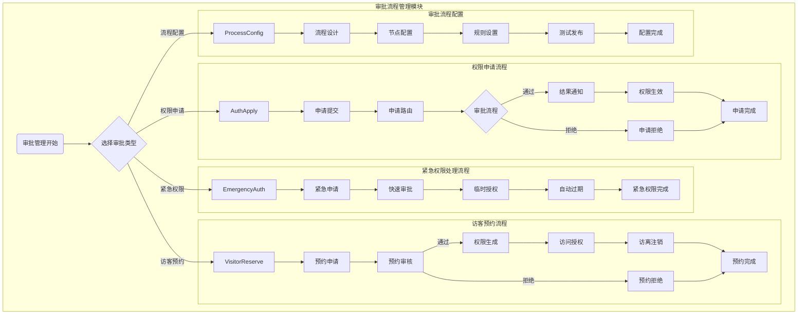

# 门禁系统 - 审批流程管理模块

> **版本**: v1.0.0  
> **创建日期**: 2025-12-17  
> **适用范围**: IOE-DREAM智慧园区门禁系统

---

## 📋 功能说明

### 模块概述

审批流程管理模块负责门禁系统中各类权限申请的审批处理，包括权限申请、访客预约、紧急权限处理和审批流程配置等功能。

### 核心功能

| 功能模块 | 功能描述 | 优先级 |
|---------|---------|--------|
| 权限申请 | 用户提交门禁权限申请，按流程审批 | P0 |
| 访客预约 | 访客预约申请和审核处理 | P0 |
| 紧急权限 | 紧急情况下的快速权限审批 | P1 |
| 流程配置 | 审批流程设计、节点配置、规则设置 | P1 |

---

## 📖 用户故事

### US-APR-001: 权限申请
**作为** 员工  
**我希望** 能够在线提交门禁权限申请  
**以便** 获得特定区域的通行权限

**验收标准**:
- 申请提交后立即进入审批流程
- 审批通过后权限自动生效
- 审批拒绝时显示拒绝理由

### US-APR-002: 访客预约
**作为** 员工  
**我希望** 能够为访客预约门禁通行权限  
**以便** 访客能够顺利进入园区

**验收标准**:
- 支持设置访问时间范围
- 审核通过后自动生成临时权限
- 访客离开后权限自动注销

### US-APR-003: 紧急权限
**作为** 安保主管  
**我希望** 能够快速审批紧急权限申请  
**以便** 应对突发情况

**验收标准**:
- 紧急审批处理时间 ≤ 30分钟
- 临时权限自动过期
- 事后补全审批流程

---

## 🔄 业务流程图

### 审批流程管理模块流程图



---

## 📊 数据结构设计

### 核心数据表

#### 1. 审批申请表 (t_access_approval_request)

```sql
CREATE TABLE `t_access_approval_request` (
    `request_id` BIGINT(20) NOT NULL AUTO_INCREMENT COMMENT '申请ID',
    `request_no` VARCHAR(50) NOT NULL COMMENT '申请编号',
    `request_type` VARCHAR(30) NOT NULL COMMENT '申请类型: PERMISSION/VISITOR/EMERGENCY',
    `applicant_id` BIGINT(20) NOT NULL COMMENT '申请人ID',
    `applicant_name` VARCHAR(100) NOT NULL COMMENT '申请人姓名',
    `applicant_dept` VARCHAR(100) COMMENT '申请人部门',
    `target_area_ids` VARCHAR(500) NOT NULL COMMENT '目标区域ID列表(JSON)',
    `access_purpose` VARCHAR(500) NOT NULL COMMENT '访问事由',
    `start_time` DATETIME NOT NULL COMMENT '开始时间',
    `end_time` DATETIME NOT NULL COMMENT '结束时间',
    `reason` TEXT COMMENT '申请理由',
    `attachments` TEXT COMMENT '附件列表(JSON)',
    `request_status` VARCHAR(20) NOT NULL DEFAULT 'PENDING' COMMENT '申请状态',
    `current_node` VARCHAR(50) COMMENT '当前节点',
    `current_approver_id` BIGINT(20) COMMENT '当前审批人ID',
    `submit_time` DATETIME NOT NULL COMMENT '提交时间',
    `complete_time` DATETIME COMMENT '完成时间',
    `create_time` DATETIME NOT NULL DEFAULT CURRENT_TIMESTAMP,
    `update_time` DATETIME NOT NULL DEFAULT CURRENT_TIMESTAMP ON UPDATE CURRENT_TIMESTAMP,
    PRIMARY KEY (`request_id`),
    UNIQUE KEY `uk_request_no` (`request_no`),
    KEY `idx_applicant_id` (`applicant_id`),
    KEY `idx_request_status` (`request_status`),
    KEY `idx_submit_time` (`submit_time`)
) ENGINE=InnoDB DEFAULT CHARSET=utf8mb4 COMMENT='审批申请表';
```

#### 2. 审批记录表 (t_access_approval_record)

```sql
CREATE TABLE `t_access_approval_record` (
    `record_id` BIGINT(20) NOT NULL AUTO_INCREMENT COMMENT '记录ID',
    `request_id` BIGINT(20) NOT NULL COMMENT '申请ID',
    `node_name` VARCHAR(50) NOT NULL COMMENT '节点名称',
    `approver_id` BIGINT(20) NOT NULL COMMENT '审批人ID',
    `approver_name` VARCHAR(100) NOT NULL COMMENT '审批人姓名',
    `approve_action` VARCHAR(20) NOT NULL COMMENT '审批动作: APPROVE/REJECT/TRANSFER',
    `approve_comment` TEXT COMMENT '审批意见',
    `approve_time` DATETIME NOT NULL COMMENT '审批时间',
    `conditions` TEXT COMMENT '审批条件(JSON)',
    `create_time` DATETIME NOT NULL DEFAULT CURRENT_TIMESTAMP,
    PRIMARY KEY (`record_id`),
    KEY `idx_request_id` (`request_id`),
    KEY `idx_approver_id` (`approver_id`)
) ENGINE=InnoDB DEFAULT CHARSET=utf8mb4 COMMENT='审批记录表';
```

#### 3. 审批流程定义表 (t_access_approval_flow)

```sql
CREATE TABLE `t_access_approval_flow` (
    `flow_id` BIGINT(20) NOT NULL AUTO_INCREMENT COMMENT '流程ID',
    `flow_name` VARCHAR(100) NOT NULL COMMENT '流程名称',
    `flow_type` VARCHAR(30) NOT NULL COMMENT '流程类型',
    `flow_config` TEXT NOT NULL COMMENT '流程配置(JSON)',
    `is_enabled` TINYINT(1) NOT NULL DEFAULT 1 COMMENT '是否启用',
    `priority` INT NOT NULL DEFAULT 0 COMMENT '优先级',
    `description` VARCHAR(500) COMMENT '流程描述',
    `create_time` DATETIME NOT NULL DEFAULT CURRENT_TIMESTAMP,
    `update_time` DATETIME NOT NULL DEFAULT CURRENT_TIMESTAMP ON UPDATE CURRENT_TIMESTAMP,
    PRIMARY KEY (`flow_id`),
    KEY `idx_flow_type` (`flow_type`)
) ENGINE=InnoDB DEFAULT CHARSET=utf8mb4 COMMENT='审批流程定义表';
```

---

## 🎯 审批流程类型

### 1. 标准审批
常规权限申请，需多级审批

### 2. 快速审批
简单权限申请，简化审批流程

### 3. 紧急审批
紧急情况下的审批流程

### 4. 自动审批
符合条件的申请自动通过

## 🔄 审批节点类型

1. **串行审批**：按顺序逐级审批
2. **并行审批**：多个审批人同时审批
3. **会签审批**：所有审批人都需同意
4. **或签审批**：任意一个审批人同意即可

## ⏰ 审批超时处理

- **提醒机制**：审批超时前提醒审批人
- **自动转交**：超时后自动转交给上级
- **自动通过**：简单申请超时后自动通过
- **升级处理**：重要申请超时后升级处理

---

## 🎯 性能指标

| 指标 | 目标值 | 说明 |
|-----|-------|------|
| 审批提交响应时间 | ≤ 2秒 | 申请提交即时响应 |
| 审批流程处理时间 | ≤ 24小时 | 标准流程处理时间 |
| 紧急审批处理时间 | ≤ 30分钟 | 紧急权限快速审批 |
| 权限生效延迟 | ≤ 1分钟 | 审批通过后生效时间 |
| 审批通知发送延迟 | ≤ 30秒 | 通知实时推送 |

---

## ⚠️ 关键控制点

- 审批流程必须完整记录每个环节
- 审批权限必须与岗位职能匹配
- 紧急审批需要事后补全审批流程
- 审批结果必须及时生效到相关系统
- 审批历史必须完整保存不可篡改

---

## 📝 注意事项

- 审批流程配置需要充分测试才能正式使用
- 访客权限需要严格控制访问时间和范围
- 紧急权限需要建立完善的事后审计机制
- 审批数据包含敏感信息，需要严格保护
- 审批系统需要支持移动端审批功能

---

## ✅ 验收标准

### 功能验收
- [ ] 权限申请流程正常运行
- [ ] 访客预约审批功能完整
- [ ] 紧急权限处理时间 ≤ 30分钟
- [ ] 审批流程配置功能完整

### 性能验收
- [ ] 审批提交响应时间 ≤ 2秒
- [ ] 权限生效延迟 ≤ 1分钟
- [ ] 支持100+并发审批

### 安全验收
- [ ] 审批记录完整不可篡改
- [ ] 权限控制正确有效
- [ ] 敏感数据加密保护

---

**📝 文档维护**
- **创建人**: IOE-DREAM架构团队
- **最后更新**: 2025-12-17
