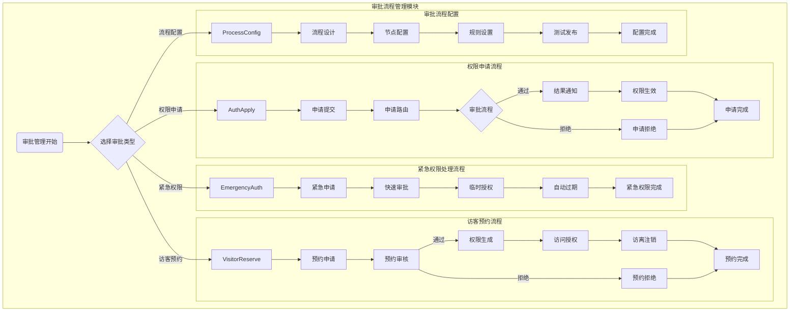
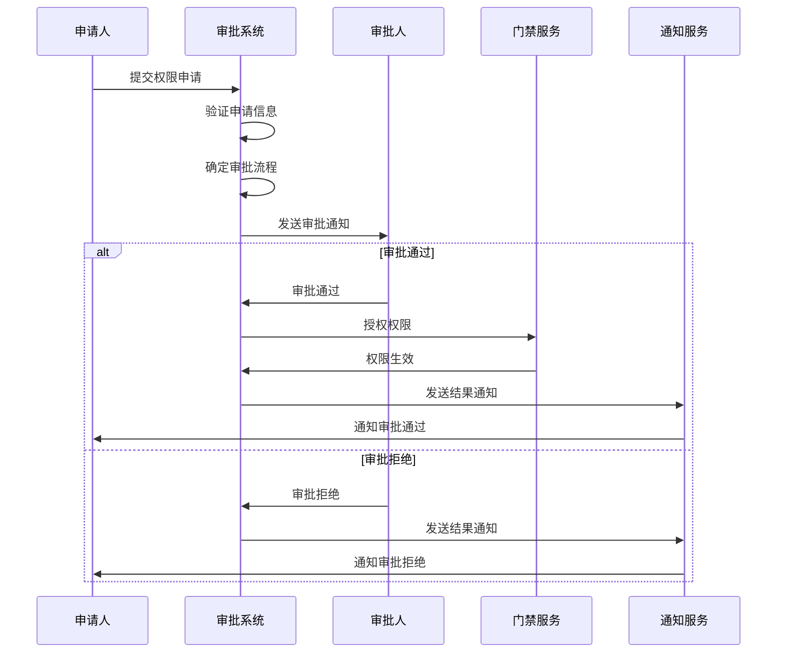

# 门禁审批流程管理 - 业务流程图

> **版本**: v1.0.0  
> **创建日期**: 2025-12-17  

---

## 📊 审批流程管理模块流程图

---

## 🔄 详细审批流程时序图

---

## 📝 流程说明

### 权限申请流程
1. **申请提交**: 用户提交权限申请，填写申请理由和所需权限
2. **申请路由**: 系统根据申请内容自动路由到相应的审批人
3. **审批流程**: 按预设流程进行多级审批
4. **结果通知**: 审批完成后通知申请人结果
5. **权限生效**: 审批通过后立即生效权限

### 访客预约流程
1. **预约申请**: 访客或被访人提交访问预约申请
2. **预约审核**: 相关负责人审核访客预约申请
3. **权限生成**: 审核通过后生成临时访问权限
4. **访问授权**: 在指定时间范围内授权访客访问
5. **访离注销**: 访客离开后自动注销访问权限

### 紧急权限处理流程
1. **紧急申请**: 紧急情况下提交权限申请
2. **快速审批**: 通过简化流程进行快速审批
3. **临时授权**: 授予临时访问权限
4. **自动过期**: 临时权限在指定时间后自动过期

### 审批流程配置
1. **流程设计**: 设计新的审批流程
2. **节点配置**: 配置审批节点和处理人
3. **规则设置**: 设置审批规则和条件
4. **测试发布**: 测试流程并正式发布

---

**📝 文档维护**
- **创建人**: IOE-DREAM架构团队
- **最后更新**: 2025-12-17
