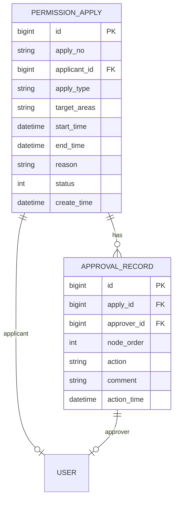

# 审批流程管理 - 数据结构设计

> **版本**: v1.0.0  
> **创建日期**: 2025-12-17

---

## 📊 ER图

---

## 📋 表结构设计

### t_permission_apply (权限申请表)

| 字段 | 类型 | 约束 | 说明 |
|------|------|------|------|
| id | BIGINT | PK | 主键 |
| apply_no | VARCHAR(30) | UNIQUE | 申请编号 |
| applicant_id | BIGINT | FK, NOT NULL | 申请人ID |
| apply_type | VARCHAR(30) | NOT NULL | 申请类型 |
| target_areas | JSON | - | 目标区域ID数组 |
| start_time | DATETIME | - | 权限开始时间 |
| end_time | DATETIME | - | 权限结束时间 |
| reason | VARCHAR(500) | - | 申请理由 |
| status | TINYINT | DEFAULT 0 | 状态 |
| current_approver | BIGINT | FK | 当前审批人 |
| create_time | DATETIME | NOT NULL | 创建时间 |

### t_approval_record (审批记录表)

| 字段 | 类型 | 约束 | 说明 |
|------|------|------|------|
| id | BIGINT | PK | 主键 |
| apply_id | BIGINT | FK, NOT NULL | 申请ID |
| approver_id | BIGINT | FK, NOT NULL | 审批人ID |
| node_order | INT | - | 节点顺序 |
| action | VARCHAR(20) | NOT NULL | 操作(APPROVE/REJECT) |
| comment | VARCHAR(500) | - | 审批意见 |
| action_time | DATETIME | NOT NULL | 操作时间 |

---

**📝 文档维护**: IOE-DREAM架构团队 | 2025-12-17
