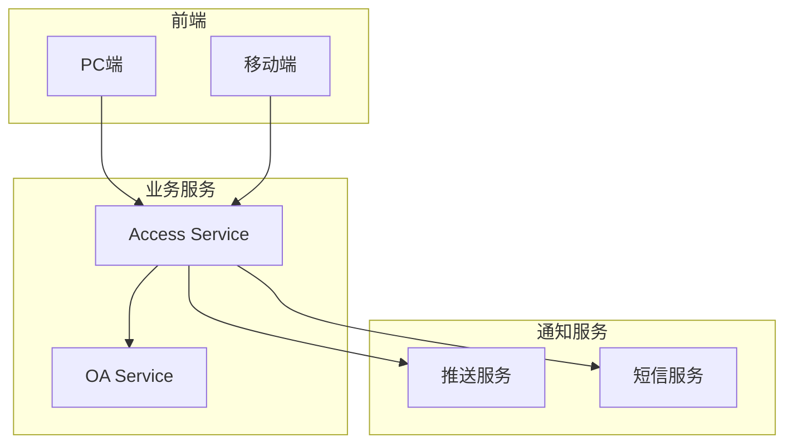

# 审批流程管理 - 概要设计说明书

> **版本**: v1.0.0  
> **创建日期**: 2025-12-17

---

## 🏗️ 系统架构

---

## 📦 模块设计

| 模块 | 职责 |
|------|------|
| 申请管理 | 申请提交、状态查询 |
| 审批引擎 | 流程流转、节点处理 |
| 通知模块 | 审批提醒、结果通知 |
| 权限同步 | 审批通过后同步权限 |

---

## 🔧 技术选型

| 技术 | 选型 | 理由 |
|------|------|------|
| 工作流 | 自研轻量流程 | 满足简单审批场景 |
| 定时任务 | XXL-JOB | 超时检测 |
| 消息推送 | WebSocket+APP | 实时通知 |

---

**📝 文档维护**: IOE-DREAM架构团队 | 2025-12-17
