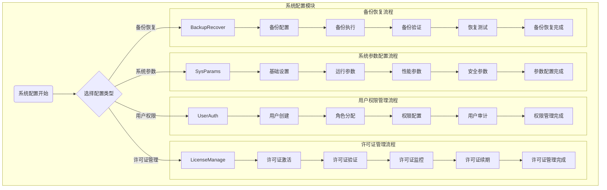

# 门禁系统 - 系统配置管理模块

> **版本**: v1.0.0  
> **创建日期**: 2025-12-17  
> **适用范围**: IOE-DREAM智慧园区门禁系统

---

## 📋 功能说明

### 模块概述

系统配置管理模块负责门禁系统的系统参数配置、用户权限管理、许可证管理和备份恢复等功能。

### 核心功能

| 功能模块 | 功能描述 | 优先级 |
|---------|---------|--------|
| 系统参数配置 | 基础设置、运行参数、性能参数、安全参数 | P0 |
| 用户权限管理 | 用户创建、角色分配、权限配置、用户审计 | P0 |
| 许可证管理 | 许可证激活、验证、监控、续期 | P1 |
| 备份恢复 | 备份配置、备份执行、备份验证、恢复测试 | P1 |

---

## 🔄 业务流程图

### 系统配置模块流程图



---

## 📊 系统参数详细说明

### 基础设置
- **系统名称**：系统显示名称
- **系统语言**：中文、英文等
- **时区设置**：系统时区和时间格式
- **字符编码**：UTF-8等字符编码
- **日志级别**：系统日志记录级别

### 运行参数
- **服务端口**：系统服务监听端口
- **数据库连接池**：数据库连接池配置
- **缓存配置**：系统缓存相关配置
- **文件存储路径**：文件上传和存储路径
- **临时文件清理**：临时文件清理策略

### 性能参数
- **并发连接数**：最大并发连接数
- **查询超时时间**：数据库查询超时时间
- **缓存过期时间**：缓存数据过期时间
- **批量处理大小**：批量操作的数据量
- **内存使用限制**：系统内存使用限制

### 安全参数
- **密码策略**：密码复杂度要求
- **会话超时**：用户会话超时时间
- **登录失败锁定**：登录失败锁定策略
- **SSL/TLS配置**：安全传输协议配置
- **访问控制**：IP地址访问控制

---

## 👤 用户权限类型

1. **系统管理员**：系统最高权限，可管理所有功能
2. **设备管理员**：设备相关管理权限
3. **区域管理员**：区域和权限管理权限
4. **监控员**：实时监控和事件查看权限
5. **普通用户**：基础使用权限

---

## 💾 备份策略

1. **全量备份**：定期完整备份所有数据
2. **增量备份**：备份变更的数据
3. **差异备份**：备份自上次全量备份后的变更
4. **实时备份**：关键数据实时备份

---

## 📊 数据结构设计

### 核心数据表

#### 1. 系统配置表 (t_access_sys_config)

```sql
CREATE TABLE `t_access_sys_config` (
    `config_id` BIGINT(20) NOT NULL AUTO_INCREMENT COMMENT '配置ID',
    `config_group` VARCHAR(50) NOT NULL COMMENT '配置组',
    `config_key` VARCHAR(100) NOT NULL COMMENT '配置键',
    `config_value` TEXT NOT NULL COMMENT '配置值',
    `config_type` VARCHAR(20) NOT NULL COMMENT '配置类型: STRING/NUMBER/BOOLEAN/JSON',
    `description` VARCHAR(500) COMMENT '配置描述',
    `is_encrypted` TINYINT(1) NOT NULL DEFAULT 0 COMMENT '是否加密',
    `is_editable` TINYINT(1) NOT NULL DEFAULT 1 COMMENT '是否可编辑',
    `create_time` DATETIME NOT NULL DEFAULT CURRENT_TIMESTAMP,
    `update_time` DATETIME NOT NULL DEFAULT CURRENT_TIMESTAMP ON UPDATE CURRENT_TIMESTAMP,
    PRIMARY KEY (`config_id`),
    UNIQUE KEY `uk_config_key` (`config_group`, `config_key`)
) ENGINE=InnoDB DEFAULT CHARSET=utf8mb4 COMMENT='系统配置表';
```

#### 2. 操作日志表 (t_access_operation_log)

```sql
CREATE TABLE `t_access_operation_log` (
    `log_id` BIGINT(20) NOT NULL AUTO_INCREMENT COMMENT '日志ID',
    `user_id` BIGINT(20) NOT NULL COMMENT '用户ID',
    `user_name` VARCHAR(100) NOT NULL COMMENT '用户名',
    `operation_type` VARCHAR(50) NOT NULL COMMENT '操作类型',
    `operation_module` VARCHAR(100) NOT NULL COMMENT '操作模块',
    `operation_content` TEXT NOT NULL COMMENT '操作内容',
    `ip_address` VARCHAR(50) COMMENT 'IP地址',
    `user_agent` VARCHAR(500) COMMENT '用户代理',
    `operation_time` DATETIME NOT NULL COMMENT '操作时间',
    `operation_result` VARCHAR(20) NOT NULL COMMENT '操作结果: SUCCESS/FAILED',
    `error_message` TEXT COMMENT '错误信息',
    `create_time` DATETIME NOT NULL DEFAULT CURRENT_TIMESTAMP,
    PRIMARY KEY (`log_id`),
    KEY `idx_user_id` (`user_id`),
    KEY `idx_operation_time` (`operation_time`),
    KEY `idx_operation_type` (`operation_type`)
) ENGINE=InnoDB DEFAULT CHARSET=utf8mb4 COMMENT='操作日志表';
```

---

## ⚠️ 关键控制点

- 系统配置变更需要管理员权限
- 重要参数变更需要备份当前配置
- 许可证到期前30天开始提醒
- 备份数据必须异地存储
- 恢复操作需要经过严格授权

---

## 📝 注意事项

- 系统配置变更需要谨慎操作，可能影响系统稳定性
- 用户权限管理需要遵循最小权限原则
- 许可证管理需要确保系统合规使用
- 备份恢复需要定期测试，确保数据安全
- 所有配置变更都需要记录审计日志

---

## ✅ 验收标准

### 功能验收
- [ ] 系统参数配置功能完整
- [ ] 用户权限管理功能完整
- [ ] 许可证管理功能完整
- [ ] 备份恢复功能正常

### 安全验收
- [ ] 权限控制正确有效
- [ ] 敏感配置加密存储
- [ ] 操作日志完整记录
- [ ] 备份数据加密保护

---

**📝 文档维护**
- **创建人**: IOE-DREAM架构团队
- **最后更新**: 2025-12-17
