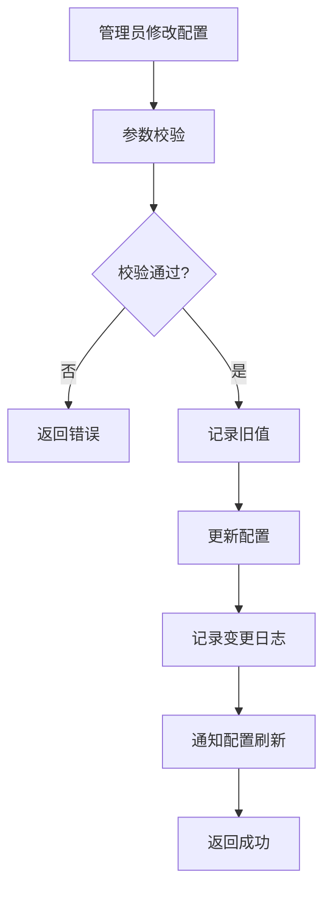
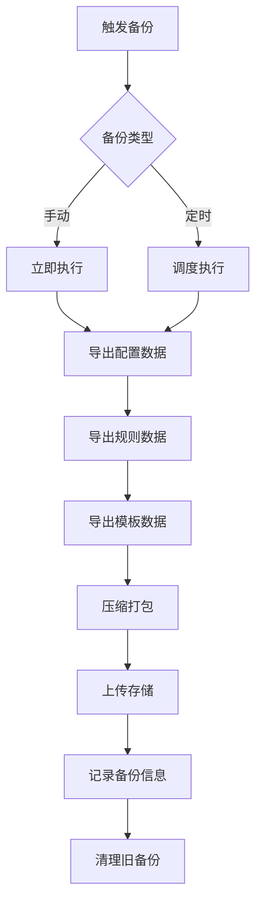
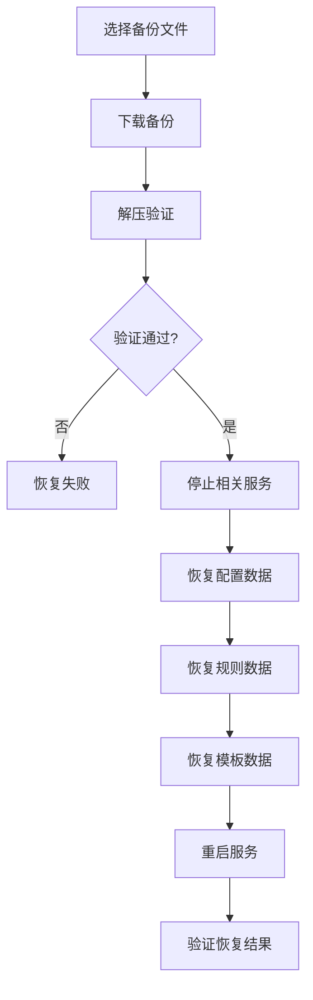

# 系统配置管理 - 业务流程图

> **版本**: v1.0.0  
> **创建日期**: 2025-12-17

---

## 📊 配置修改流程

```mermaid
flowchart TD
    A[管理员修改配置] --> B[参数校验]
    B --> C{校验通过?}
    C -->|否| D[返回错误]
    C -->|是| E[记录旧值]
    E --> F[更新配置]
    F --> G[记录变更日志]
    G --> H[通知配置刷新]
    H --> I[返回成功]
```

---

## 📊 备份流程

```mermaid
flowchart TD
    A[触发备份] --> B{备份类型}
    B -->|手动| C[立即执行]
    B -->|定时| D[调度执行]
    C --> E[导出配置数据]
    D --> E
    E --> F[导出规则数据]
    F --> G[导出模板数据]
    G --> H[压缩打包]
    H --> I[上传存储]
    I --> J[记录备份信息]
    J --> K[清理旧备份]
```

---

## 📊 恢复流程

```mermaid
flowchart TD
    A[选择备份文件] --> B[下载备份]
    B --> C[解压验证]
    C --> D{验证通过?}
    D -->|否| E[恢复失败]
    D -->|是| F[停止相关服务]
    F --> G[恢复配置数据]
    G --> H[恢复规则数据]
    H --> I[恢复模板数据]
    I --> J[重启服务]
    J --> K[验证恢复结果]
```

---

**📝 文档维护**: IOE-DREAM架构团队 | 2025-12-17
