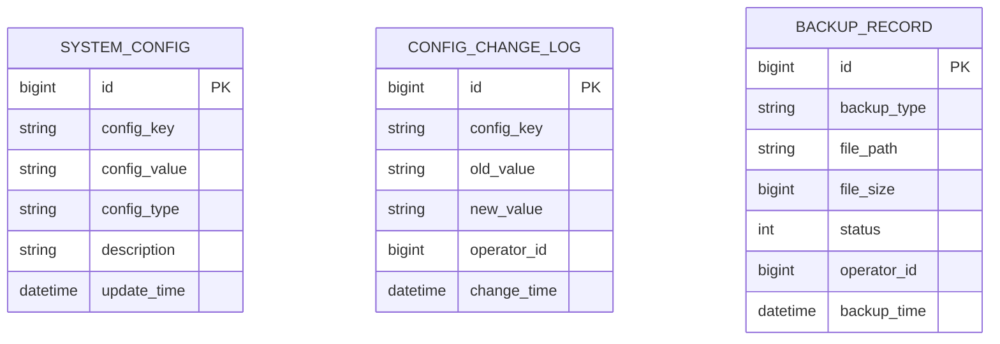

# 系统配置管理 - 数据结构设计

> **版本**: v1.0.0  
> **创建日期**: 2025-12-17

---

## 📊 ER图

---

## 📋 表结构设计

### t_system_config (系统配置表)

| 字段 | 类型 | 约束 | 说明 |
|------|------|------|------|
| id | BIGINT | PK | 主键 |
| config_key | VARCHAR(100) | UNIQUE, NOT NULL | 配置键 |
| config_value | VARCHAR(500) | - | 配置值 |
| config_type | VARCHAR(30) | - | 配置类型 |
| description | VARCHAR(200) | - | 描述 |
| update_time | DATETIME | NOT NULL | 更新时间 |

### t_config_change_log (配置变更日志)

| 字段 | 类型 | 约束 | 说明 |
|------|------|------|------|
| id | BIGINT | PK | 主键 |
| config_key | VARCHAR(100) | NOT NULL | 配置键 |
| old_value | VARCHAR(500) | - | 旧值 |
| new_value | VARCHAR(500) | - | 新值 |
| operator_id | BIGINT | NOT NULL | 操作人 |
| change_time | DATETIME | NOT NULL | 变更时间 |

---

**📝 文档维护**: IOE-DREAM架构团队 | 2025-12-17
