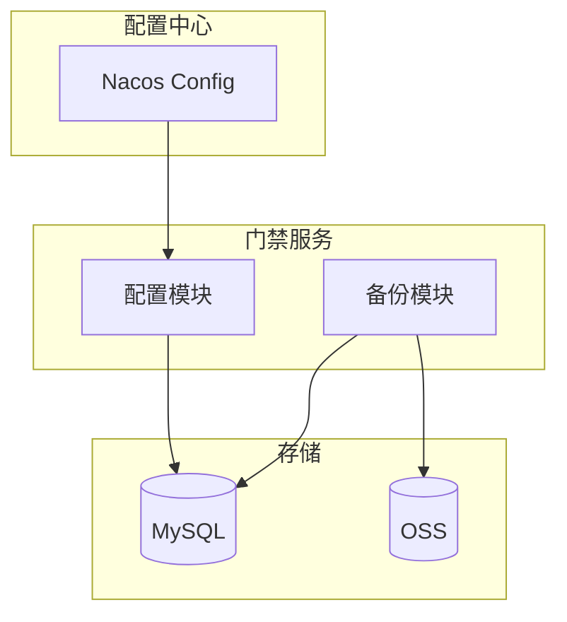

# 系统配置管理 - 概要设计说明书

> **版本**: v1.0.0  
> **创建日期**: 2025-12-17

---

## 🏗️ 系统架构

---

## 📦 模块设计

| 模块 | 职责 |
|------|------|
| 配置服务 | 参数CRUD、变更通知 |
| 备份服务 | 数据备份恢复 |
| 审计服务 | 操作日志记录 |

---

## 🔧 技术选型

| 技术 | 选型 | 理由 |
|------|------|------|
| 配置中心 | Nacos | 动态配置 |
| 文件存储 | MinIO/OSS | 备份存储 |
| 压缩算法 | GZIP | 标准压缩 |

---

**📝 文档维护**: IOE-DREAM架构团队 | 2025-12-17
