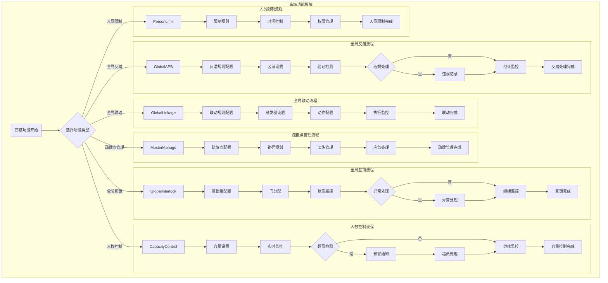

# 门禁系统 - 高级功能管理模块

> **版本**: v1.0.0  
> **创建日期**: 2025-12-17  
> **适用范围**: IOE-DREAM智慧园区门禁系统

---

## 📋 功能说明

### 模块概述

高级功能管理模块提供门禁系统的高级安全功能，包括全局反潜、全局联动、全局互锁、疏散点管理、人数控制和人员限制等功能。

### 核心功能

| 功能模块 | 功能描述 | 优先级 |
|---------|---------|--------|
| 全局反潜 | 防止同一人员在短时间内重复验证 | P1 |
| 全局联动 | 设备间的联动规则配置和执行 | P1 |
| 全局互锁 | 门组互锁控制，确保安全 | P1 |
| 疏散点管理 | 紧急疏散点配置和管理 | P2 |
| 人数控制 | 区域人数容量监控和控制 | P1 |
| 人员限制 | 人员访问时间和权限限制 | P1 |

---

## 🔄 业务流程图

### 高级功能模块流程图



---

## 📊 高级功能详细说明

### 全局反潜类型
1. **区域反潜**：防止同一人员在短时间内重复验证
2. **逻辑反潜**：根据逻辑关系判断验证合理性
3. **定时反潜**：在特定时间段内启用反潜
4. **精准反潜**：基于人员轨迹的精确反潜

### 联动触发条件
1. **门禁事件**：刷卡、人脸等验证事件
2. **报警事件**：设备故障、非法闯入等
3. **时间事件**：定时触发或时间段触发
4. **系统事件**：系统启动、停止等

### 互锁类型
1. **两门互锁**：两门不能同时开启
2. **多门互锁**：多个门中只能开启一扇
3. **区域互锁**：区域内门的互锁控制
4. **时间互锁**：特定时间段的互锁

### 疏散点类型
1. **主要疏散点**：主要的紧急疏散集合点
2. **次要疏散点**：备用的疏散集合点
3. **备用疏散点**：应急情况下的备用点

---

## 📊 数据结构设计

### 核心数据表

#### 1. 反潜规则表 (t_access_anti_passback)

```sql
CREATE TABLE `t_access_anti_passback` (
    `rule_id` BIGINT(20) NOT NULL AUTO_INCREMENT COMMENT '规则ID',
    `rule_name` VARCHAR(100) NOT NULL COMMENT '规则名称',
    `rule_type` VARCHAR(30) NOT NULL COMMENT '规则类型: AREA/LOGIC/TIME/ACCURATE',
    `area_ids` VARCHAR(500) COMMENT '区域ID列表(JSON)',
    `device_ids` VARCHAR(500) COMMENT '设备ID列表(JSON)',
    `time_interval` INT NOT NULL DEFAULT 60 COMMENT '时间间隔(秒)',
    `is_enabled` TINYINT(1) NOT NULL DEFAULT 1 COMMENT '是否启用',
    `violation_action` VARCHAR(20) NOT NULL DEFAULT 'DENY' COMMENT '违规动作: DENY/WARN/LOG',
    `create_time` DATETIME NOT NULL DEFAULT CURRENT_TIMESTAMP,
    `update_time` DATETIME NOT NULL DEFAULT CURRENT_TIMESTAMP ON UPDATE CURRENT_TIMESTAMP,
    PRIMARY KEY (`rule_id`)
) ENGINE=InnoDB DEFAULT CHARSET=utf8mb4 COMMENT='反潜规则表';
```

#### 2. 联动规则表 (t_access_linkage_rule)

```sql
CREATE TABLE `t_access_linkage_rule` (
    `rule_id` BIGINT(20) NOT NULL AUTO_INCREMENT COMMENT '规则ID',
    `rule_name` VARCHAR(100) NOT NULL COMMENT '规则名称',
    `trigger_type` VARCHAR(30) NOT NULL COMMENT '触发类型',
    `trigger_config` TEXT NOT NULL COMMENT '触发配置(JSON)',
    `action_type` VARCHAR(30) NOT NULL COMMENT '动作类型',
    `action_config` TEXT NOT NULL COMMENT '动作配置(JSON)',
    `is_enabled` TINYINT(1) NOT NULL DEFAULT 1 COMMENT '是否启用',
    `priority` INT NOT NULL DEFAULT 0 COMMENT '优先级',
    `create_time` DATETIME NOT NULL DEFAULT CURRENT_TIMESTAMP,
    `update_time` DATETIME NOT NULL DEFAULT CURRENT_TIMESTAMP ON UPDATE CURRENT_TIMESTAMP,
    PRIMARY KEY (`rule_id`)
) ENGINE=InnoDB DEFAULT CHARSET=utf8mb4 COMMENT='联动规则表';
```

#### 3. 互锁组表 (t_access_interlock_group)

```sql
CREATE TABLE `t_access_interlock_group` (
    `group_id` BIGINT(20) NOT NULL AUTO_INCREMENT COMMENT '组ID',
    `group_name` VARCHAR(100) NOT NULL COMMENT '组名称',
    `interlock_type` VARCHAR(30) NOT NULL COMMENT '互锁类型: TWO_DOOR/MULTI_DOOR/AREA/TIME',
    `device_ids` VARCHAR(500) NOT NULL COMMENT '设备ID列表(JSON)',
    `is_enabled` TINYINT(1) NOT NULL DEFAULT 1 COMMENT '是否启用',
    `exception_users` VARCHAR(500) COMMENT '例外用户(JSON)',
    `create_time` DATETIME NOT NULL DEFAULT CURRENT_TIMESTAMP,
    `update_time` DATETIME NOT NULL DEFAULT CURRENT_TIMESTAMP ON UPDATE CURRENT_TIMESTAMP,
    PRIMARY KEY (`group_id`)
) ENGINE=InnoDB DEFAULT CHARSET=utf8mb4 COMMENT='互锁组表';
```

#### 4. 区域容量配置表 (t_access_area_capacity)

```sql
CREATE TABLE `t_access_area_capacity` (
    `capacity_id` BIGINT(20) NOT NULL AUTO_INCREMENT COMMENT '配置ID',
    `area_id` BIGINT(20) NOT NULL COMMENT '区域ID',
    `max_capacity` INT NOT NULL COMMENT '最大容量',
    `warning_threshold` INT NOT NULL COMMENT '预警阈值',
    `current_count` INT NOT NULL DEFAULT 0 COMMENT '当前人数',
    `is_enabled` TINYINT(1) NOT NULL DEFAULT 1 COMMENT '是否启用',
    `over_action` VARCHAR(20) NOT NULL DEFAULT 'DENY' COMMENT '超员动作',
    `create_time` DATETIME NOT NULL DEFAULT CURRENT_TIMESTAMP,
    `update_time` DATETIME NOT NULL DEFAULT CURRENT_TIMESTAMP ON UPDATE CURRENT_TIMESTAMP,
    PRIMARY KEY (`capacity_id`),
    UNIQUE KEY `uk_area_id` (`area_id`)
) ENGINE=InnoDB DEFAULT CHARSET=utf8mb4 COMMENT='区域容量配置表';
```

---

## 🎯 性能要求

| 指标 | 目标值 | 说明 |
|-----|-------|------|
| 反潜检测延迟 | ≤ 1秒 | 实时检测响应 |
| 联动执行响应 | ≤ 2秒 | 联动动作执行 |
| 互锁状态更新 | ≤ 500毫秒 | 状态同步更新 |
| 人数统计延迟 | ≤ 3秒 | 实时人数统计 |
| 疏散引导响应 | ≤ 5秒 | 紧急疏散启动 |
| 限制权限生效 | ≤ 1秒 | 权限立即生效 |

---

## ⚠️ 关键控制点

- 反潜规则需要合理设置，避免误报
- 联动规则需要充分测试，确保执行可靠
- 互锁配置不能影响正常通行和紧急疏散
- 疏散路径需要定期检查，确保畅通无阻
- 容量控制需要区分不同类型人员
- 人员限制需要考虑紧急情况的例外处理

---

## 📝 注意事项

- 高级功能配置需要专业人员进行
- 功能启用前需要进行充分测试
- 需要建立完善的异常处理机制
- 定期检查和更新配置参数
- 做好功能使用记录和维护日志
- 确保高级功能不影响系统基本性能

---

## ✅ 验收标准

### 功能验收
- [ ] 全局反潜功能正常，检测延迟 ≤ 1秒
- [ ] 全局联动功能正常，执行响应 ≤ 2秒
- [ ] 全局互锁功能正常，状态更新 ≤ 500ms
- [ ] 疏散点管理功能完整
- [ ] 人数控制功能正常，统计延迟 ≤ 3秒
- [ ] 人员限制功能正常，权限生效 ≤ 1秒

### 性能验收
- [ ] 支持1000+设备联动
- [ ] 支持100+互锁组配置
- [ ] 系统稳定性 ≥ 99.9%

### 安全验收
- [ ] 不影响紧急疏散功能
- [ ] 配置变更有完整日志
- [ ] 异常情况自动告警

---

**📝 文档维护**
- **创建人**: IOE-DREAM架构团队
- **最后更新**: 2025-12-17
