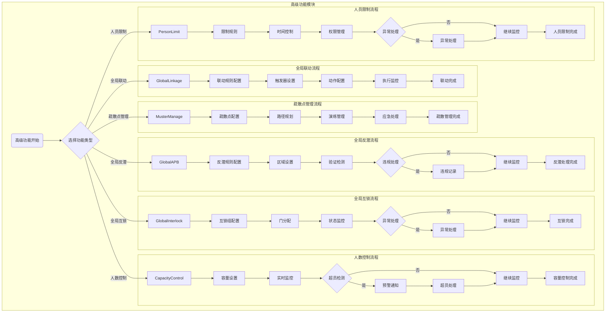

# 门禁高级功能管理 - 业务流程图

> **版本**: v1.0.0  
> **创建日期**: 2025-12-17  

---

## 📊 高级功能模块流程图

---

## 📝 流程说明

### 全局反潜流程
1. **反潜规则配置**: 配置反潜验证规则和参数
2. **区域设置**: 设置需要反潜控制的区域
3. **验证检测**: 实时检测人员的验证行为
4. **违规处理**: 检测到违规时记录并处理
5. **继续监控**: 持续进行反潜监控

### 全局联动流程
1. **联动规则配置**: 配置设备间的联动规则
2. **触发器设置**: 设置联动事件的触发条件
3. **动作配置**: 配置联动触发后的执行动作
4. **执行监控**: 监控联动动作的执行情况

### 全局互锁流程
1. **互锁组配置**: 配置需要互锁的门组
2. **门分配**: 将门分配到相应的互锁组
3. **状态监控**: 实时监控门的互锁状态
4. **异常处理**: 处理互锁异常情况

### 疏散点管理流程
1. **疏散点配置**: 配置疏散点位置和容量
2. **路径规划**: 规划紧急疏散路径
3. **演练管理**: 组织和管理疏散演练
4. **应急处理**: 紧急情况下的疏散处理

### 人数控制流程
1. **容量设置**: 设置区域的最大容量
2. **实时监控**: 实时统计区域内人数
3. **超员检测**: 检测是否超过容量限制
4. **预警通知**: 超员时发送预警通知
5. **超员处理**: 采取超员控制措施

### 人员限制流程
1. **限制规则**: 配置人员访问限制规则
2. **时间控制**: 设置时间段的访问限制
3. **权限管理**: 根据限制规则管理权限
4. **异常处理**: 处理违规访问情况

---

**📝 文档维护**
- **创建人**: IOE-DREAM架构团队
- **最后更新**: 2025-12-17
