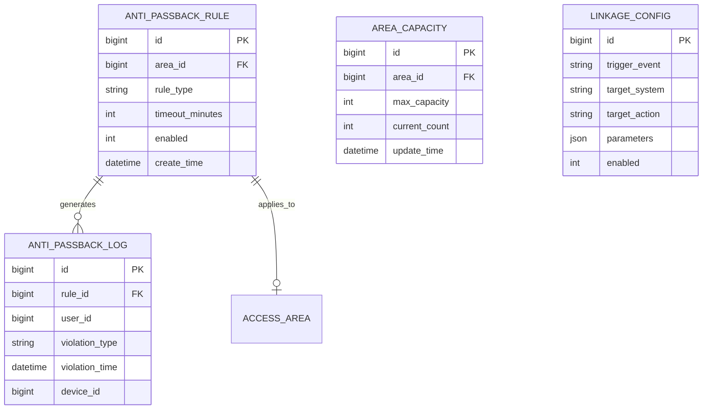

# 高级功能管理 - 数据结构设计

> **版本**: v1.0.0  
> **创建日期**: 2025-12-17

---

## 📊 ER图

---

## 📋 表结构设计

### t_anti_passback_rule (反潜回规则表)

| 字段 | 类型 | 约束 | 说明 |
|------|------|------|------|
| id | BIGINT | PK | 主键 |
| area_id | BIGINT | FK, NOT NULL | 区域ID |
| rule_type | VARCHAR(30) | NOT NULL | 规则类型 |
| timeout_minutes | INT | DEFAULT 0 | 超时时间(分钟) |
| enabled | TINYINT | DEFAULT 1 | 是否启用 |
| create_time | DATETIME | NOT NULL | 创建时间 |

### t_area_capacity (区域容量表)

| 字段 | 类型 | 约束 | 说明 |
|------|------|------|------|
| id | BIGINT | PK | 主键 |
| area_id | BIGINT | FK, UNIQUE | 区域ID |
| max_capacity | INT | NOT NULL | 最大容量 |
| current_count | INT | DEFAULT 0 | 当前人数 |
| update_time | DATETIME | NOT NULL | 更新时间 |

---

**📝 文档维护**: IOE-DREAM架构团队 | 2025-12-17
