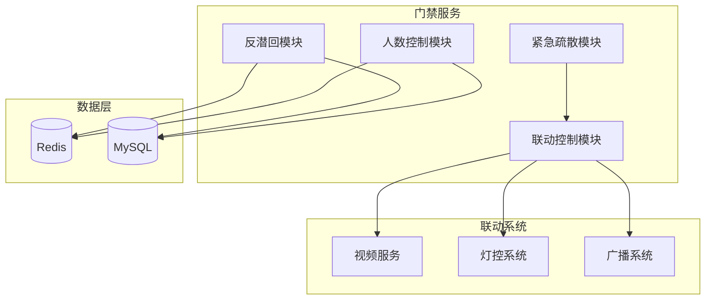

# 高级功能管理 - 概要设计说明书

> **版本**: v1.0.0  
> **创建日期**: 2025-12-17

---

## 🏗️ 系统架构

---

## 📦 模块设计

| 模块 | 职责 | 关键类 |
|------|------|--------|
| 反潜回 | 防尾随/重复进入 | AntiPassbackService |
| 人数控制 | 区域容量管理 | AreaCapacityService |
| 联动控制 | 事件触发联动 | LinkageService |
| 紧急疏散 | 应急响应 | EmergencyService |

---

## 🔧 技术选型

| 技术 | 选型 | 理由 |
|------|------|------|
| 状态缓存 | Redis | 高性能读写 |
| 联动通信 | HTTP/MQ | 可靠传输 |
| 并发控制 | Redis Lock | 分布式锁 |

---

**📝 文档维护**: IOE-DREAM架构团队 | 2025-12-17
