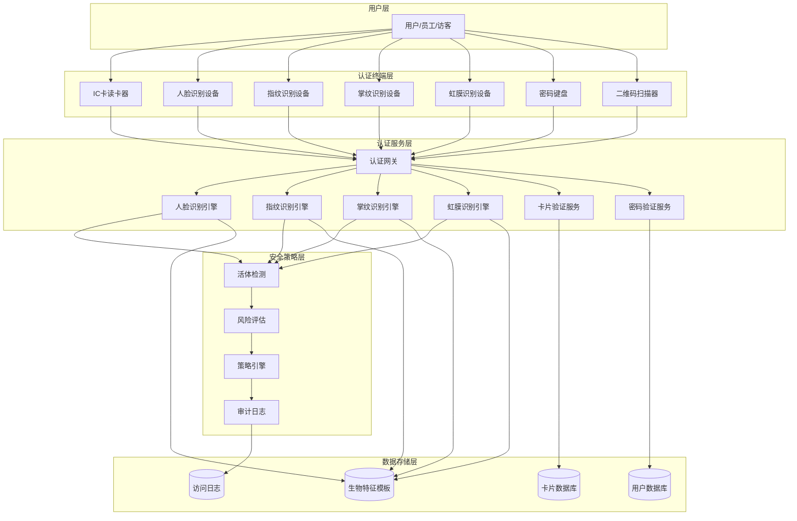
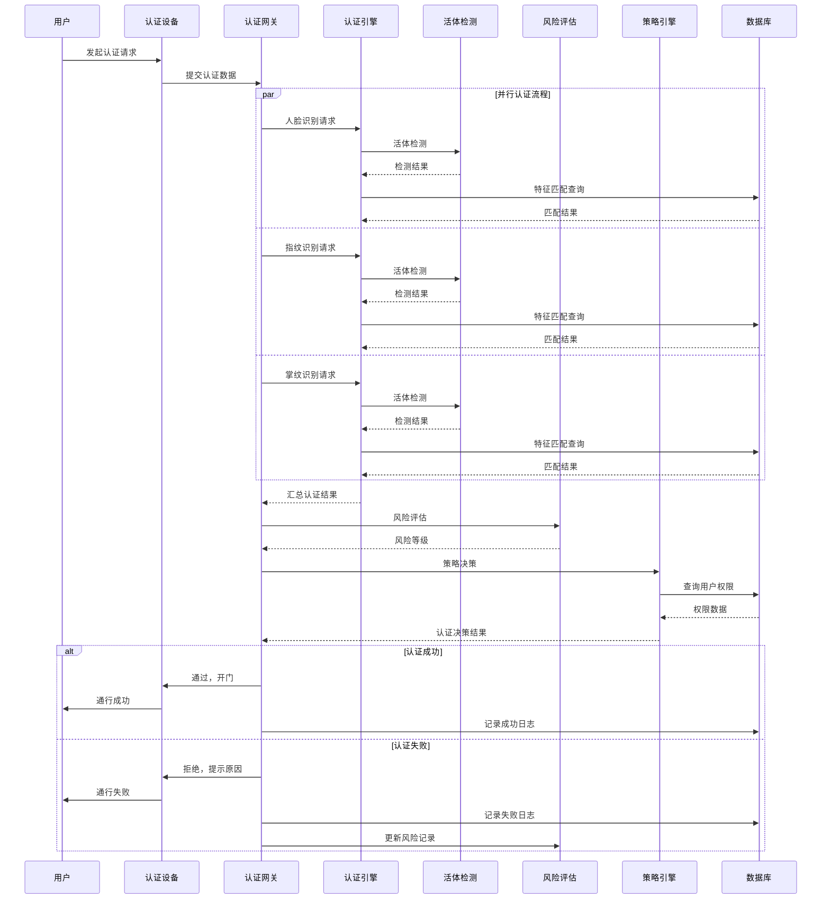

# 门禁系统 - 多因子认证管理模块

> **版本**: v1.0.0  
> **创建日期**: 2025-12-17  
> **适用范围**: IOE-DREAM智慧园区门禁系统

---

## 📋 功能说明

### 模块概述

多因子认证管理模块提供门禁系统的多模态生物识别认证功能，支持人脸识别、指纹验证、掌纹识别、虹膜识别、声纹识别、IC卡、二维码、密码、NFC等多种认证方式的组合验证。

### 支持的认证方式

| 认证方式 | 安全等级 | 响应时间 | 适用场景 |
|---------|---------|---------|---------|
| 人脸识别 | 高 | ≤ 2秒 | 普通通行、高安全区域 |
| 指纹验证 | 高 | ≤ 1秒 | 普通通行、考勤 |
| 掌纹识别 | 高 | ≤ 1.5秒 | 高安全区域 |
| 虹膜识别 | 极高 | ≤ 3秒 | 核心区域、数据中心 |
| 声纹识别 | 中高 | ≤ 2秒 | 辅助认证 |
| IC卡 | 中 | ≤ 0.5秒 | 普通通行 |
| 二维码 | 低 | ≤ 1秒 | 访客、临时通行 |
| 密码 | 低 | - | 辅助认证 |
| NFC | 中 | ≤ 0.5秒 | 移动端通行 |

---

## 🔄 业务流程图

### 多因子认证整体架构



### 多因子认证详细流程



---

## 🔐 安全认证策略

### 认证因子权重配置

| 认证因子 | 安全权重 | 可信度 | 备注 |
|---------|---------|-------|------|
| 人脸识别 | 0.35 | 高 | 含活体检测 |
| 指纹验证 | 0.30 | 高 | 支持多指登记 |
| 掌纹识别 | 0.30 | 高 | 适合手套环境 |
| 虹膜识别 | 0.40 | 极高 | 最高安全等级 |
| 声纹识别 | 0.20 | 中 | 辅助验证 |
| IC卡 | 0.15 | 低 | 易丢失复制 |
| 密码 | 0.10 | 低 | 辅助验证 |
| 二维码 | 0.05 | 很低 | 临时通行 |

### 风险等级与认证策略

| 风险等级 | 最低认证因子数 | 最低权重和 | 策略说明 |
|---------|---------------|-----------|---------|
| 低风险 | 1 | 0.15 | 普通区域单因子 |
| 中风险 | 2 | 0.40 | 一般办公区双因子 |
| 高风险 | 2 | 0.60 | 财务/机房双因子 |
| 极高风险 | 3 | 0.80 | 核心区域三因子 |

---

## 📊 数据结构设计

### 核心数据表

#### 1. 生物特征模板表 (t_access_bio_template)

```sql
CREATE TABLE `t_access_bio_template` (
    `template_id` BIGINT(20) NOT NULL AUTO_INCREMENT COMMENT '模板ID',
    `user_id` BIGINT(20) NOT NULL COMMENT '用户ID',
    `template_type` VARCHAR(30) NOT NULL COMMENT '模板类型: FACE/FINGERPRINT/PALM/IRIS/VOICE',
    `template_data` BLOB NOT NULL COMMENT '加密模板数据',
    `template_version` VARCHAR(20) NOT NULL COMMENT '模板版本',
    `quality_score` DECIMAL(5,2) COMMENT '质量分数',
    `finger_index` INT COMMENT '手指索引(指纹专用)',
    `is_primary` TINYINT(1) NOT NULL DEFAULT 0 COMMENT '是否主模板',
    `is_enabled` TINYINT(1) NOT NULL DEFAULT 1 COMMENT '是否启用',
    `register_time` DATETIME NOT NULL COMMENT '注册时间',
    `last_use_time` DATETIME COMMENT '最后使用时间',
    `create_time` DATETIME NOT NULL DEFAULT CURRENT_TIMESTAMP,
    `update_time` DATETIME NOT NULL DEFAULT CURRENT_TIMESTAMP ON UPDATE CURRENT_TIMESTAMP,
    PRIMARY KEY (`template_id`),
    KEY `idx_user_id` (`user_id`),
    KEY `idx_template_type` (`template_type`)
) ENGINE=InnoDB DEFAULT CHARSET=utf8mb4 COMMENT='生物特征模板表';
```

#### 2. 认证配置表 (t_access_auth_config)

```sql
CREATE TABLE `t_access_auth_config` (
    `config_id` BIGINT(20) NOT NULL AUTO_INCREMENT COMMENT '配置ID',
    `area_id` BIGINT(20) COMMENT '区域ID(NULL表示全局)',
    `risk_level` VARCHAR(20) NOT NULL COMMENT '风险等级',
    `min_factors` INT NOT NULL COMMENT '最少认证因子数',
    `min_weight_sum` DECIMAL(5,2) NOT NULL COMMENT '最低权重和',
    `required_factors` VARCHAR(200) COMMENT '必需因子(JSON)',
    `liveness_required` TINYINT(1) NOT NULL DEFAULT 1 COMMENT '是否需要活体检测',
    `max_retry_times` INT NOT NULL DEFAULT 3 COMMENT '最大重试次数',
    `lock_duration` INT NOT NULL DEFAULT 1800 COMMENT '锁定时长(秒)',
    `is_enabled` TINYINT(1) NOT NULL DEFAULT 1 COMMENT '是否启用',
    `create_time` DATETIME NOT NULL DEFAULT CURRENT_TIMESTAMP,
    `update_time` DATETIME NOT NULL DEFAULT CURRENT_TIMESTAMP ON UPDATE CURRENT_TIMESTAMP,
    PRIMARY KEY (`config_id`),
    KEY `idx_area_id` (`area_id`),
    KEY `idx_risk_level` (`risk_level`)
) ENGINE=InnoDB DEFAULT CHARSET=utf8mb4 COMMENT='认证配置表';
```

#### 3. 认证日志表 (t_access_auth_log)

```sql
CREATE TABLE `t_access_auth_log` (
    `log_id` BIGINT(20) NOT NULL AUTO_INCREMENT COMMENT '日志ID',
    `user_id` BIGINT(20) COMMENT '用户ID',
    `device_id` BIGINT(20) NOT NULL COMMENT '设备ID',
    `auth_type` VARCHAR(30) NOT NULL COMMENT '认证类型',
    `auth_result` VARCHAR(20) NOT NULL COMMENT '认证结果: SUCCESS/FAILED/TIMEOUT',
    `match_score` DECIMAL(5,2) COMMENT '匹配分数',
    `liveness_score` DECIMAL(5,2) COMMENT '活体检测分数',
    `risk_score` DECIMAL(5,2) COMMENT '风险评分',
    `auth_duration` INT COMMENT '认证耗时(ms)',
    `fail_reason` VARCHAR(200) COMMENT '失败原因',
    `factors_used` VARCHAR(200) COMMENT '使用的认证因子(JSON)',
    `auth_time` DATETIME NOT NULL COMMENT '认证时间',
    `create_time` DATETIME NOT NULL DEFAULT CURRENT_TIMESTAMP,
    PRIMARY KEY (`log_id`),
    KEY `idx_user_id` (`user_id`),
    KEY `idx_device_id` (`device_id`),
    KEY `idx_auth_time` (`auth_time`),
    KEY `idx_auth_result` (`auth_result`)
) ENGINE=InnoDB DEFAULT CHARSET=utf8mb4 COMMENT='认证日志表';
```

---

## ⚠️ 异常处理机制

### 认证失败处理
1. **降级认证**：主认证方式失败时，自动切换备用方式
2. **设备切换**：当前设备异常时，引导使用其他设备
3. **离线模式**：网络异常时启用本地缓存认证

### 安全防护
1. **连续失败锁定**：连续3次失败临时锁定30分钟
2. **高风险锁定**：连续5次失败永久锁定等待管理员解锁
3. **异常行为监控**：实时监控异常认证行为
4. **安全审计**：完整的认证过程审计日志

---

## 🎯 性能指标

| 指标 | 目标值 | 说明 |
|-----|-------|------|
| 人脸识别响应时间 | ≤ 2秒 | 含活体检测 |
| 指纹识别响应时间 | ≤ 1秒 | 单次验证 |
| 多因子组合认证 | ≤ 3秒 | 双因子验证 |
| 认证成功率 | ≥ 99.5% | 正常条件下 |
| 活体检测准确率 | ≥ 99.9% | 防欺骗攻击 |
| 并发认证能力 | ≥ 100TPS | 高峰期处理 |

---

## ✅ 验收标准

### 功能验收
- [ ] 人脸识别功能正常，响应时间 ≤ 2秒
- [ ] 指纹识别功能正常，响应时间 ≤ 1秒
- [ ] 多因子组合认证正常工作
- [ ] 活体检测功能准确率 ≥ 99.9%
- [ ] 降级认证机制正常

### 安全验收
- [ ] 生物特征数据加密存储
- [ ] 认证日志完整记录
- [ ] 异常锁定机制正常
- [ ] 防欺骗攻击测试通过

---

**📝 文档维护**
- **创建人**: IOE-DREAM架构团队
- **最后更新**: 2025-12-17
