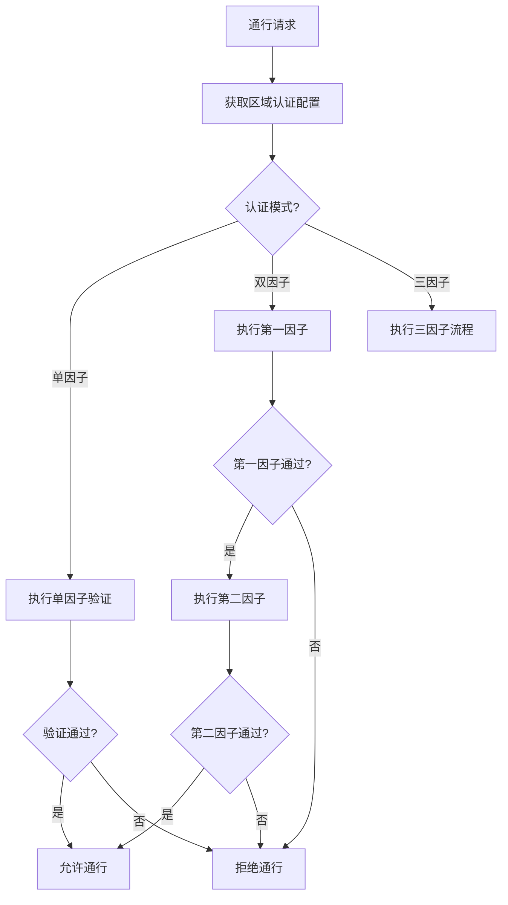
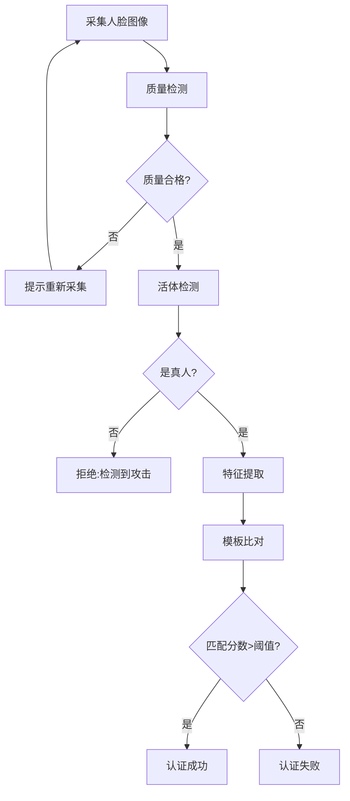
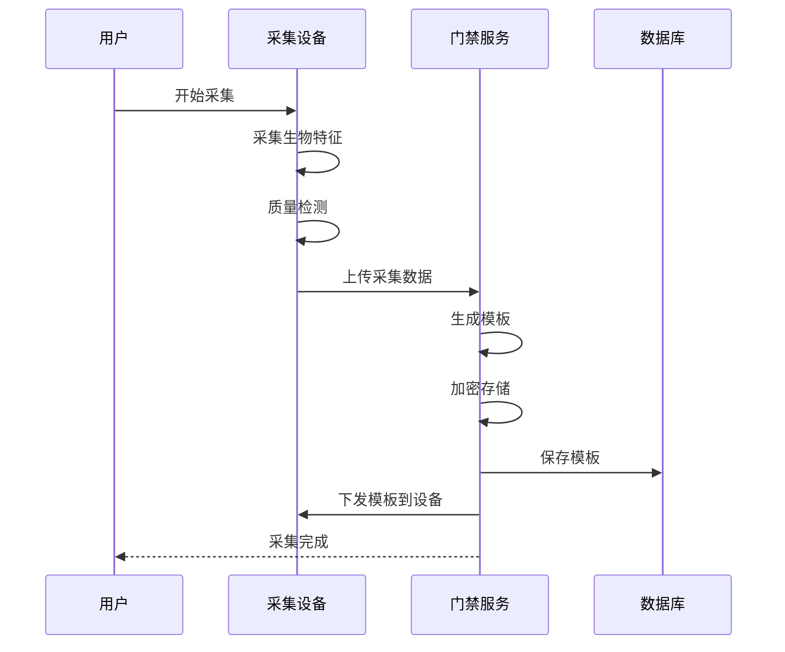

# 多因子认证管理 - 业务流程图

> **版本**: v1.0.0  
> **创建日期**: 2025-12-17

---

## 📊 多因子认证流程

```mermaid
flowchart TD
    A[通行请求] --> B[获取区域认证配置]
    B --> C{认证模式?}
    C -->|单因子| D[执行单因子验证]
    C -->|双因子| E[执行第一因子]
    C -->|三因子| F[执行三因子流程]
    
    D --> G{验证通过?}
    G -->|是| H[允许通行]
    G -->|否| I[拒绝通行]
    
    E --> J{第一因子通过?}
    J -->|是| K[执行第二因子]
    J -->|否| I
    K --> L{第二因子通过?}
    L -->|是| H
    L -->|否| I
```

---

## 📊 人脸识别流程

```mermaid
flowchart TD
    A[采集人脸图像] --> B[质量检测]
    B --> C{质量合格?}
    C -->|否| D[提示重新采集]
    D --> A
    C -->|是| E[活体检测]
    E --> F{是真人?}
    F -->|否| G[拒绝:检测到攻击]
    F -->|是| H[特征提取]
    H --> I[模板比对]
    I --> J{匹配分数>阈值?}
    J -->|是| K[认证成功]
    J -->|否| L[认证失败]
```

---

## 📊 模板采集流程

```mermaid
sequenceDiagram
    participant U as 用户
    participant D as 采集设备
    participant S as 门禁服务
    participant DB as 数据库
    
    U->>D: 开始采集
    D->>D: 采集生物特征
    D->>D: 质量检测
    D->>S: 上传采集数据
    S->>S: 生成模板
    S->>S: 加密存储
    S->>DB: 保存模板
    S->>D: 下发模板到设备
    S-->>U: 采集完成
```

---

**📝 文档维护**: IOE-DREAM架构团队 | 2025-12-17
