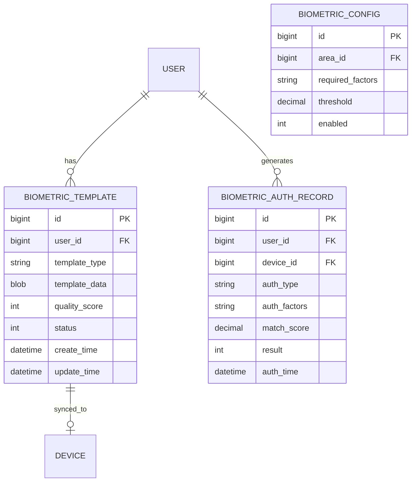

# 多因子认证管理 - 数据结构设计

> **版本**: v1.0.0  
> **创建日期**: 2025-12-17

---

## 📊 ER图

---

## 📋 表结构设计

### t_biometric_template (生物模板表)

| 字段 | 类型 | 约束 | 说明 |
|------|------|------|------|
| id | BIGINT | PK | 主键 |
| user_id | BIGINT | FK, NOT NULL | 用户ID |
| template_type | VARCHAR(20) | NOT NULL | 类型(FACE/FINGERPRINT) |
| template_data | BLOB | NOT NULL | 模板数据(加密) |
| quality_score | INT | - | 质量分数 |
| status | TINYINT | DEFAULT 1 | 状态 |
| create_time | DATETIME | NOT NULL | 创建时间 |
| update_time | DATETIME | NOT NULL | 更新时间 |

### t_biometric_auth_record (认证记录表)

| 字段 | 类型 | 约束 | 说明 |
|------|------|------|------|
| id | BIGINT | PK | 主键 |
| user_id | BIGINT | FK | 用户ID |
| device_id | BIGINT | FK, NOT NULL | 设备ID |
| auth_type | VARCHAR(30) | NOT NULL | 认证类型 |
| auth_factors | VARCHAR(100) | - | 使用的因子 |
| match_score | DECIMAL(5,2) | - | 匹配分数 |
| result | TINYINT | NOT NULL | 结果 |
| auth_time | DATETIME | NOT NULL | 认证时间 |

---

## 🔐 安全设计

- 模板数据AES-256加密存储
- 传输使用TLS加密
- 活体检测防伪

---

**📝 文档维护**: IOE-DREAM架构团队 | 2025-12-17
