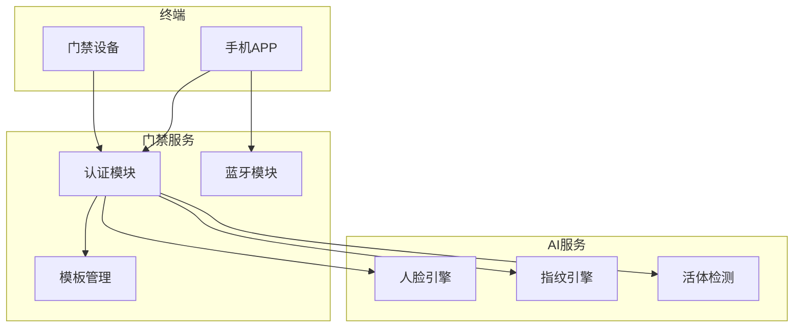

# 多因子认证管理 - 概要设计说明书

> **版本**: v1.0.0  
> **创建日期**: 2025-12-17

---

## 🏗️ 系统架构

---

## 📦 模块设计

| 模块 | 职责 | 关键类 |
|------|------|--------|
| 认证模块 | 执行各类认证 | BiometricAuthService |
| 模板管理 | 模板CRUD和同步 | BiometricTemplateManager |
| 蓝牙模块 | 蓝牙开门 | BluetoothAccessService |
| AI引擎 | 人脸/指纹识别 | FaceEngine, FingerprintEngine |

---

## 🔧 技术选型

| 技术 | 选型 | 理由 |
|------|------|------|
| 人脸算法 | 自研/商用SDK | 高准确率 |
| 指纹算法 | 设备内置 | 硬件加速 |
| 蓝牙协议 | BLE 5.0 | 低功耗远距离 |
| 加密算法 | AES-256 | 安全标准 |

---

**📝 文档维护**: IOE-DREAM架构团队 | 2025-12-17
