# IOE-DREAM 门禁管理模块 - 完整设计文档

> **版本**: v1.0.0  
> **创建日期**: 2025-12-17  
> **最后更新**: 2025-12-17  
> **模块负责人**: IOE-DREAM架构团队

---

## 📋 目录

- [模块概述](#模块概述)
- [文档结构](#文档结构)
- [核心功能模块](#核心功能模块)
- [系统架构](#系统架构)
- [技术规范](#技术规范)
- [性能指标](#性能指标)
- [安全设计](#安全设计)

---

## 📖 模块概述

门禁管理模块是IOE-DREAM智慧园区一卡通管理平台的核心业务模块之一，提供企业级的门禁权限控制和设备管理功能。基于ZKBioSecurity-ACC门禁系统设计规范，实现从设备管理到权限控制、实时监控的完整业务闭环。

### 核心业务价值

- **统一认证**: 集成人脸识别、指纹、IC卡、密码多模态验证
- **精细化权限**: 基于区域和时间的动态权限管理
- **实时监控**: 设备状态实时监控和异常告警
- **远程控制**: 支持远程开门和设备配置
- **审计追溯**: 完整的通行记录和操作日志
- **高级安全**: 全局反潜、联动、互锁等高级安全功能

---

## 📁 文档结构

```
03-门禁管理模块/
├── README.md                           # 本文件 - 模块总览
├── 00-门禁微服务总体设计文档.md         # 微服务总体架构设计
├── 01-门禁模块总体设计文档.md           # 业务总体设计
├── 02-门禁模块业务流程设计.md           # 业务流程详细设计
├── 03-门禁模块数据库设计文档.md         # 数据库ER图和表结构
├── 04-门禁模块前端API接口设计文档.md    # RESTful API设计
├── 05-门禁模块前端界面设计文档.md       # 前端界面和移动端设计
│
├── 01-门禁设备管理/                     # 子模块1：设备管理
│   ├── 功能说明.md                     # 功能需求说明
│   ├── 用户故事.md                     # 用户故事
│   ├── 数据结构设计.md                 # 数据库设计
│   └── 业务流程图.md                   # 业务流程图
│
├── 02-区域权限管理/                     # 子模块2：区域权限
│   ├── 功能说明.md                     # 功能需求说明
│   └── 数据结构设计.md                 # 数据库设计
│
├── 03-实时监控管理/                     # 子模块3：实时监控
│   └── README.md                       # 实时监控模块设计
│
├── 04-事件记录管理/                     # 子模块4：事件记录
│   └── README.md                       # 事件记录模块设计
│
├── 05-审批流程管理/                     # 子模块5：审批流程
│   └── README.md                       # 审批流程模块设计
│
├── 06-系统配置管理/                     # 子模块6：系统配置
│   └── README.md                       # 系统配置模块设计
│
├── 07-高级功能管理/                     # 子模块7：高级功能
│   └── README.md                       # 高级功能模块设计
│
└── 08-多因子认证管理/                   # 子模块8：多因子认证
    └── README.md                       # 多因子认证模块设计
```

---

## 🏗️ 核心功能模块

### 模块清单

| 模块编号 | 模块名称 | 功能描述 | 优先级 |
|---------|---------|---------|--------|
| 01 | 门禁设备管理 | 设备注册、配置、监控、远程控制 | P0 |
| 02 | 区域权限管理 | 区域空间管理和人员通行权限分配 | P0 |
| 03 | 实时监控管理 | 设备状态监控、报警处理、视频联动 | P1 |
| 04 | 事件记录管理 | 通行事件记录、异常事件、统计报表 | P0 |
| 05 | 审批流程管理 | 权限申请、访客预约、紧急权限处理 | P1 |
| 06 | 系统配置管理 | 系统参数、用户权限、许可证、备份恢复 | P2 |
| 07 | 高级功能管理 | 全局反潜、联动、互锁、疏散点、人数控制 | P1 |
| 08 | 多因子认证管理 | 人脸、指纹、掌纹、虹膜、声纹多模态认证 | P0 |

### 功能关系图

```mermaid
graph TB
    A[用户登录] --> B[系统主界面]
    B --> C[设备管理模块]
    B --> D[区域权限管理模块]
    B --> E[实时监控模块]
    B --> F[事件记录查询模块]
    B --> G[审批流程管理模块]
    B --> H[系统配置模块]
    B --> I[高级功能模块]

    C --> C1[设备管理]
    C --> C2[门管理]
    C --> C3[读头管理]
    C --> C4[I/O扩展板管理]

    D --> D1[区域创建]
    D --> D2[人员权限分配]
    D --> D3[设备分配]
    D --> D4[占用监控]

    E --> E1[实时状态监控]
    E --> E2[报警处理]
    E --> E3[视频联动]
    E --> E4[人员追踪]

    F --> F1[事件查询]
    F --> F2[异常事件处理]
    F --> F3[统计报表生成]

    G --> G1[权限申请]
    G --> G2[访客预约]
    G --> G3[紧急权限处理]
    G --> G4[审批流程配置]

    H --> H1[系统参数配置]
    H --> H2[用户权限管理]
    H --> H3[许可证管理]
    H --> H4[备份恢复]

    I --> I1[全局反潜]
    I --> I2[全局联动]
    I --> I3[全局互锁]
    I --> I4[疏散点管理]
    I --> I5[人数控制]
    I --> I6[人员限制]
```



---

## 🔧 系统架构

### IOE-DREAM七微服务架构

**核心架构组成**:
- **Gateway Service (8080)**: API网关
- **Common Service (8088)**: 公共模块微服务
- **DeviceComm Service (8087)**: 设备通讯微服务
- **Access Service (8090)**: 门禁服务
- **Attendance Service (8091)**: 考勤服务
- **Video Service (8092)**: 视频服务
- **Consume Service (8094)**: 消费服务
- **Visitor Service (8095)**: 访客服务

### 四层架构规范

```
Controller (接口控制层)
    ↓
Service (核心业务层)
    ↓
Manager (流程管理层)
    ↓
DAO (数据访问层)
```

**层级职责**:
- **Controller层**: HTTP请求处理、参数验证、权限控制
- **Service层**: 核心业务逻辑、事务管理、业务规则验证
- **Manager层**: 复杂流程编排、多数据组装、第三方服务集成
- **DAO层**: 数据库CRUD操作、SQL查询实现、数据访问边界

---

## 📐 技术规范

### 强制遵守的架构规则

- ✅ **必须使用 @Resource 注入依赖**
- ✅ **必须使用 @Mapper 注解** (禁止@Repository)
- ✅ **必须使用 Dao 后缀** (禁止Repository)
- ✅ **必须使用 @RestController 注解**
- ✅ **必须使用 @Valid 参数校验**
- ✅ **必须返回统一ResponseDTO格式**
- ✅ **必须遵循四层架构边界**

### 严格禁止事项

- ❌ **禁止使用 @Autowired 注入**
- ❌ **禁止使用 @Repository 注解**
- ❌ **禁止使用 Repository 后缀命名**
- ❌ **禁止跨层访问**
- ❌ **禁止在Controller中包含业务逻辑**
- ❌ **禁止直接访问数据库**

### 技术栈标准

- **数据库**: MySQL 8.0 + Druid连接池
- **缓存**: Redis + Caffeine多级缓存
- **注册中心**: Nacos
- **配置中心**: Nacos Config
- **认证授权**: Sa-Token

---

## ⚡ 性能指标

### 响应时间要求

| 操作类型 | 目标响应时间 |
|---------|-------------|
| 系统登录 | < 2秒 |
| 设备操作 | < 1秒 |
| 实时监控更新 | < 5秒 |
| 事件查询 | < 3秒 |
| 报警响应 | < 30秒 |

### 可用性要求

| 指标 | 目标值 |
|-----|-------|
| 系统整体可用性 | ≥ 99.9% |
| 核心功能可用性 | ≥ 99.99% |
| 设备连接成功率 | ≥ 99.5% |

### 并发处理能力

| 指标 | 目标值 |
|-----|-------|
| 同时在线用户 | ≥ 500个 |
| 并发设备管理 | ≥ 1000个 |
| 实时事件处理 | ≥ 10000条/秒 |

---

## 🛡️ 安全设计

### 安全等级

本系统满足**国家三级等保安全要求**，实现以下安全机制：

1. **多因子认证**: 人脸+指纹+卡片多模态认证
2. **活体检测**: 防止照片、视频、面具等欺骗攻击
3. **传输加密**: HTTPS + 接口加解密
4. **存储加密**: 敏感数据AES256加密存储
5. **访问控制**: 基于RBAC的细粒度权限控制
6. **审计日志**: 完整的操作日志和访问审计

### 反欺诈机制

- **连续失败锁定**: 连续3次失败临时锁定30分钟
- **高风险锁定**: 连续5次失败永久锁定
- **异常行为监控**: 实时监控异常认证行为
- **安全审计**: 完整的认证过程审计日志

---

## 📊 业务场景覆盖

门禁管理模块覆盖以下业务场景：

- 企业办公楼宇门禁管理
- 工厂厂区安全管控
- 学校校园安全管理
- 医院病区访问控制
- 政府机关安全保卫
- 数据中心权限管理

---

## 🔗 相关文档

### 上游依赖文档
- [IOE-DREAM全局架构规范](../../architecture/)
- [公共模块设计文档](../07-公共模块/)

### 下游关联文档
- [考勤管理模块](../03-考勤管理模块/)
- [访客管理模块](../05-访客管理模块/)
- [视频监控模块](../视频监控模块/)

---

**📝 文档维护**
- **创建人**: IOE-DREAM架构委员会
- **维护人**: 门禁微服务开发团队
- **最后更新**: 2025-12-17
- **版本**: v1.0.0
