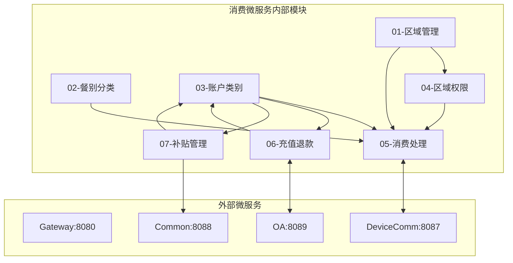
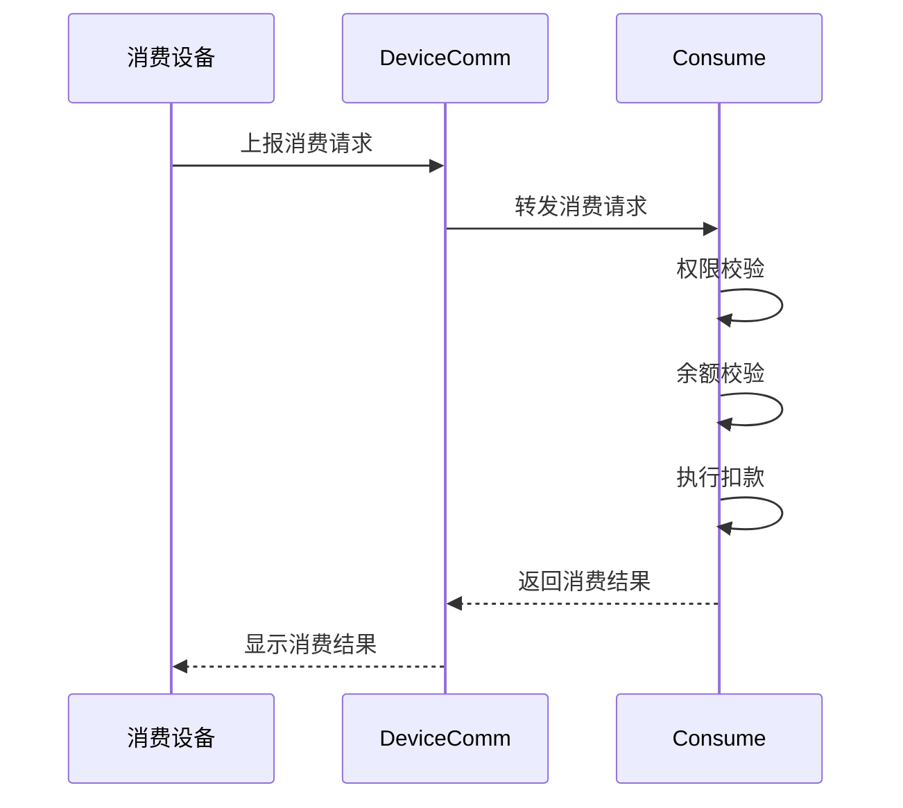
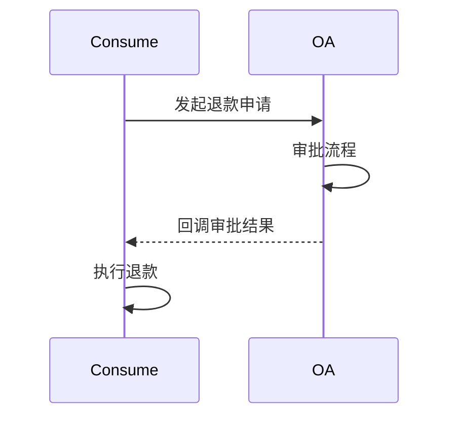
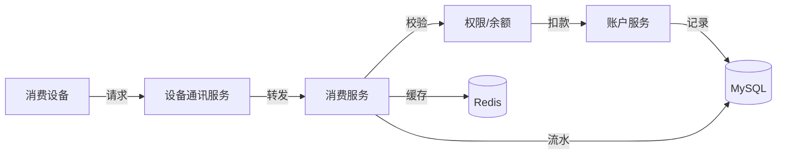

# 消费管理模块 - 模块间关联设计文档

> **版本**: v1.0.0  
> **微服务**: ioedream-consume-service (8094)  
> **创建日期**: 2025-12-17

---

## 📊 模块关联全景图



---

## 🔗 内部模块关联详细设计

### 1. 账户类别 ↔ 消费处理

| 关联点 | 说明 | 数据流向 |
|--------|------|----------|
| 余额查询 | 消费前查询账户余额 | ACCOUNT → CONSUME |
| 余额扣减 | 消费成功扣减余额 | CONSUME → ACCOUNT |
| 消费限额 | 按账户类型控制消费限额 | ACCOUNT → CONSUME |

**关键接口**:
```java
// AccountService.java
AccountBalanceVO getBalance(Long userId, String accountType);
void deductBalance(Long userId, BigDecimal amount, String consumeNo);

// ConsumeService.java
ConsumeResultVO processConsume(ConsumeRequestDTO request);
```

### 2. 区域权限 ↔ 消费处理

| 关联点 | 说明 | 数据流向 |
|--------|------|----------|
| 权限校验 | 消费前校验区域权限 | PERM → CONSUME |
| 餐别限制 | 按区域控制餐别 | PERM → CONSUME |

**关键接口**:
```java
// ConsumePermissionService.java
Boolean checkConsumePermission(Long userId, Long areaId, String mealType);
```

### 3. 充值退款 ↔ 账户类别

| 关联点 | 说明 | 数据流向 |
|--------|------|----------|
| 充值入账 | 充值成功增加余额 | RECHARGE → ACCOUNT |
| 退款扣减 | 退款成功扣减余额 | RECHARGE → ACCOUNT |
| 流水记录 | 记录账户变动流水 | RECHARGE → ACCOUNT |

**关键接口**:
```java
// RechargeService.java
RechargeResultVO recharge(RechargeForm form);
RefundResultVO refund(RefundForm form);

// AccountService.java
void addBalance(Long userId, BigDecimal amount, String tradeNo);
```

### 4. 补贴管理 ↔ 账户类别

| 关联点 | 说明 | 数据流向 |
|--------|------|----------|
| 补贴发放 | 补贴入账到指定账户 | SUBSIDY → ACCOUNT |
| 批量发放 | 按部门/人员批量发放 | SUBSIDY → ACCOUNT |

**关键接口**:
```java
// SubsidyService.java
void grantSubsidy(SubsidyGrantForm form);
void batchGrantSubsidy(BatchSubsidyForm form);
```

---

## 🌐 外部微服务关联设计

### 1. 消费服务 ↔ 设备通讯服务 (8087)



**关键API**:
```
POST /api/consume/v1/transaction/process  # 处理消费
POST /api/consume/v1/device/sync          # 同步设备配置
```

### 2. 消费服务 ↔ OA服务 (8089)



**关键API**:
```
POST /api/oa/v1/workflow/refund/apply  # 退款申请
POST /api/consume/v1/workflow/callback # 审批回调
```

---

## 📋 数据流转设计

### 消费数据流



---

## 🔧 接口契约规范

| 调用方 | 被调用方 | 接口 | 超时 | 重试 |
|--------|----------|------|------|------|
| CON | DC | processConsume | 3s | 0次 |
| CON | OA | startRefundWorkflow | 5s | 2次 |
| CMN | CON | grantSubsidy | 10s | 3次 |

---

**📝 文档维护**: IOE-DREAM架构团队 | 2025-12-17
