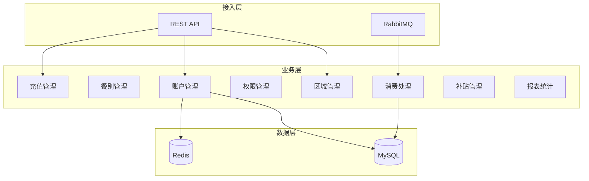
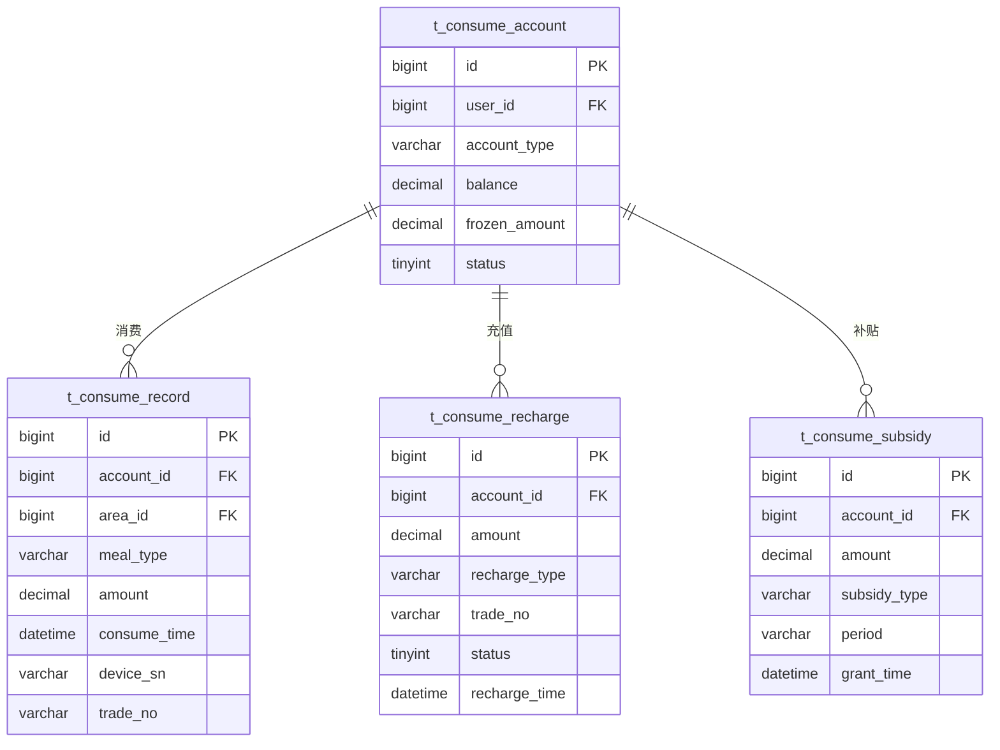

# 消费管理微服务 - 总体设计文档

> **版本**: v1.1.0 - 中心实时验证模式  
> **微服务**: ioedream-consume-service (8094)  
> **创建日期**: 2025-12-17  
> **设备交互模式**: 中心实时验证模式（Mode 2）

---

## 📋 模块概述

消费管理微服务负责企业内部消费场景的全流程管理，包括食堂就餐、便利店购物、自助售卖等消费场景的账户管理、交易处理和统计分析。

本文档是IOE-DREAM智慧消费管理微服务的总体设计文档，基于**中心实时验证模式**设计，确保消费微服务下每个子模块的完整性、系统性和一致性。

---

## ⭐ 中心实时验证模式（Mode 2）

### 核心理念

消费系统采用**中心实时验证模式**，设备端采集生物特征或卡片信息，服务器端实时验证和扣款。

### 设备交互流程

```
【数据下发】软件 → 设备
  ├─ 生物模板（可选，部分设备不需要）
  └─ 设备配置（消费单价、限额等）

【实时消费】设备 ⇄ 软件（必须在线）
  设备端采集 → 上传biometricData/cardNo → 服务器验证
  服务器处理 → 识别用户 → 检查余额 → 执行扣款
  服务器返回 → 扣款结果 → 设备显示+语音提示

【离线降级】设备端处理
  ⚠️ 网络故障时: 支持有限次数的离线消费
  ├─ 白名单验证: 仅允许白名单用户
  ├─ 固定额度: 单次消费固定金额
  └─ 事后补录: 网络恢复后上传补录
```

### 技术优势

- ✅ **数据安全**: 余额存储在服务器，防止篡改
- ✅ **实时补贴**: 可立即发放补贴到账户
- ✅ **灵活定价**: 可根据时段/菜品动态定价

### 架构要求

- ✅ 设备端采集生物特征或卡片信息
- ✅ 服务器端实时验证和扣款
- ✅ 支持离线降级模式（白名单+固定额度）
- ✅ 网络恢复后自动补录离线消费

---

## 🏗️ 系统架构



---

## 📁 代码结构

```
ioedream-consume-service/src/main/java/net/lab1024/sa/consume/
├── ConsumeApplication.java                 # 启动类
├── controller/                             # Controller层
│   ├── ConsumeAreaController.java         # 区域管理
│   ├── MealTypeController.java            # 餐别管理
│   ├── AccountController.java             # 账户管理
│   ├── ConsumePermissionController.java   # 权限管理
│   ├── ConsumeTransactionController.java  # 消费交易
│   ├── RechargeController.java            # 充值管理
│   ├── SubsidyController.java             # 补贴管理
│   └── ConsumeReportController.java       # 报表统计
├── service/                                # Service层
│   ├── ConsumeAreaService.java
│   ├── MealTypeService.java
│   ├── AccountService.java
│   ├── ConsumePermissionService.java
│   ├── ConsumeTransactionService.java
│   ├── RechargeService.java
│   ├── SubsidyService.java
│   └── ConsumeReportService.java
├── dao/                                    # DAO层
│   ├── ConsumeAreaDao.java
│   ├── AccountDao.java
│   ├── ConsumeRecordDao.java
│   └── SubsidyRecordDao.java
├── domain/                                 # 领域对象
│   ├── entity/
│   ├── form/
│   └── vo/
└── manager/                                # Manager层
    ├── AccountBalanceManager.java
    └── ConsumeStatisticsManager.java
```

---

## 🎯 核心功能模块

### 1. 区域管理
- 消费区域定义（食堂、便利店、自动售货机）
- 区域设备绑定
- 区域营业时间配置

### 2. 餐别分类
- 餐别定义（早餐、午餐、晚餐、夜宵）
- 餐别时间配置
- 餐别消费限额

### 3. 账户管理
- 员工账户
- 访客临时账户
- 账户类型（现金账户、补贴账户）
- 余额查询

### 4. 消费处理
- 实时消费扣款
- 消费记录
- 消费限额控制
- 消费撤销

### 5. 充值退款
- 现金充值
- 线上充值
- 退款申请
- 退款审批

### 6. 补贴管理
- 补贴方案配置
- 定时发放
- 手动发放
- 补贴查询

### 7. 报表统计
- 消费明细报表
- 充值统计报表
- 补贴发放报表
- 区域消费分析

---

## 📊 数据库设计

### 核心表结构

| 表名 | 说明 |
|------|------|
| t_consume_area | 消费区域表 |
| t_consume_meal_type | 餐别分类表 |
| t_consume_account | 消费账户表 |
| t_consume_account_type | 账户类型表 |
| t_consume_record | 消费记录表 |
| t_consume_recharge | 充值记录表 |
| t_consume_subsidy | 补贴记录表 |
| t_consume_permission | 消费权限表 |

### ER图



---

## 🔧 API接口设计

### 账户管理

| 方法 | 路径 | 说明 |
|------|------|------|
| GET | /api/consume/v1/account/balance | 查询余额 |
| GET | /api/consume/v1/account/detail | 账户详情 |
| POST | /api/consume/v1/account/freeze | 冻结账户 |

### 消费交易

| 方法 | 路径 | 说明 |
|------|------|------|
| POST | /api/consume/v1/transaction/process | 消费扣款 |
| POST | /api/consume/v1/transaction/cancel | 消费撤销 |
| GET | /api/consume/v1/transaction/records | 消费记录 |

### 充值管理

| 方法 | 路径 | 说明 |
|------|------|------|
| POST | /api/consume/v1/recharge/cash | 现金充值 |
| POST | /api/consume/v1/recharge/online | 线上充值 |
| POST | /api/consume/v1/refund/apply | 退款申请 |

### 补贴管理

| 方法 | 路径 | 说明 |
|------|------|------|
| POST | /api/consume/v1/subsidy/grant | 发放补贴 |
| POST | /api/consume/v1/subsidy/batch | 批量发放 |
| GET | /api/consume/v1/subsidy/records | 补贴记录 |

---

## 📈 性能指标

| 指标项 | 要求 |
|--------|------|
| 消费扣款延迟 | ≤ 500ms |
| 余额查询延迟 | ≤ 100ms |
| 并发消费支持 | ≥ 500次/秒 |
| 批量补贴发放 | ≥ 10000人/分钟 |
| 数据保存周期 | ≥ 5年 |

---

## 🔐 安全要求

- 账户余额操作需要事务保证
- 消费记录不可篡改
- 敏感操作需要审计日志
- 支持幂等性设计防止重复扣款

---

**📝 文档维护**: IOE-DREAM架构团队 | 2025-12-17
