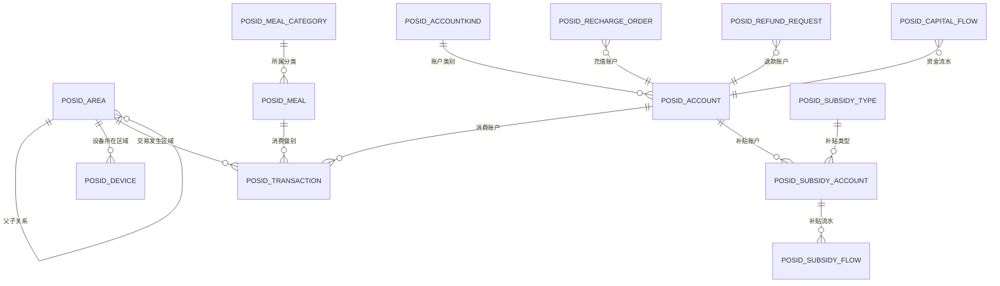

# 消费管理模块 - 数据库设计

> **版本**: v2.0.0  
> **更新日期**: 2025-12-17

---

## 1. 整体ER图



---

## 2. 核心表结构

### 2.1 区域表 (POSID_AREA)

```sql
CREATE TABLE POSID_AREA (
    id VARCHAR(50) PRIMARY KEY COMMENT '区域ID',
    code VARCHAR(50) NOT NULL UNIQUE COMMENT '区域编号',
    name VARCHAR(100) NOT NULL COMMENT '区域名称',
    parent_id VARCHAR(50) COMMENT '父区域ID',
    level INT DEFAULT 1 COMMENT '层级(1-园区 2-楼栋 3-楼层 4-区域)',
    type INT DEFAULT 1 COMMENT '类型(1-餐饮 2-商店 3-办公 4-医疗)',
    
    -- 核心业务属性
    area_sub_type INT COMMENT '区域细分类型',
    manage_mode INT COMMENT '经营模式(1-餐别制 2-超市制 3-混合)',
    fixed_value_config TEXT COMMENT '定值配置JSON',
    
    -- 餐厅属性
    order_meal_mode INT COMMENT '订餐模式',
    order_payment_type INT COMMENT '订餐付费类型',
    inventory_flag BOOLEAN DEFAULT FALSE COMMENT '是否启用进销存',
    meal_categories TEXT COMMENT '可用餐别分类JSON',
    business_hours TEXT COMMENT '营业时间JSON',
    
    -- 通用字段
    available BOOLEAN DEFAULT TRUE COMMENT '是否启用',
    sort_order INT DEFAULT 0 COMMENT '排序',
    create_time DATETIME NOT NULL DEFAULT CURRENT_TIMESTAMP,
    update_time DATETIME DEFAULT CURRENT_TIMESTAMP ON UPDATE CURRENT_TIMESTAMP,
    
    INDEX idx_parent(parent_id),
    INDEX idx_type(type, available),
    INDEX idx_level(level)
) ENGINE=InnoDB DEFAULT CHARSET=utf8mb4 COMMENT='统一区域管理表';
```

### 2.2 餐别分类表 (POSID_MEAL_CATEGORY)

```sql
CREATE TABLE POSID_MEAL_CATEGORY (
    id VARCHAR(50) PRIMARY KEY COMMENT '分类ID',
    code VARCHAR(50) NOT NULL UNIQUE COMMENT '分类编号',
    name VARCHAR(100) NOT NULL COMMENT '分类名称',
    area_id VARCHAR(50) COMMENT '关联区域ID',
    sort_order INT DEFAULT 0 COMMENT '排序',
    description VARCHAR(255) COMMENT '描述',
    available BOOLEAN DEFAULT TRUE COMMENT '是否启用',
    create_time DATETIME NOT NULL DEFAULT CURRENT_TIMESTAMP,
    update_time DATETIME DEFAULT CURRENT_TIMESTAMP ON UPDATE CURRENT_TIMESTAMP,
    
    INDEX idx_code(code),
    INDEX idx_area(area_id)
) ENGINE=InnoDB DEFAULT CHARSET=utf8mb4 COMMENT='餐别分类表';
```

### 2.3 餐别表 (POSID_MEAL)

```sql
CREATE TABLE POSID_MEAL (
    id VARCHAR(50) PRIMARY KEY COMMENT '餐别ID',
    code VARCHAR(50) NOT NULL UNIQUE COMMENT '餐别编号',
    name VARCHAR(100) NOT NULL COMMENT '餐别名称',
    category_id VARCHAR(50) COMMENT '所属分类ID',
    start_time VARCHAR(10) COMMENT '开始时间',
    end_time VARCHAR(10) COMMENT '结束时间',
    base_price INT COMMENT '基础价格(分)',
    price_rules TEXT COMMENT '价格规则JSON',
    sort_order INT DEFAULT 0 COMMENT '排序',
    available BOOLEAN DEFAULT TRUE COMMENT '是否启用',
    create_time DATETIME NOT NULL DEFAULT CURRENT_TIMESTAMP,
    update_time DATETIME DEFAULT CURRENT_TIMESTAMP ON UPDATE CURRENT_TIMESTAMP,
    
    INDEX idx_category(category_id, available)
) ENGINE=InnoDB DEFAULT CHARSET=utf8mb4 COMMENT='餐别表';
```

### 2.4 账户类别表 (POSID_ACCOUNTKIND)

```sql
CREATE TABLE POSID_ACCOUNTKIND (
    id VARCHAR(50) PRIMARY KEY COMMENT '账户类别ID',
    code VARCHAR(50) NOT NULL UNIQUE COMMENT '类别编号',
    name VARCHAR(100) NOT NULL COMMENT '类别名称',
    
    -- 消费模式配置
    mode_config JSON COMMENT '各模式参数配置',
    area_config JSON COMMENT '区域权限配置',
    
    -- 折扣配置
    discount_type INT COMMENT '折扣类型',
    discount INT COMMENT '折扣值',
    
    -- 限额配置
    date_max_money INT COMMENT '每日限额(分)',
    date_max_count INT COMMENT '每日限次',
    month_max_money INT COMMENT '每月限额(分)',
    month_max_count INT COMMENT '每月限次',
    
    -- 业务配置
    order_meal BOOLEAN DEFAULT FALSE COMMENT '必须订餐',
    is_attendance_consume BOOLEAN DEFAULT FALSE COMMENT '考勤消费',
    
    -- 通用字段
    available BOOLEAN DEFAULT TRUE COMMENT '是否启用',
    create_time DATETIME NOT NULL DEFAULT CURRENT_TIMESTAMP,
    update_time DATETIME DEFAULT CURRENT_TIMESTAMP ON UPDATE CURRENT_TIMESTAMP,
    
    INDEX idx_code(code)
) ENGINE=InnoDB DEFAULT CHARSET=utf8mb4 COMMENT='账户类别表';
```

### 2.5 账户表 (POSID_ACCOUNT)

```sql
CREATE TABLE POSID_ACCOUNT (
    id VARCHAR(50) PRIMARY KEY COMMENT '账户ID',
    account_no VARCHAR(50) NOT NULL UNIQUE COMMENT '账户号',
    person_id VARCHAR(50) NOT NULL COMMENT '人员ID',
    account_kind_id VARCHAR(50) NOT NULL COMMENT '账户类别ID',
    
    -- 余额信息(分)
    balance INT DEFAULT 0 COMMENT '现金余额',
    frozen_balance INT DEFAULT 0 COMMENT '冻结余额',
    
    -- 状态信息
    status INT DEFAULT 1 COMMENT '状态(1-正常 2-挂失 3-冻结)',
    version INT DEFAULT 0 COMMENT '乐观锁版本',
    
    -- 通用字段
    create_time DATETIME NOT NULL DEFAULT CURRENT_TIMESTAMP,
    update_time DATETIME DEFAULT CURRENT_TIMESTAMP ON UPDATE CURRENT_TIMESTAMP,
    
    INDEX idx_person(person_id),
    INDEX idx_kind(account_kind_id)
) ENGINE=InnoDB DEFAULT CHARSET=utf8mb4 COMMENT='账户表';
```

### 2.6 交易表 (POSID_TRANSACTION)

```sql
CREATE TABLE POSID_TRANSACTION (
    id VARCHAR(50) PRIMARY KEY,
    transaction_no VARCHAR(32) UNIQUE COMMENT '交易流水号',
    
    -- 人员信息
    person_id VARCHAR(50) NOT NULL,
    person_name VARCHAR(100),
    dept_id VARCHAR(50),
    
    -- 账户信息
    account_id VARCHAR(50) NOT NULL,
    account_kind_id VARCHAR(50),
    is_attendance_consume BOOLEAN DEFAULT FALSE COMMENT '是否考勤消费',
    
    -- 区域信息
    area_id VARCHAR(50) NOT NULL,
    area_name VARCHAR(100),
    area_manage_mode INT COMMENT '区域经营模式',
    
    -- 餐别信息
    meal_id VARCHAR(50),
    meal_category_id VARCHAR(50),
    meal_name VARCHAR(100),
    
    -- 设备信息
    device_id VARCHAR(50),
    device_name VARCHAR(100),
    
    -- 消费金额(分)
    consume_money INT NOT NULL COMMENT '消费金额',
    discount_money INT DEFAULT 0 COMMENT '折扣金额',
    final_money INT NOT NULL COMMENT '实际支付金额',
    
    -- 账户余额变化
    balance_before INT COMMENT '消费前余额',
    balance_after INT COMMENT '消费后余额',
    allowance_used INT DEFAULT 0 COMMENT '使用补贴金额',
    cash_used INT DEFAULT 0 COMMENT '使用现金金额',
    
    -- 消费模式
    consume_mode VARCHAR(20) NOT NULL COMMENT '消费模式',
    consume_type VARCHAR(20) COMMENT '消费类型',
    
    -- 时间信息
    consume_time DATETIME NOT NULL COMMENT '消费时间',
    create_time DATETIME NOT NULL DEFAULT CURRENT_TIMESTAMP,
    
    -- 状态
    status VARCHAR(20) DEFAULT 'SUCCESS',
    
    INDEX idx_account(account_id, consume_time),
    INDEX idx_person(person_id, consume_time),
    INDEX idx_area(area_id, consume_time),
    INDEX idx_time(consume_time)
) ENGINE=InnoDB DEFAULT CHARSET=utf8mb4 COMMENT='消费交易表'
PARTITION BY RANGE (TO_DAYS(consume_time)) (
    PARTITION p202501 VALUES LESS THAN (TO_DAYS('2025-02-01'))
);
```

### 2.7 充值订单表 (POSID_RECHARGE_ORDER)

```sql
CREATE TABLE POSID_RECHARGE_ORDER (
    id VARCHAR(50) PRIMARY KEY,
    order_no VARCHAR(32) UNIQUE COMMENT '充值订单号',
    
    -- 账户信息
    account_id VARCHAR(50) NOT NULL,
    person_id VARCHAR(50),
    person_name VARCHAR(100),
    
    -- 充值金额(分)
    recharge_money INT NOT NULL COMMENT '充值金额',
    gift_money INT DEFAULT 0 COMMENT '赠送金额',
    actual_money INT NOT NULL COMMENT '实际到账金额',
    
    -- 支付信息
    payment_type VARCHAR(20) NOT NULL COMMENT '支付类型',
    payment_channel VARCHAR(50) COMMENT '支付渠道订单号',
    payment_time DATETIME COMMENT '支付时间',
    
    -- 订单状态
    status VARCHAR(20) NOT NULL COMMENT '状态',
    
    -- 时间信息
    create_time DATETIME NOT NULL DEFAULT CURRENT_TIMESTAMP,
    update_time DATETIME,
    
    INDEX idx_account(account_id, create_time),
    INDEX idx_status(status, create_time)
) ENGINE=InnoDB DEFAULT CHARSET=utf8mb4 COMMENT='充值订单表';
```

### 2.8 补贴类型表 (POSID_SUBSIDY_TYPE)

```sql
CREATE TABLE POSID_SUBSIDY_TYPE (
    id VARCHAR(50) PRIMARY KEY COMMENT '补贴类型ID',
    code VARCHAR(50) NOT NULL UNIQUE COMMENT '类型编码',
    name VARCHAR(100) NOT NULL COMMENT '类型名称',
    priority INT DEFAULT 10 COMMENT '使用优先级',
    clear_strategy VARCHAR(20) COMMENT '清零策略',
    validity_days INT COMMENT '有效期天数',
    allow_transfer BOOLEAN DEFAULT FALSE COMMENT '允许转换',
    allow_refund BOOLEAN DEFAULT FALSE COMMENT '允许退回',
    use_scope JSON COMMENT '使用范围',
    available BOOLEAN DEFAULT TRUE COMMENT '是否启用',
    create_time DATETIME NOT NULL DEFAULT CURRENT_TIMESTAMP,
    update_time DATETIME DEFAULT CURRENT_TIMESTAMP ON UPDATE CURRENT_TIMESTAMP,
    
    INDEX idx_code(code)
) ENGINE=InnoDB DEFAULT CHARSET=utf8mb4 COMMENT='补贴类型表';
```

### 2.9 补贴账户表 (POSID_SUBSIDY_ACCOUNT)

```sql
CREATE TABLE POSID_SUBSIDY_ACCOUNT (
    id VARCHAR(50) PRIMARY KEY COMMENT '补贴账户ID',
    account_id VARCHAR(50) NOT NULL COMMENT '关联账户',
    subsidy_type_id VARCHAR(50) NOT NULL COMMENT '补贴类型',
    balance INT DEFAULT 0 COMMENT '补贴余额(分)',
    expire_date DATE COMMENT '过期日期',
    status VARCHAR(20) DEFAULT 'ACTIVE' COMMENT '状态',
    create_time DATETIME NOT NULL DEFAULT CURRENT_TIMESTAMP,
    update_time DATETIME DEFAULT CURRENT_TIMESTAMP ON UPDATE CURRENT_TIMESTAMP,
    
    INDEX idx_account(account_id),
    INDEX idx_type(subsidy_type_id),
    INDEX idx_expire(expire_date)
) ENGINE=InnoDB DEFAULT CHARSET=utf8mb4 COMMENT='补贴账户表';
```

---

## 3. JSON配置结构

### 3.1 fixed_value_config (区域定值配置)

```json
{
  "breakfast": {"amount": 5.00, "unit": "元"},
  "lunch": {"amount": 12.00, "unit": "元"},
  "dinner": {"amount": 10.00, "unit": "元"},
  "supper": {"amount": 8.00, "unit": "元"}
}
```

### 3.2 mode_config (账户类别消费模式配置)

```json
{
  "FIXED_AMOUNT": {
    "enabled": true,
    "subType": "SECTION",
    "values": [
      {"key": "breakfast", "amount": 8.00, "time": "06:00-09:00"},
      {"key": "lunch", "amount": 15.00, "time": "11:00-13:30"}
    ]
  },
  "FREE_AMOUNT": {
    "enabled": true,
    "minAmount": 1,
    "maxAmount": 100000
  },
  "PRODUCT": {
    "enabled": true,
    "maxItemsPerTransaction": 50
  }
}
```

### 3.3 area_config (账户类别区域权限配置)

```json
[
  {
    "areaId": "main_campus",
    "includeSubAreas": true
  },
  {
    "areaId": "canteen_1",
    "includeSubAreas": false
  }
]
```

---

## 4. 索引设计

### 4.1 核心索引

| 表名 | 索引名 | 字段 | 说明 |
|------|--------|------|------|
| POSID_AREA | idx_parent | parent_id | 父区域查询 |
| POSID_TRANSACTION | idx_account | account_id, consume_time | 账户消费查询 |
| POSID_TRANSACTION | idx_time | consume_time | 时间范围查询 |
| POSID_ACCOUNT | idx_person | person_id | 人员账户查询 |

### 4.2 分表策略

| 表名 | 分表策略 | 分表键 |
|------|----------|--------|
| POSID_TRANSACTION | 按月分表 | consume_time |
| POSID_RECHARGE_ORDER | 按月分表 | create_time |
| POSID_CAPITAL_FLOW | 按月分表 | create_time |

---

*本文档持续更新中*

