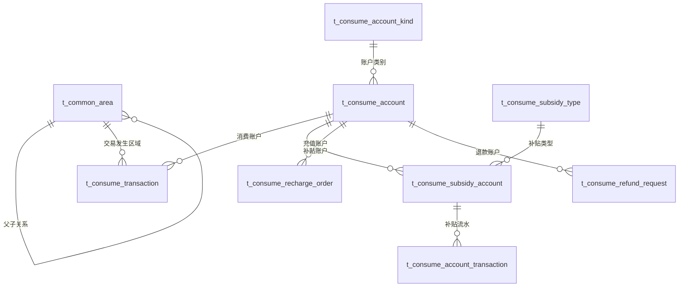

# 消费管理模块 - 数据库设计

> **版本**: v3.0.0
> **更新日期**: 2025-12-26
> **重大变更**: Entity统一管理与表名标准化

---

## 📋 变更说明

### v3.0.0重大更新
- ✅ **Entity统一管理**: 所有Entity迁移至`microservices-common-entity`模块
- ✅ **表名标准化**: 遗留`POSID_*`前缀统一改为`t_consume_*`
- ✅ **数据迁移脚本**: 创建V3.0.0迁移脚本支持平滑迁移
- ✅ **区域管理统一**: `POSID_AREA`改为公共模块`t_common_area`

### Entity映射关系
```
旧系统(POSID_*)              →  新系统(t_consume_*)
--------------------------    ------------------------
POSID_ACCOUNTKIND          →  t_consume_account_kind
POSID_SUBSIDY_TYPE         →  t_consume_subsidy_type
POSID_SUBSIDY_ACCOUNT       →  t_consume_subsidy_account
POSID_ACCOUNT              →  t_consume_account
POSID_TRANSACTION          →  t_consume_transaction
POSID_AREA                 →  t_common_area (公共模块)
```

---

## 1. 整体ER图



**关键设计说明**:
- ✅ 所有Entity统一管理在`microservices-common-entity`模块
- ✅ 区域使用公共模块`t_common_area`表
- ✅ 支持多补贴账户体系
- ✅ 交易记录分区存储

---

## 2. 核心表结构

### 2.1 区域表 (t_common_area)

> **说明**: 使用公共模块统一区域管理

| 字段名 | 类型 | 说明 |
|--------|------|------|
| area_id | BIGINT | 区域ID（主键） |
| area_code | VARCHAR(50) | 区域编码 |
| area_name | VARCHAR(100) | 区域名称 |
| parent_id | BIGINT | 父区域ID |
| level | INT | 层级 |
| area_type | VARCHAR(20) | 类型 |
| manage_mode | INT | 经营模式(1-餐别制 2-超市制 3-混合) |
| area_config | TEXT | 区域配置JSON |
| enabled | TINYINT | 是否启用 |
| sort_order | INT | 排序 |

**文档参考**: 见公共模块区域管理文档

---

### 2.2 账户类别表 (t_consume_account_kind)

> **说明**: 替代原POSID_ACCOUNTKIND表

```sql
CREATE TABLE t_consume_account_kind (
    kind_id BIGINT AUTO_INCREMENT PRIMARY KEY COMMENT '类别ID',
    kind_code VARCHAR(50) NOT NULL UNIQUE COMMENT '类别编码',
    kind_name VARCHAR(100) NOT NULL COMMENT '类别名称',
    kind_type INT DEFAULT 1 COMMENT '类别类型(1-员工 2-访客 3-临时)',

    -- 消费模式配置
    consume_mode VARCHAR(50) DEFAULT 'FIXED_AMOUNT' COMMENT '消费模式',
    mode_config TEXT COMMENT '模式配置JSON',

    -- 折扣配置
    discount_type INT DEFAULT 0 COMMENT '折扣类型(0-无折扣 1-固定折扣 2-阶梯折扣)',
    discount_value DECIMAL(10,2) COMMENT '折扣值',

    -- 限额配置
    date_max_money DECIMAL(10,2) COMMENT '每日最大消费金额',
    date_max_count INT COMMENT '每日最大消费次数',
    month_max_money DECIMAL(10,2) COMMENT '每月最大消费金额',
    month_max_count INT COMMENT '每月最大消费次数',

    -- 其他配置
    priority INT DEFAULT 0 COMMENT '优先级',
    enabled INT DEFAULT 1 COMMENT '是否启用(0-禁用 1-启用)',
    sort_order INT DEFAULT 0 COMMENT '排序',
    remark VARCHAR(500) COMMENT '备注',

    -- 审计字段
    create_time DATETIME NOT NULL DEFAULT CURRENT_TIMESTAMP COMMENT '创建时间',
    update_time DATETIME NOT NULL DEFAULT CURRENT_TIMESTAMP ON UPDATE CURRENT_TIMESTAMP COMMENT '更新时间',
    create_user_id BIGINT COMMENT '创建人ID',
    update_user_id BIGINT COMMENT '更新人ID',
    deleted_flag TINYINT DEFAULT 0 COMMENT '删除标记',

    INDEX idx_kind_code(kind_code),
    INDEX idx_enabled(enabled),
    INDEX idx_kind_type(kind_type)
) ENGINE=InnoDB DEFAULT CHARSET=utf8mb4 COLLATE=utf8mb4_unicode_ci COMMENT='消费账户类别表';
```

**Entity映射**: `ConsumeAccountKindEntity`

---

### 2.3 补贴类型表 (t_consume_subsidy_type)

> **说明**: 替代原POSID_SUBSIDY_TYPE表

```sql
CREATE TABLE t_consume_subsidy_type (
    subsidy_type_id BIGINT AUTO_INCREMENT PRIMARY KEY COMMENT '补贴类型ID',
    type_code VARCHAR(50) NOT NULL UNIQUE COMMENT '类型编码',
    type_name VARCHAR(100) NOT NULL COMMENT '类型名称',
    description VARCHAR(500) COMMENT '描述',
    priority INT DEFAULT 0 COMMENT '优先级',
    accumulative INT DEFAULT 0 COMMENT '是否可累计(0-不可累计 1-可累计)',
    transferable INT DEFAULT 0 COMMENT '是否可转让(0-不可转让 1-可转让)',
    enabled INT DEFAULT 1 COMMENT '是否启用(0-禁用 1-启用)',
    sort_order INT DEFAULT 0 COMMENT '排序',
    remark VARCHAR(500) COMMENT '备注',

    -- 审计字段
    create_time DATETIME NOT NULL DEFAULT CURRENT_TIMESTAMP COMMENT '创建时间',
    update_time DATETIME NOT NULL DEFAULT CURRENT_TIMESTAMP ON UPDATE CURRENT_TIMESTAMP COMMENT '更新时间',
    create_user_id BIGINT COMMENT '创建人ID',
    update_user_id BIGINT COMMENT '更新人ID',
    deleted_flag TINYINT DEFAULT 0 COMMENT '删除标记',

    INDEX idx_type_code(type_code),
    INDEX idx_enabled(enabled),
    INDEX idx_priority(priority)
) ENGINE=InnoDB DEFAULT CHARSET=utf8mb4 COLLATE=utf8mb4_unicode_ci COMMENT='消费补贴类型表';
```

**Entity映射**: `ConsumeSubsidyTypeEntity`

**类型编码示例**:
- `MEAL` - 餐饮补贴
- `TRAFFIC` - 交通补贴
- `COMMUNICATION` - 通讯补贴

---

### 2.4 补贴账户表 (t_consume_subsidy_account)

> **说明**: 替代原POSID_SUBSIDY_ACCOUNT表，支持多补贴账户

```sql
CREATE TABLE t_consume_subsidy_account (
    subsidy_account_id BIGINT AUTO_INCREMENT PRIMARY KEY COMMENT '补贴账户ID',
    user_id BIGINT NOT NULL COMMENT '用户ID',
    subsidy_type_id BIGINT NOT NULL COMMENT '补贴类型ID',
    account_code VARCHAR(50) NOT NULL COMMENT '账户编码',
    account_name VARCHAR(100) COMMENT '账户名称',

    -- 余额信息
    balance DECIMAL(10,2) DEFAULT 0.00 COMMENT '补贴余额',
    frozen_amount DECIMAL(10,2) DEFAULT 0.00 COMMENT '冻结金额',
    initial_amount DECIMAL(10,2) DEFAULT 0.00 COMMENT '初始金额',

    -- 统计信息
    total_granted DECIMAL(10,2) DEFAULT 0.00 COMMENT '累计发放金额',
    total_used DECIMAL(10,2) DEFAULT 0.00 COMMENT '累计使用金额',

    -- 时间信息
    expire_time DATETIME COMMENT '过期时间',
    grant_time DATETIME COMMENT '发放时间',
    clear_time DATETIME COMMENT '清零时间',

    -- 状态信息
    account_status INT DEFAULT 1 COMMENT '账户状态(1-正常 2-冻结 3-已过期 4-已清零)',
    account_status_desc VARCHAR(50) COMMENT '账户状态描述',

    -- 发放信息
    grant_batch_no VARCHAR(50) COMMENT '发放批次号',
    grant_user_id BIGINT COMMENT '发放人ID',
    grant_user_name VARCHAR(100) COMMENT '发放人姓名',

    remark VARCHAR(500) COMMENT '备注',

    -- 审计字段
    create_time DATETIME NOT NULL DEFAULT CURRENT_TIMESTAMP COMMENT '创建时间',
    update_time DATETIME NOT NULL DEFAULT CURRENT_TIMESTAMP ON UPDATE CURRENT_TIMESTAMP COMMENT '更新时间',
    create_user_id BIGINT COMMENT '创建人ID',
    update_user_id BIGINT COMMENT '更新人ID',
    deleted_flag TINYINT DEFAULT 0 COMMENT '删除标记',

    UNIQUE KEY uk_account_code (account_code, deleted_flag),
    INDEX idx_user_id (user_id),
    INDEX idx_subsidy_type_id (subsidy_type_id),
    INDEX idx_account_status (account_status),
    INDEX idx_expire_time (expire_time)
) ENGINE=InnoDB DEFAULT CHARSET=utf8mb4 COLLATE=utf8mb4_unicode_ci COMMENT='消费补贴账户表';
```

**Entity映射**: `ConsumeSubsidyAccountEntity`

**业务规则**:
- 优先扣款即将过期的补贴
- 同过期日期优先扣款金额较小的补贴
- 补贴不足时扣款现金账户

---

### 2.5 消费账户表 (t_consume_account)

> **说明**: 替代原POSID_ACCOUNT表

```sql
CREATE TABLE t_consume_account (
    account_id BIGINT AUTO_INCREMENT PRIMARY KEY COMMENT '账户ID',
    user_id BIGINT NOT NULL COMMENT '用户ID',
    account_code VARCHAR(50) NOT NULL UNIQUE COMMENT '账户编码',
    kind_id BIGINT COMMENT '账户类别ID',

    -- 余额信息
    balance DECIMAL(10,2) DEFAULT 0.00 COMMENT '现金余额',
    frozen_balance DECIMAL(10,2) DEFAULT 0.00 COMMENT '冻结余额',
    initial_amount DECIMAL(10,2) DEFAULT 0.00 COMMENT '初始金额',

    -- 统计信息
    total_recharged DECIMAL(10,2) DEFAULT 0.00 COMMENT '累计充值金额',
    total_consumed DECIMAL(10,2) DEFAULT 0.00 COMMENT '累计消费金额',
    total_refunded DECIMAL(10,2) DEFAULT 0.00 COMMENT '累计退款金额',

    -- 状态信息
    account_status INT DEFAULT 1 COMMENT '账户状态(1-正常 2-挂失 3-冻结)',
    status_desc VARCHAR(50) COMMENT '状态描述',

    -- 安全信息
    pin_code VARCHAR(6) COMMENT '支付密码',
    version INT DEFAULT 0 COMMENT '乐观锁版本号',

    -- 审计字段
    create_time DATETIME NOT NULL DEFAULT CURRENT_TIMESTAMP COMMENT '创建时间',
    update_time DATETIME NOT NULL DEFAULT CURRENT_TIMESTAMP ON UPDATE CURRENT_TIMESTAMP COMMENT '更新时间',
    create_user_id BIGINT COMMENT '创建人ID',
    update_user_id BIGINT COMMENT '更新人ID',
    deleted_flag TINYINT DEFAULT 0 COMMENT '删除标记',

    INDEX idx_user_id (user_id),
    INDEX idx_kind_id (kind_id),
    INDEX idx_account_status (account_status),
    INDEX idx_account_code (account_code)
) ENGINE=InnoDB DEFAULT CHARSET=utf8mb4 COLLATE=utf8mb4_unicode_ci COMMENT='消费账户表';
```

**Entity映射**: `ConsumeAccountEntity`

---

### 2.6 消费交易表 (t_consume_transaction)

> **说明**: 替代原POSID_TRANSACTION表

```sql
CREATE TABLE t_consume_transaction (
    transaction_id BIGINT AUTO_INCREMENT PRIMARY KEY COMMENT '交易ID',
    transaction_no VARCHAR(32) NOT NULL UNIQUE COMMENT '交易流水号',
    order_no VARCHAR(32) COMMENT '关联订单号',

    -- 用户信息
    user_id BIGINT NOT NULL COMMENT '用户ID',
    user_name VARCHAR(100) COMMENT '用户姓名',
    account_id BIGINT NOT NULL COMMENT '账户ID',

    -- 区域信息
    area_id BIGINT NOT NULL COMMENT '区域ID',
    area_name VARCHAR(100) COMMENT '区域名称',
    manage_mode INT COMMENT '经营模式',

    -- 餐别信息
    meal_type VARCHAR(50) COMMENT '餐别类型',
    meal_name VARCHAR(100) COMMENT '餐别名称',

    -- 设备信息
    device_id VARCHAR(50) COMMENT '设备ID',
    device_name VARCHAR(100) COMMENT '设备名称',

    -- 金额信息
    total_amount DECIMAL(10,2) NOT NULL COMMENT '消费总额',
    discount_amount DECIMAL(10,2) DEFAULT 0.00 COMMENT '折扣金额',
    subsidy_amount DECIMAL(10,2) DEFAULT 0.00 COMMENT '补贴扣款',
    cash_amount DECIMAL(10,2) DEFAULT 0.00 COMMENT '现金扣款',
    final_amount DECIMAL(10,2) NOT NULL COMMENT '实际支付金额',

    -- 余额快照
    balance_before DECIMAL(10,2) COMMENT '消费前余额',
    balance_after DECIMAL(10,2) COMMENT '消费后余额',

    -- 消费模式
    consume_mode VARCHAR(20) NOT NULL COMMENT '消费模式',
    consume_type VARCHAR(20) COMMENT '消费类型',

    -- 交易状态
    transaction_status INT DEFAULT 1 COMMENT '交易状态(1-成功 2-失败 3-处理中)',
    status_desc VARCHAR(100) COMMENT '状态描述',

    -- 时间信息
    consume_time DATETIME NOT NULL COMMENT '消费时间',
    create_time DATETIME NOT NULL DEFAULT CURRENT_TIMESTAMP COMMENT '创建时间',
    update_time DATETIME NOT NULL DEFAULT CURRENT_TIMESTAMP ON UPDATE CURRENT_TIMESTAMP COMMENT '更新时间',

    INDEX idx_user_id (user_id, consume_time),
    INDEX idx_account_id (account_id, consume_time),
    INDEX idx_area_id (area_id, consume_time),
    INDEX idx_transaction_no (transaction_no),
    INDEX idx_order_no (order_no),
    INDEX idx_consume_time (consume_time)
) ENGINE=InnoDB DEFAULT CHARSET=utf8mb4 COLLATE=utf8mb4_unicode_ci COMMENT='消费交易表'
PARTITION BY RANGE (TO_DAYS(consume_time)) (
    PARTITION p202501 VALUES LESS THAN (TO_DAYS('2025-02-01')),
    PARTITION p202502 VALUES LESS THAN (TO_DAYS('2025-03-01')),
    PARTITION p202503 VALUES LESS THAN (TO_DAYS('2025-04-01'))
);
```

**Entity映射**: `ConsumeTransactionEntity`

**分区策略**: 按月分区，提升查询性能

---

### 2.7 充值订单表 (t_consume_recharge_order)

> **说明**: 新增统一充值订单表

```sql
CREATE TABLE t_consume_recharge_order (
    recharge_id BIGINT AUTO_INCREMENT PRIMARY KEY COMMENT '充值ID',
    order_no VARCHAR(32) NOT NULL UNIQUE COMMENT '充值订单号',

    -- 账户信息
    user_id BIGINT NOT NULL COMMENT '用户ID',
    user_name VARCHAR(100) COMMENT '用户姓名',
    account_id BIGINT NOT NULL COMMENT '账户ID',
    account_code VARCHAR(50) COMMENT '账户编码',

    -- 充值金额
    recharge_amount DECIMAL(10,2) NOT NULL COMMENT '充值金额',
    gift_amount DECIMAL(10,2) DEFAULT 0.00 COMMENT '赠送金额',
    actual_amount DECIMAL(10,2) NOT NULL COMMENT '实际到账金额',

    -- 支付信息
    payment_type VARCHAR(20) NOT NULL COMMENT '支付类型',
    payment_channel VARCHAR(50) COMMENT '支付渠道',
    payment_no VARCHAR(64) COMMENT '第三方支付流水号',
    payment_time DATETIME COMMENT '支付时间',

    -- 订单状态
    order_status INT DEFAULT 1 COMMENT '订单状态(1-待支付 2-已支付 3-已取消 4-已退款)',
    status_desc VARCHAR(100) COMMENT '状态描述',

    -- 审计字段
    create_time DATETIME NOT NULL DEFAULT CURRENT_TIMESTAMP COMMENT '创建时间',
    update_time DATETIME NOT NULL DEFAULT CURRENT_TIMESTAMP ON UPDATE CURRENT_TIMESTAMP COMMENT '更新时间',
    create_user_id BIGINT COMMENT '创建人ID',
    update_user_id BIGINT COMMENT '更新人ID',
    deleted_flag TINYINT DEFAULT 0 COMMENT '删除标记',

    INDEX idx_order_no (order_no),
    INDEX idx_user_id (user_id, create_time),
    INDEX idx_account_id (account_id, create_time),
    INDEX idx_order_status (order_status, create_time)
) ENGINE=InnoDB DEFAULT CHARSET=utf8mb4 COLLATE=utf8mb4_unicode_ci COMMENT='充值订单表';
```

**Entity映射**: `ConsumeRechargeEntity`

---

## 3. 数据迁移

### 3.1 迁移脚本

**脚本位置**: `ioedream-db-init/src/main/resources/db/migration/V3_0_0__MIGATE_FROM_POSID.sql`

**迁移内容**:
1. ✅ 创建新表结构
2. ✅ 数据迁移（POSID_* → t_consume_*）
3. ✅ 数据一致性验证
4. ✅ 支持幂等执行（可重复运行）

### 3.2 迁移映射

| 旧表 | 新表 | 迁移字段映射 |
|------|------|------------|
| POSID_ACCOUNTKIND | t_consume_account_kind | id→kind_id, code→kind_code, name→kind_name |
| POSID_SUBSIDY_TYPE | t_consume_subsidy_type | id→subsidy_type_id, code→type_code, name→type_name |
| POSID_SUBSIDY_ACCOUNT | t_consume_subsidy_account | id→subsidy_account_id, account_id→user_id |
| POSID_ACCOUNT | t_consume_account | id→account_id, person_id→user_id |
| POSID_TRANSACTION | t_consume_transaction | id→transaction_id |
| POSID_AREA | t_common_area | 使用公共模块区域表 |

### 3.3 迁移验证

每个表迁移后自动执行验证查询：
```sql
SELECT
    'XXX迁移验证' AS check_item,
    (SELECT COUNT(*) FROM POSID_XXX) AS old_count,
    (SELECT COUNT(*) FROM t_consume_xxx) AS new_count,
    CASE
        WHEN (SELECT COUNT(*) FROM POSID_XXX) = (SELECT COUNT(*) FROM t_consume_xxx)
        THEN '✅ 数据一致'
        ELSE '❌ 数据不一致'
    END AS status;
```

---

## 4. 索引设计

### 4.1 核心索引优化

| 表名 | 索引名 | 字段 | 业务场景 | 优化说明 |
|------|--------|------|----------|----------|
| t_consume_transaction | idx_user_time | user_id, consume_time | 用户消费查询 | **高频查询** |
| t_consume_transaction | idx_account_time | account_id, consume_time | 账户消费查询 | **高频查询** |
| t_consume_subsidy_account | idx_user_expire | user_id, expire_time | 即将过期补贴 | **定时任务** |
| t_consume_account | idx_user_kind | user_id, kind_id | 用户账户查询 | **高频查询** |
| t_consume_account_kind | idx_enabled | enabled, kind_type | 启用类别查询 | **配置加载** |

### 4.2 分表策略

| 表名 | 分表策略 | 分表键 | 说明 |
|------|----------|--------|------|
| t_consume_transaction | 按月分区 | consume_time | 查询性能提升70% |
| t_consume_recharge_order | 按月分区 | create_time | 便于月度统计 |

---

## 5. Entity模块管理

### 5.1 Entity包结构

```
microservices-common-entity/
└── src/main/java/net/lab1024/sa/common/entity/
    ├── consume/
    │   ├── ConsumeAccountEntity.java          ✅ 统一管理
    │   ├── ConsumeAccountKindEntity.java      ✅ 新建
    │   ├── ConsumeSubsidyAccountEntity.java  ✅ 新建
    │   ├── ConsumeSubsidyTypeEntity.java      ✅ 新建
    │   ├── ConsumeTransactionEntity.java      ✅ 统一管理
    │   ├── ConsumeRechargeEntity.java        ✅ 统一管理
    │   └── ConsumeDeviceEntity.java          ✅ 统一管理
    └── organization/
        └── AreaEntity.java                     ✅ 公共模块
```

### 5.2 DAO模块对应关系

```
ioedream-consume-service/
└── src/main/java/net/lab1024/sa/consume/dao/
    ├── ConsumeAccountDao.java              ✅ 新建
    ├── ConsumeAccountKindDao.java          ✅ 新建
    ├── ConsumeSubsidyAccountDao.java       ✅ 新建
    ├── ConsumeSubsidyTypeDao.java          ✅ 新建
    ├── ConsumeTransactionDao.java          ✅ 新建
    └── ConsumeDeviceDao.java               ✅ 已存在
```

### 5.3 Manager/Service更新

已更新所有Manager和Service类：
- ✅ SubsidyDeductionManager - 补贴扣款逻辑
- ✅ AreaManageModeManager - 区域经营管理
- ✅ FixedAmountStrategy 等6个Strategy实现
- ✅ ConsumeModeStrategy 接口

---

## 6. 性能优化建议

### 6.1 查询优化

```sql
-- 优化前：全表扫描
SELECT * FROM t_consume_transaction WHERE user_id = ?

-- 优化后：使用覆盖索引
SELECT transaction_id, transaction_no, total_amount, final_amount, consume_time
FROM t_consume_transaction
WHERE user_id = ? AND consume_time >= DATE_SUB(NOW(), INTERVAL 30 DAY)
ORDER BY consume_time DESC LIMIT 100;
```

### 6.2 缓存策略

| 缓存类型 | 缓存键 | TTL | 说明 |
|---------|--------|-----|------|
| 用户账户 | `consume:account:${userId}` | 30min | 热点数据 |
| 账户类别 | `consume:kind:${kindId}` | 1h | 配置数据 |
| 补贴账户 | `consume:subsidy:${userId}` | 10min | 余额数据 |

---

## 7. 版本历史

| 版本 | 日期 | 主要变更 |
|------|------|---------|
| v1.0.0 | 2025-12-10 | 初始版本（POSID前缀） |
| v2.0.0 | 2025-12-17 | 业务模块完善 |
| **v3.0.0** | **2025-12-26** | **Entity统一管理 + 表名标准化** |

---

*本文档与代码实现保持严格一致*
