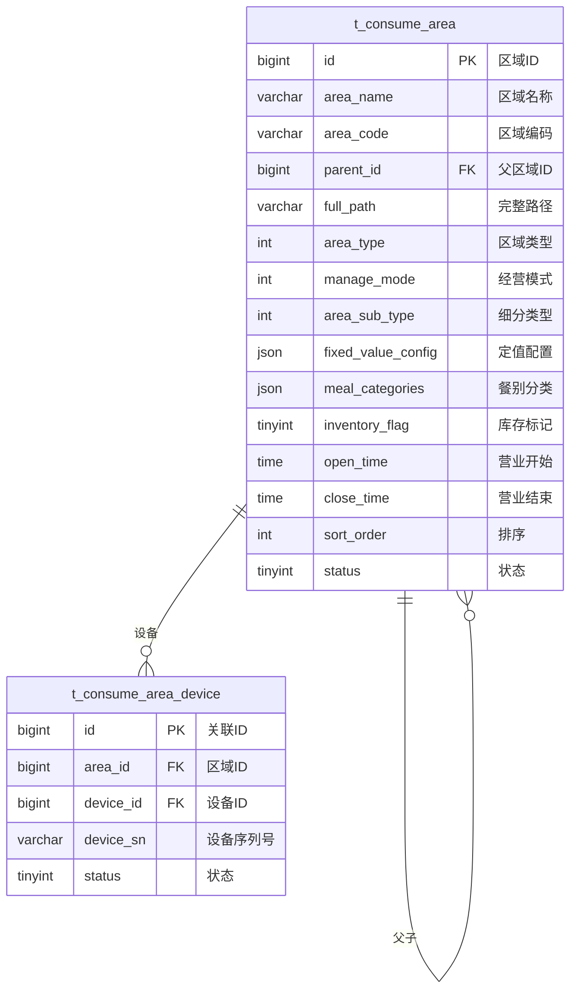

# 区域管理 - 数据结构设计

> **版本**: v1.0.0  
> **创建日期**: 2025-12-17

---

## 📊 ER图



---

## 📋 表结构详细设计

### t_consume_area (消费区域表)

```sql
CREATE TABLE t_consume_area (
    id BIGINT PRIMARY KEY AUTO_INCREMENT COMMENT '区域ID',
    area_name VARCHAR(100) NOT NULL COMMENT '区域名称',
    area_code VARCHAR(50) NOT NULL COMMENT '区域编码',
    parent_id BIGINT DEFAULT 0 COMMENT '父区域ID,0为顶级',
    full_path VARCHAR(500) COMMENT '完整路径,如/1/2/3/',
    level INT DEFAULT 1 COMMENT '层级',
    
    -- 区域类型
    area_type INT NOT NULL COMMENT '区域类型:1餐饮2超市3自助',
    manage_mode INT NOT NULL COMMENT '经营模式:1餐别制2超市制3混合',
    area_sub_type INT COMMENT '细分类型',
    
    -- 定值配置
    fixed_value_config JSON COMMENT '定值配置JSON',
    
    -- 餐别配置
    meal_categories JSON COMMENT '允许餐别分类IDs JSON数组',
    
    -- 库存配置
    inventory_flag TINYINT DEFAULT 0 COMMENT '是否启用库存:0否1是',
    
    -- 营业时间
    open_time TIME COMMENT '营业开始时间',
    close_time TIME COMMENT '营业结束时间',
    
    -- 其他
    address VARCHAR(200) COMMENT '区域地址',
    contact_name VARCHAR(50) COMMENT '负责人',
    contact_phone VARCHAR(20) COMMENT '联系电话',
    sort_order INT DEFAULT 0 COMMENT '排序',
    status TINYINT DEFAULT 1 COMMENT '状态:0禁用1启用',
    remark VARCHAR(500) COMMENT '备注',
    
    create_time DATETIME NOT NULL DEFAULT CURRENT_TIMESTAMP,
    update_time DATETIME NOT NULL DEFAULT CURRENT_TIMESTAMP ON UPDATE CURRENT_TIMESTAMP,
    deleted_flag TINYINT DEFAULT 0 COMMENT '删除标记',
    
    UNIQUE KEY uk_area_code (area_code),
    INDEX idx_parent_id (parent_id),
    INDEX idx_area_type (area_type),
    INDEX idx_status (status)
) ENGINE=InnoDB DEFAULT CHARSET=utf8mb4 COMMENT='消费区域表';
```

---

## 🔧 配置说明

### 经营模式(manage_mode)

| 值 | 说明 | 消费方式 |
|------|------|----------|
| 1 | 餐别制 | 定值消费，按餐别配置固定金额 |
| 2 | 超市制 | 商品扫码，按商品价格计算 |
| 3 | 混合模式 | 支持定值和商品扫码 |

### fixed_value_config 配置示例

```json
{
  "breakfast": {"amount": 5.00, "unit": "元"},
  "lunch": {"amount": 12.00, "unit": "元"},
  "dinner": {"amount": 10.00, "unit": "元"},
  "supper": {"amount": 8.00, "unit": "元"}
}
```

### meal_categories 配置示例

```json
["1", "2", "3"]
```

---

**📝 文档维护**: IOE-DREAM架构团队 | 2025-12-17
