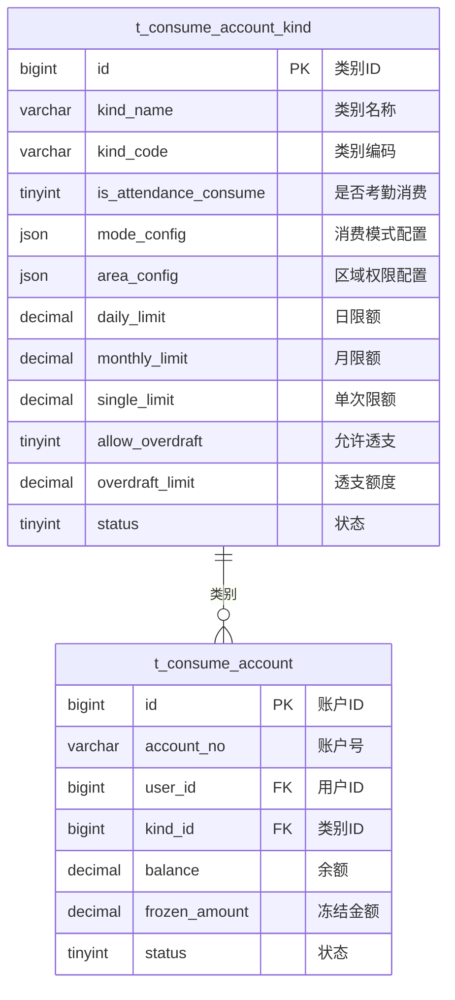

# 账户类别与消费模式 - 数据结构设计

> **版本**: v1.0.0  
> **创建日期**: 2025-12-17

---

## 📊 ER图



---

## 📋 表结构详细设计

### t_consume_account_kind (账户类别表)

```sql
CREATE TABLE t_consume_account_kind (
    id BIGINT PRIMARY KEY AUTO_INCREMENT COMMENT '类别ID',
    kind_name VARCHAR(100) NOT NULL COMMENT '类别名称',
    kind_code VARCHAR(50) NOT NULL COMMENT '类别编码',
    
    -- 考勤消费标识
    is_attendance_consume TINYINT DEFAULT 0 COMMENT '是否作为考勤消费:0否1是',
    
    -- 消费模式配置
    mode_config JSON COMMENT '消费模式配置JSON',
    
    -- 区域权限配置
    area_config JSON COMMENT '区域权限配置JSON数组',
    
    -- 限额配置
    daily_limit DECIMAL(10,2) DEFAULT 200.00 COMMENT '日限额',
    monthly_limit DECIMAL(10,2) DEFAULT 3000.00 COMMENT '月限额',
    single_limit DECIMAL(10,2) DEFAULT 100.00 COMMENT '单次限额',
    
    -- 透支配置
    allow_overdraft TINYINT DEFAULT 0 COMMENT '允许透支:0否1是',
    overdraft_limit DECIMAL(10,2) DEFAULT 0.00 COMMENT '透支额度',
    
    -- 补贴配置
    subsidy_enabled TINYINT DEFAULT 0 COMMENT '启用补贴:0否1是',
    subsidy_priority TINYINT DEFAULT 1 COMMENT '补贴优先扣款:0否1是',
    
    -- 折扣配置
    discount_rate DECIMAL(3,2) DEFAULT 1.00 COMMENT '折扣率(0.00-1.00)',
    
    sort_order INT DEFAULT 0 COMMENT '排序',
    status TINYINT DEFAULT 1 COMMENT '状态:0禁用1启用',
    remark VARCHAR(500) COMMENT '备注',
    
    create_time DATETIME NOT NULL DEFAULT CURRENT_TIMESTAMP,
    update_time DATETIME NOT NULL DEFAULT CURRENT_TIMESTAMP ON UPDATE CURRENT_TIMESTAMP,
    deleted_flag TINYINT DEFAULT 0 COMMENT '删除标记',
    
    UNIQUE KEY uk_kind_code (kind_code),
    INDEX idx_status (status)
) ENGINE=InnoDB DEFAULT CHARSET=utf8mb4 COMMENT='账户类别表';
```

### t_consume_account (消费账户表)

```sql
CREATE TABLE t_consume_account (
    id BIGINT PRIMARY KEY AUTO_INCREMENT COMMENT '账户ID',
    account_no VARCHAR(32) NOT NULL COMMENT '账户号',
    user_id BIGINT NOT NULL COMMENT '用户ID',
    user_name VARCHAR(50) COMMENT '用户姓名',
    kind_id BIGINT NOT NULL COMMENT '账户类别ID',
    
    -- 余额
    balance DECIMAL(10,2) DEFAULT 0.00 COMMENT '账户余额',
    frozen_amount DECIMAL(10,2) DEFAULT 0.00 COMMENT '冻结金额',
    
    -- 统计
    total_recharge DECIMAL(12,2) DEFAULT 0.00 COMMENT '累计充值',
    total_consume DECIMAL(12,2) DEFAULT 0.00 COMMENT '累计消费',
    
    -- 状态
    status TINYINT DEFAULT 1 COMMENT '状态:0禁用1正常2冻结',
    
    -- 绑定信息
    card_no VARCHAR(50) COMMENT '卡号',
    
    create_time DATETIME NOT NULL DEFAULT CURRENT_TIMESTAMP,
    update_time DATETIME NOT NULL DEFAULT CURRENT_TIMESTAMP ON UPDATE CURRENT_TIMESTAMP,
    deleted_flag TINYINT DEFAULT 0 COMMENT '删除标记',
    version INT DEFAULT 0 COMMENT '乐观锁版本号',
    
    UNIQUE KEY uk_account_no (account_no),
    INDEX idx_user_id (user_id),
    INDEX idx_kind_id (kind_id),
    INDEX idx_status (status)
) ENGINE=InnoDB DEFAULT CHARSET=utf8mb4 COMMENT='消费账户表';
```

---

## 🔧 配置说明

### mode_config 消费模式配置

```json
{
  "mode": "FIXED_AMOUNT",
  "values": {
    "breakfast": {"amount": 8.00, "unit": "元", "remark": "VIP早餐标准"},
    "lunch": {"amount": 15.00, "unit": "元", "remark": "VIP午餐标准"}
  }
}
```

### area_config 区域权限配置

```json
[
  {
    "areaId": "100",
    "areaName": "一食堂",
    "includeSubAreas": true,
    "allowedMeals": ["breakfast", "lunch", "dinner"]
  },
  {
    "areaId": "200",
    "areaName": "便利店",
    "includeSubAreas": false
  }
]
```

---

**📝 文档维护**: IOE-DREAM架构团队 | 2025-12-17
