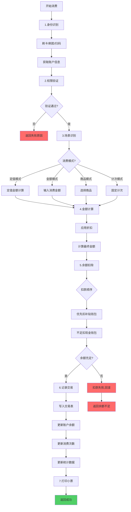
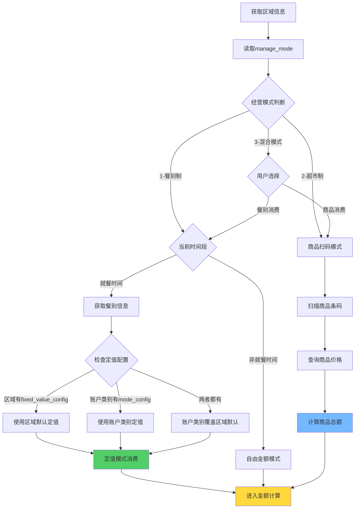
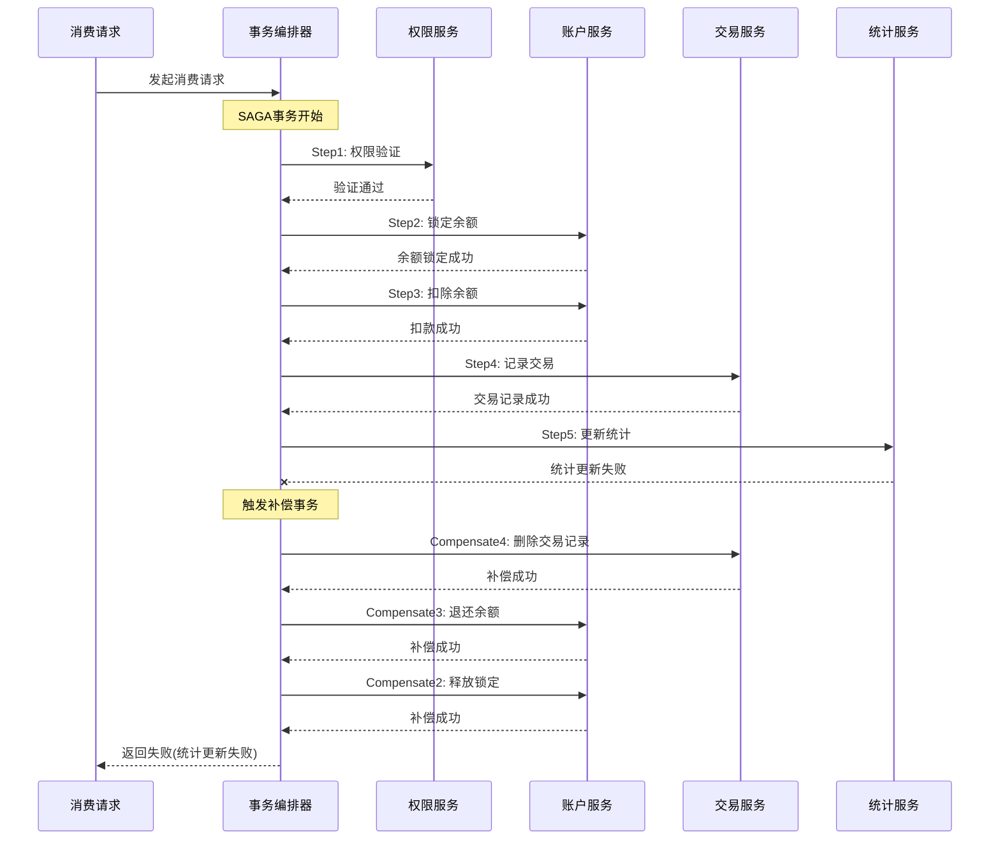
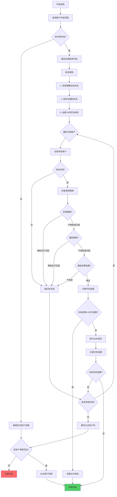
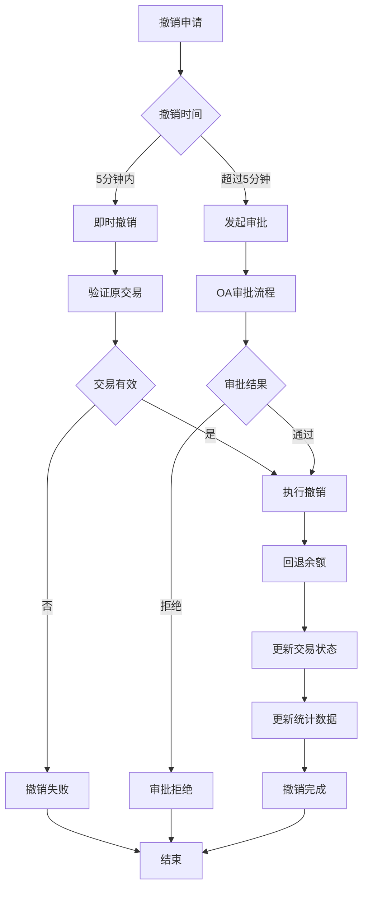
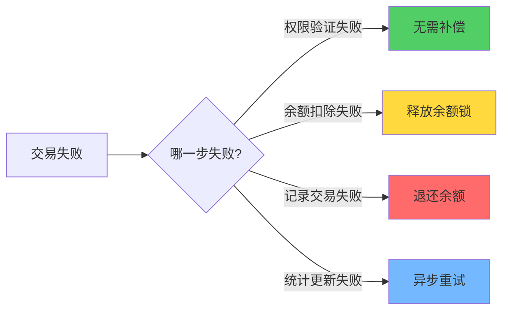

# 消费处理 - 业务流程图

> **版本**: v1.0.0  
> **创建日期**: 2025-12-17

---

## 📊 完整消费流程（7步标准流程）

---

## 📊 消费模式判断流程（基于区域经营模式）

**核心逻辑说明**：

1. **餐别制（manage_mode=1）**：
   - 检查当前时间是否在就餐时间段内
   - 优先使用账户类别的`mode_config`定值配置
   - 如果账户类别未配置，使用区域的`fixed_value_config`默认定值
   - 非就餐时间段，降级为自由金额模式

2. **超市制（manage_mode=2）**：
   - 直接进入商品扫码流程
   - 从商品库查询价格
   - 累计多个商品的总价

3. **混合模式（manage_mode=3）**：
   - 由用户或设备选择消费方式
   - 支持餐别定值消费和商品扫码消费
   - 同一笔交易可混合两种方式

---

## 📊 SAGA分布式事务流程

---

## 📊 补贴扣款流程

---

## 📊 消费撤销流程

---

## 📊 异常补偿策略

---

**📝 文档维护**: IOE-DREAM架构团队 | 2025-12-17
