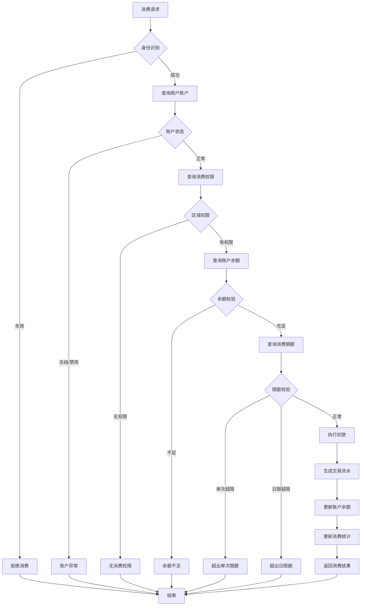
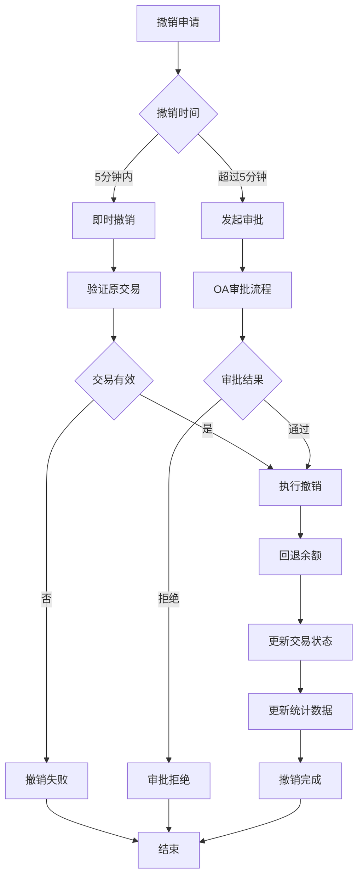
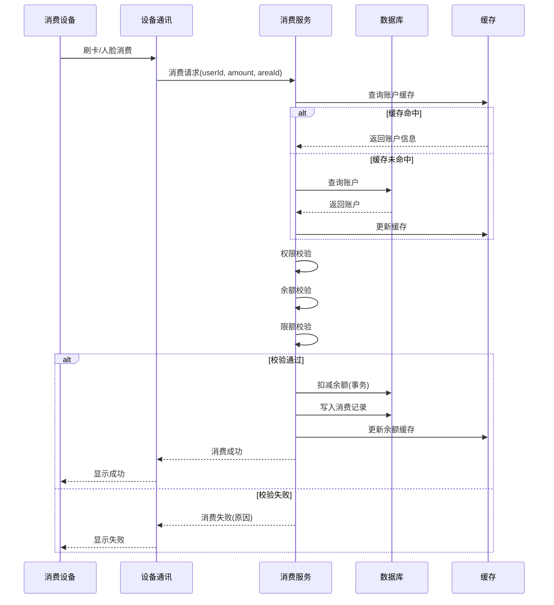
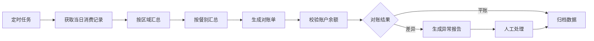

# 消费处理 - 业务流程图

> **版本**: v1.0.0  
> **创建日期**: 2025-12-17

---

## 📊 消费扣款流程

```mermaid
flowchart TD
    A[消费请求] --> B{身份识别}
    B -->|成功| C[查询用户账户]
    B -->|失败| Z1[拒绝消费]
    
    C --> D{账户状态}
    D -->|正常| E[查询消费权限]
    D -->|冻结/禁用| Z2[账户异常]
    
    E --> F{区域权限}
    F -->|有权限| G[查询账户余额]
    F -->|无权限| Z3[无消费权限]
    
    G --> H{余额校验}
    H -->|充足| I[查询消费限额]
    H -->|不足| Z4[余额不足]
    
    I --> J{限额校验}
    J -->|单次超限| Z5[超出单次限额]
    J -->|日限超限| Z6[超出日限额]
    J -->|正常| K[执行扣款]
    
    K --> L[生成交易流水]
    L --> M[更新账户余额]
    M --> N[更新消费统计]
    N --> O[返回消费结果]
    
    Z1 --> END[结束]
    Z2 --> END
    Z3 --> END
    Z4 --> END
    Z5 --> END
    Z6 --> END
    O --> END
```

---

## 📊 消费撤销流程

```mermaid
flowchart TD
    A[撤销申请] --> B{撤销时间}
    B -->|5分钟内| C[即时撤销]
    B -->|超过5分钟| D[发起审批]
    
    C --> E[验证原交易]
    E --> F{交易有效}
    F -->|是| G[执行撤销]
    F -->|否| Z1[撤销失败]
    
    D --> H[OA审批流程]
    H --> I{审批结果}
    I -->|通过| G
    I -->|拒绝| Z2[审批拒绝]
    
    G --> J[回退余额]
    J --> K[更新交易状态]
    K --> L[更新统计数据]
    L --> M[撤销完成]
    
    Z1 --> END[结束]
    Z2 --> END
    M --> END
```

---

## 📊 消费时序图

```mermaid
sequenceDiagram
    participant DEV as 消费设备
    participant DC as 设备通讯
    participant CON as 消费服务
    participant DB as 数据库
    participant Redis as 缓存
    
    DEV->>DC: 刷卡/人脸消费
    DC->>CON: 消费请求(userId, amount, areaId)
    
    CON->>Redis: 查询账户缓存
    alt 缓存命中
        Redis-->>CON: 返回账户信息
    else 缓存未命中
        CON->>DB: 查询账户
        DB-->>CON: 返回账户
        CON->>Redis: 更新缓存
    end
    
    CON->>CON: 权限校验
    CON->>CON: 余额校验
    CON->>CON: 限额校验
    
    alt 校验通过
        CON->>DB: 扣减余额(事务)
        CON->>DB: 写入消费记录
        CON->>Redis: 更新余额缓存
        CON-->>DC: 消费成功
        DC-->>DEV: 显示成功
    else 校验失败
        CON-->>DC: 消费失败(原因)
        DC-->>DEV: 显示失败
    end
```

---

## 📊 批量消费对账流程

```mermaid
flowchart LR
    A[定时任务] --> B[获取当日消费记录]
    B --> C[按区域汇总]
    C --> D[按餐别汇总]
    D --> E[生成对账单]
    E --> F[校验账户余额]
    F --> G{对账结果}
    G -->|平账| H[归档数据]
    G -->|差异| I[生成异常报告]
    I --> J[人工处理]
    J --> H
```

---

**📝 文档维护**: IOE-DREAM架构团队 | 2025-12-17
