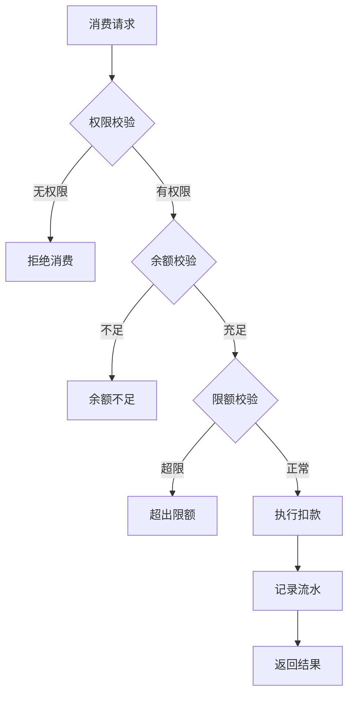

# 消费处理 - 功能说明

> **版本**: v1.0.0  
> **微服务**: ioedream-consume-service (8094)  
> **创建日期**: 2025-12-17

---

## 📋 功能概述

消费处理模块负责企业内部消费交易的核心处理，包括消费扣款、余额校验、限额控制和交易记录。

---

## 🎯 核心功能

### 1. 消费扣款
- **实时扣款**: 消费设备发起扣款请求
- **余额校验**: 校验账户余额是否充足
- **权限校验**: 校验消费区域权限
- **扣款执行**: 执行账户余额扣减

### 2. 消费限额控制
- **单次限额**: 单笔消费最大金额
- **日限额**: 每日消费累计限额
- **餐别限额**: 各餐别消费限额
- **月限额**: 每月消费累计限额

### 3. 消费撤销
- **撤销申请**: 误操作消费撤销
- **撤销审批**: 超时撤销需审批
- **余额回退**: 撤销后余额返还

### 4. 消费查询
- **消费明细**: 个人消费记录查询
- **消费统计**: 消费数据统计分析
- **账单导出**: 消费账单导出

---

## 📊 消费流程

---

## 🔧 消费类型

| 类型 | 说明 |
|------|------|
| 刷卡消费 | IC卡刷卡消费 |
| 人脸消费 | 人脸识别消费 |
| 二维码消费 | 扫码消费 |
| 指纹消费 | 指纹识别消费 |

---

## 📈 性能指标

| 指标项 | 要求 |
|--------|------|
| 消费响应时间 | ≤ 500ms |
| 并发处理能力 | ≥ 500TPS |
| 数据一致性 | 100% |

---

**📝 文档维护**: IOE-DREAM架构团队 | 2025-12-17
