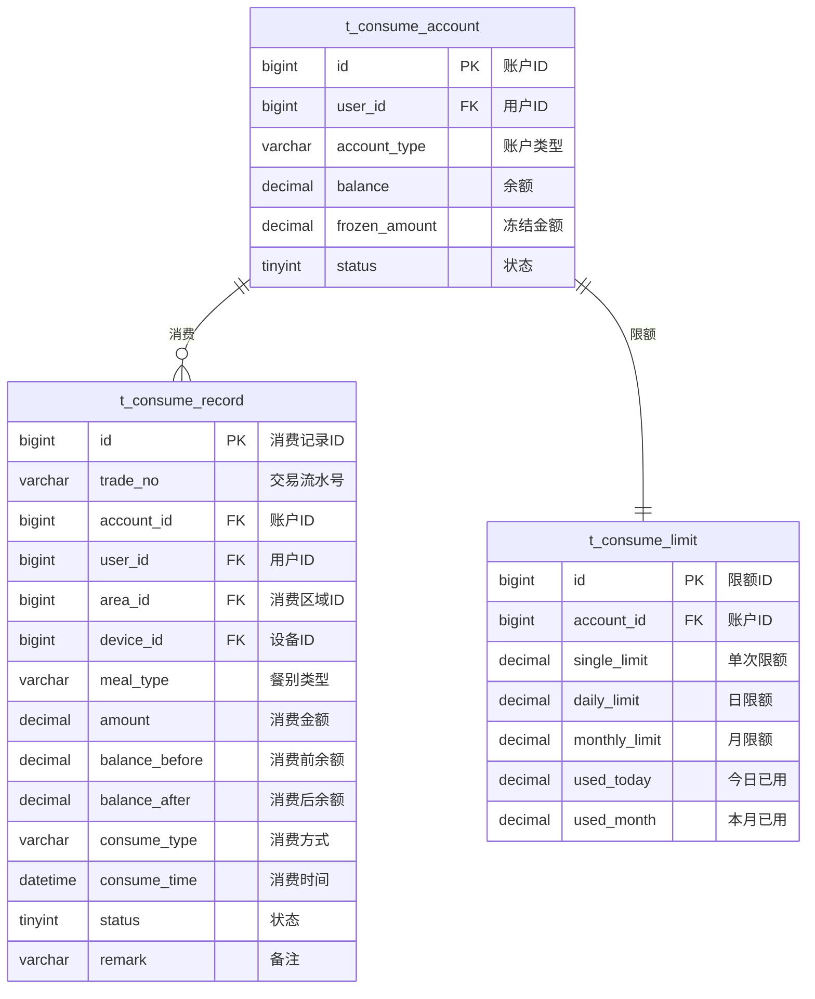

# 消费处理 - 数据结构设计

> **版本**: v1.0.0  
> **创建日期**: 2025-12-17

---

## 📊 ER图



---

## 📋 表结构详细设计

### t_consume_record (消费记录表)

```sql
CREATE TABLE t_consume_record (
    id BIGINT PRIMARY KEY AUTO_INCREMENT COMMENT '消费记录ID',
    trade_no VARCHAR(32) NOT NULL COMMENT '交易流水号',
    account_id BIGINT NOT NULL COMMENT '账户ID',
    user_id BIGINT NOT NULL COMMENT '用户ID',
    area_id BIGINT NOT NULL COMMENT '消费区域ID',
    device_id BIGINT COMMENT '设备ID',
    device_sn VARCHAR(50) COMMENT '设备序列号',
    meal_type VARCHAR(20) COMMENT '餐别类型:BREAKFAST/LUNCH/DINNER/SNACK',
    amount DECIMAL(10,2) NOT NULL COMMENT '消费金额',
    balance_before DECIMAL(10,2) NOT NULL COMMENT '消费前余额',
    balance_after DECIMAL(10,2) NOT NULL COMMENT '消费后余额',
    consume_type VARCHAR(20) NOT NULL COMMENT '消费方式:CARD/FACE/QR/FINGER',
    consume_time DATETIME NOT NULL COMMENT '消费时间',
    status TINYINT DEFAULT 1 COMMENT '状态:1正常2撤销',
    cancel_time DATETIME COMMENT '撤销时间',
    cancel_reason VARCHAR(200) COMMENT '撤销原因',
    remark VARCHAR(200) COMMENT '备注',
    create_time DATETIME NOT NULL DEFAULT CURRENT_TIMESTAMP COMMENT '创建时间',
    UNIQUE KEY uk_trade_no (trade_no),
    INDEX idx_user_id (user_id),
    INDEX idx_account_id (account_id),
    INDEX idx_consume_time (consume_time),
    INDEX idx_area_id (area_id)
) ENGINE=InnoDB DEFAULT CHARSET=utf8mb4 COMMENT='消费记录表';
```

### t_consume_limit (消费限额表)

```sql
CREATE TABLE t_consume_limit (
    id BIGINT PRIMARY KEY AUTO_INCREMENT COMMENT '限额ID',
    account_id BIGINT NOT NULL COMMENT '账户ID',
    single_limit DECIMAL(10,2) DEFAULT 100.00 COMMENT '单次限额',
    daily_limit DECIMAL(10,2) DEFAULT 200.00 COMMENT '日限额',
    monthly_limit DECIMAL(10,2) DEFAULT 3000.00 COMMENT '月限额',
    used_today DECIMAL(10,2) DEFAULT 0.00 COMMENT '今日已用金额',
    used_month DECIMAL(10,2) DEFAULT 0.00 COMMENT '本月已用金额',
    last_reset_date DATE COMMENT '上次重置日期',
    create_time DATETIME NOT NULL DEFAULT CURRENT_TIMESTAMP COMMENT '创建时间',
    update_time DATETIME NOT NULL DEFAULT CURRENT_TIMESTAMP ON UPDATE CURRENT_TIMESTAMP COMMENT '更新时间',
    UNIQUE KEY uk_account_id (account_id),
    FOREIGN KEY (account_id) REFERENCES t_consume_account(id)
) ENGINE=InnoDB DEFAULT CHARSET=utf8mb4 COMMENT='消费限额表';
```

---

**📝 文档维护**: IOE-DREAM架构团队 | 2025-12-17
