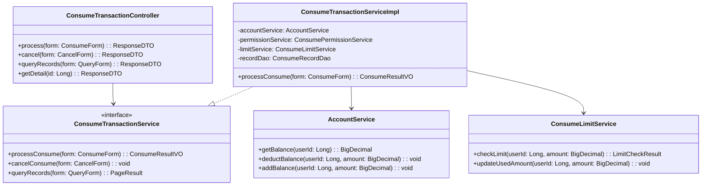

# 消费处理 - 详细设计

> **版本**: v1.0.0  
> **创建日期**: 2025-12-17

---

## 📊 类结构设计



---

## 🔧 核心算法

### 消费扣款事务

```java
@Transactional(rollbackFor = Exception.class)
public ConsumeResultVO processConsume(ConsumeForm form) {
    // 1. 幂等性检查
    if (recordDao.existsByTradeNo(form.getTradeNo())) {
        return getExistingResult(form.getTradeNo());
    }
    
    // 2. 加锁防止并发
    String lockKey = "consume:user:" + form.getUserId();
    RLock lock = redissonClient.getLock(lockKey);
    try {
        lock.lock(5, TimeUnit.SECONDS);
        
        // 3. 权限校验
        checkPermission(form.getUserId(), form.getAreaId());
        
        // 4. 余额校验
        BigDecimal balance = accountService.getBalance(form.getUserId());
        if (balance.compareTo(form.getAmount()) < 0) {
            throw new BusinessException("余额不足");
        }
        
        // 5. 限额校验
        LimitCheckResult limitResult = limitService.checkLimit(
            form.getUserId(), form.getAmount());
        if (!limitResult.isAllowed()) {
            throw new BusinessException(limitResult.getReason());
        }
        
        // 6. 执行扣款
        accountService.deductBalance(form.getUserId(), form.getAmount());
        
        // 7. 记录流水
        ConsumeRecordEntity record = buildRecord(form, balance);
        recordDao.insert(record);
        
        // 8. 更新限额统计
        limitService.updateUsedAmount(form.getUserId(), form.getAmount());
        
        return buildSuccessResult(record);
    } finally {
        lock.unlock();
    }
}
```

---

## 📋 API接口设计

### 消费扣款

```
POST /api/consume/v1/transaction/process
```

**请求**:
```json
{
  "tradeNo": "CON20251217100001",
  "userId": 1001,
  "areaId": 100,
  "deviceSn": "CON-001",
  "amount": 15.50,
  "consumeType": "FACE",
  "mealType": "LUNCH"
}
```

**响应**:
```json
{
  "code": 0,
  "data": {
    "tradeNo": "CON20251217100001",
    "amount": 15.50,
    "balanceBefore": 200.00,
    "balanceAfter": 184.50,
    "consumeTime": "2025-12-17 12:30:00"
  }
}
```

### 消费撤销

```
POST /api/consume/v1/transaction/cancel
```

**请求**:
```json
{
  "tradeNo": "CON20251217100001",
  "reason": "误操作"
}
```

### 消费记录查询

```
GET /api/consume/v1/transaction/records
```

**请求参数**:
| 参数 | 类型 | 必填 | 说明 |
|------|------|------|------|
| userId | Long | 否 | 用户ID |
| areaId | Long | 否 | 区域ID |
| startTime | String | 否 | 开始时间 |
| endTime | String | 否 | 结束时间 |
| pageNum | Integer | 是 | 页码 |
| pageSize | Integer | 是 | 每页条数 |

---

## 📈 性能优化

1. **余额缓存**: Redis缓存账户余额，减少DB查询
2. **分布式锁**: Redisson防止并发扣款
3. **幂等设计**: tradeNo唯一索引防止重复消费
4. **异步记录**: 消费成功后异步写入统计表

---

**📝 文档维护**: IOE-DREAM架构团队 | 2025-12-17
