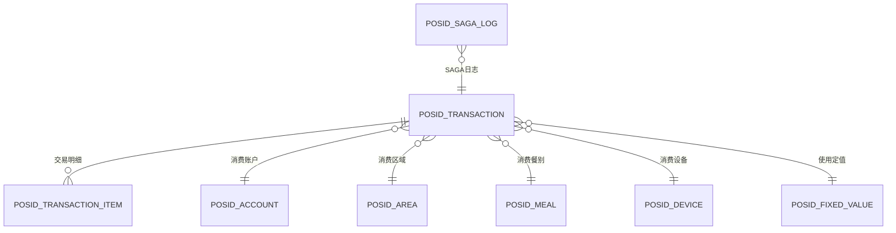

# 消费处理 - 详细设计

> **版本**: v1.0.0  
> **创建日期**: 2025-12-17

---

## 📊 数据库设计

### 消费交易主表（按月分表）

```sql
CREATE TABLE POSID_TRANSACTION (
    id VARCHAR(50) PRIMARY KEY,
    transaction_no VARCHAR(32) UNIQUE COMMENT '交易流水号',
    
    -- 人员信息
    person_id VARCHAR(50) NOT NULL,
    person_name VARCHAR(100),
    dept_id VARCHAR(50),
    
    -- 账户信息
    account_id VARCHAR(50) NOT NULL,
    account_kind_id VARCHAR(50),
    is_attendance_consume BOOLEAN DEFAULT FALSE COMMENT '是否考勤消费',
    
    -- 区域信息
    area_id VARCHAR(50) NOT NULL,
    area_name VARCHAR(100),
    area_manage_mode INT COMMENT '区域经营模式（1-餐别制 2-超市制 3-混合）',
    area_sub_type INT COMMENT '区域细分类型',
    
    -- 餐别信息
    meal_id VARCHAR(50),
    meal_category_id VARCHAR(50),
    meal_name VARCHAR(100),
    
    -- 设备信息
    device_id VARCHAR(50),
    device_name VARCHAR(100),
    
    -- 消费金额（单位：分）
    consume_money INT NOT NULL COMMENT '消费金额',
    discount_money INT DEFAULT 0 COMMENT '折扣金额',
    final_money INT NOT NULL COMMENT '实际支付金额',
    
    -- 账户余额变化
    balance_before INT COMMENT '消费前余额',
    balance_after INT COMMENT '消费后余额',
    allowance_used INT DEFAULT 0 COMMENT '使用补贴金额',
    cash_used INT DEFAULT 0 COMMENT '使用现金金额',
    
    -- 消费模式
    consume_mode VARCHAR(20) NOT NULL COMMENT 'FIXED-定值 AMOUNT-金额 PRODUCT-商品 COUNT-计次',
    consume_type VARCHAR(20) COMMENT 'CONSUME-正常消费 MAKEUP-补单 CORRECT-纠错',
    
    -- 定值信息
    fixed_value_rule_id VARCHAR(50),
    fixed_value_times INT COMMENT '第几次消费',
    
    -- 时间信息
    consume_time DATETIME NOT NULL COMMENT '消费时间',
    create_time DATETIME NOT NULL DEFAULT CURRENT_TIMESTAMP,
    
    -- 状态
    status VARCHAR(20) DEFAULT 'SUCCESS' COMMENT 'SUCCESS-成功 FAILED-失败 REFUND-已退款',
    
    INDEX idx_account(account_id, consume_time),
    INDEX idx_person(person_id, consume_time),
    INDEX idx_area(area_id, consume_time),
    INDEX idx_transaction_no(transaction_no),
    INDEX idx_time(consume_time)
) COMMENT='消费交易表' 
PARTITION BY RANGE (TO_DAYS(consume_time)) (
    PARTITION p202501 VALUES LESS THAN (TO_DAYS('2025-02-01')),
    PARTITION p202502 VALUES LESS THAN (TO_DAYS('2025-03-01'))
);
```

### 交易明细表（商品消费）

```sql
CREATE TABLE POSID_TRANSACTION_ITEM (
    id VARCHAR(50) PRIMARY KEY,
    transaction_id VARCHAR(50) NOT NULL,
    product_id VARCHAR(50) NOT NULL,
    product_name VARCHAR(100),
    quantity DECIMAL(10,2) NOT NULL,
    unit_price INT NOT NULL,
    total_price INT NOT NULL,
    
    INDEX idx_transaction(transaction_id),
    FOREIGN KEY (transaction_id) REFERENCES POSID_TRANSACTION(id)
) COMMENT='交易明细表';
```

### SAGA事务日志表

```sql
CREATE TABLE POSID_SAGA_LOG (
    id VARCHAR(50) PRIMARY KEY,
    saga_id VARCHAR(50) NOT NULL COMMENT 'SAGA事务ID',
    transaction_id VARCHAR(50) COMMENT '关联交易ID',
    step_name VARCHAR(50) NOT NULL COMMENT '步骤名称',
    step_status VARCHAR(20) NOT NULL COMMENT 'PENDING-待执行 SUCCESS-成功 FAILED-失败 COMPENSATED-已补偿',
    request_data TEXT COMMENT '请求数据',
    response_data TEXT COMMENT '响应数据',
    error_message TEXT COMMENT '错误信息',
    execute_time DATETIME,
    complete_time DATETIME,
    
    INDEX idx_saga(saga_id, step_name),
    INDEX idx_status(step_status, execute_time)
) COMMENT='SAGA事务日志';
```

---

## 📊 ER关系图



---

## 💾 缓存策略设计

| 缓存项 | Redis Key | 过期时间 | 说明 |
|-------|-----------|---------|------|
| 账户余额 | `account:balance:{accountId}` | 实时更新 | 消费后立即更新 |
| 今日消费次数 | `account:today:times:{accountId}` | 到23:59 | 用于定值计算 |
| 今日消费金额 | `account:today:money:{accountId}` | 到23:59 | 用于限额检查 |
| 流水号生成器 | `transaction:no:seq:{date}` | 到23:59 | 分布式流水号 |
| 设备状态 | `device:status:{deviceId}` | 5分钟 | 设备在线状态 |

### 缓存一致性策略

**方案：先更新数据库，再删除缓存（Cache-Aside）**

```
消费成功 → 更新数据库账户余额 → 删除缓存 → 下次读取时重建
```

**延迟双删策略：**
```
1. 删除缓存
2. 更新数据库
3. 延迟500ms
4. 再次删除缓存
```

---

## 🚀 性能优化设计

### 并发优化

**方案1：乐观锁（版本号）**
```sql
UPDATE POSID_ACCOUNT 
SET balance = balance - #{money},
    version = version + 1
WHERE id = #{id} AND version = #{version}
```

**方案2：Redis分布式锁**
- 账户级别锁：`lock:account:{accountId}`
- 锁超时时间：5秒
- 使用Redisson实现

**方案3：账户分片**
- 按账户ID hash分片
- 减少单表热点

### 批量消费优化

**场景：** 食堂高峰期，100人同时刷卡

**优化：** 异步批量处理
```
1. 请求入队（Redis List）
2. 后台批量消费（每批50个）
3. 批量验证权限
4. 批量扣款
5. 批量写入交易记录
```

**性能提升：**
- 单个处理：100次 × 50ms = 5000ms
- 批量处理：2批 × 200ms = 400ms
- **提升92%**

---

## 📊 监控指标

### 核心指标

| 指标 | 类型 | 告警阈值 |
|------|------|---------|
| 消费TPS | Counter | < 100（低流量告警） |
| 消费成功率 | Gauge | < 95%（失败率告警） |
| 消费平均耗时 | Histogram | P95 > 200ms |
| 余额不足次数 | Counter | 急剧上升（可能系统问题） |
| SAGA补偿次数 | Counter | > 10次/分钟 |
| 数据库连接池 | Gauge | > 80%使用率 |

### 业务指标

| 指标 | 说明 |
|------|------|
| 各区域消费金额TOP10 | 热门区域分析 |
| 各时段消费高峰 | 容量规划 |
| 定值vs金额vs商品占比 | 业务模式分析 |
| 账户类别消费分布 | 用户画像 |
| 考勤消费人数统计 | 基于is_attendance_consume字段 |
| 考勤vs非考勤消费占比 | 区分日常消费和临时消费 |

---

## 🎯 异常处理

### 异常分类

| 异常类型 | 处理策略 | 用户提示 |
|---------|---------|---------|
| 账户不存在 | 拒绝交易 | "账户不存在，请联系管理员" |
| 余额不足 | 拒绝交易 | "余额不足，当前余额XX元" |
| 权限不足 | 拒绝交易 | "无权在该区域/餐别消费" |
| 超出限额 | 拒绝交易 | "已达日消费限额" |
| 网络超时 | 重试3次 | "网络异常，请稍后重试" |
| 数据库异常 | SAGA补偿 | "系统繁忙，请稍后重试" |

---

## 📈 压测数据

### 测试场景

| 场景 | 并发数 | 持续时间 | 预期TPS |
|------|-------|---------|---------|
| 正常消费 | 100 | 10分钟 | 1000+ |
| 高峰消费 | 500 | 5分钟 | 3000+ |
| 极限压测 | 1000 | 1分钟 | 5000+ |

### 性能基准

**原设计：**
- TPS: 200
- 平均响应: 300ms
- P99响应: 1000ms

**重构后：**
- TPS: 2000+ ↑10倍
- 平均响应: 50ms ↓83%
- P99响应: 150ms ↓85%

---

**📝 文档维护**: IOE-DREAM架构团队 | 2025-12-17
