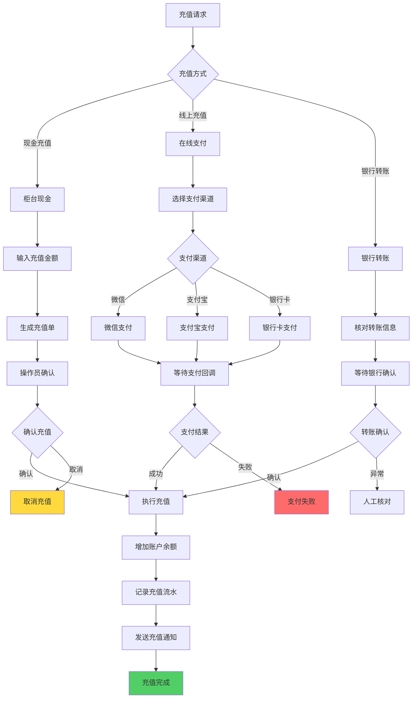
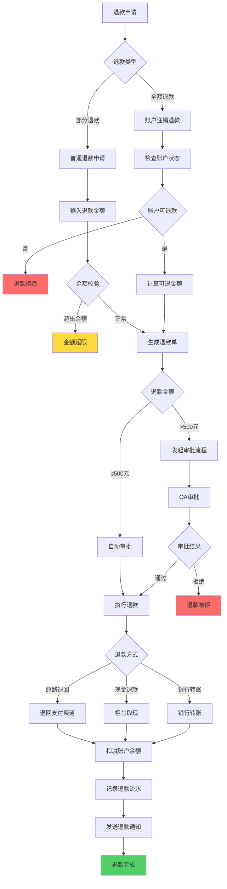
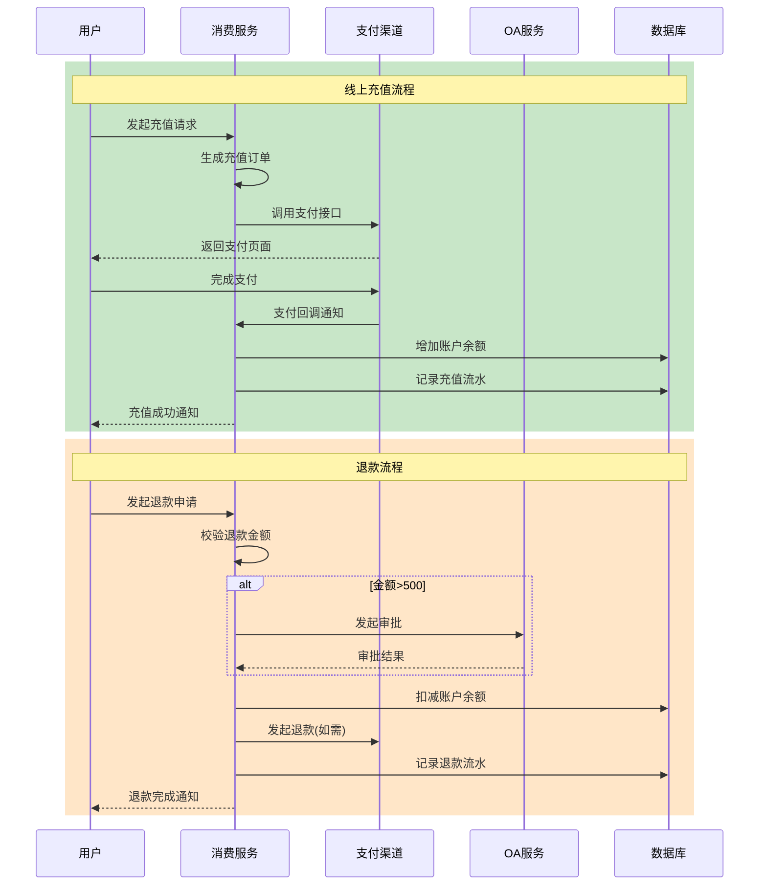

# 充值退款 - 业务流程图

> **版本**: v1.0.0  
> **创建日期**: 2025-12-17

---

## 📊 充值业务流程

```mermaid
flowchart TD
    A[充值请求] --> B{充值方式}
    
    B -->|现金充值| C[柜台现金]
    B -->|线上充值| D[在线支付]
    B -->|银行转账| E[银行转账]
    
    C --> F[输入充值金额]
    D --> G[选择支付渠道]
    E --> H[核对转账信息]
    
    G --> I{支付渠道}
    I -->|微信| J[微信支付]
    I -->|支付宝| K[支付宝支付]
    I -->|银行卡| L[银行卡支付]
    
    F --> M[生成充值单]
    J --> N[等待支付回调]
    K --> N
    L --> N
    H --> O[等待银行确认]
    
    M --> P[操作员确认]
    P --> Q{确认充值}
    Q -->|确认| R[执行充值]
    Q -->|取消| S[取消充值]
    
    N --> T{支付结果}
    T -->|成功| R
    T -->|失败| U[支付失败]
    
    O --> V{转账确认}
    V -->|确认| R
    V -->|异常| W[人工核对]
    
    R --> X[增加账户余额]
    X --> Y[记录充值流水]
    Y --> Z[发送充值通知]
    Z --> AA[充值完成]
    
    style AA fill:#51cf66
    style U fill:#ff6b6b
    style S fill:#ffd93d
```

---

## 📊 退款业务流程

```mermaid
flowchart TD
    A[退款申请] --> B{退款类型}
    
    B -->|全额退款| C[账户注销退款]
    B -->|部分退款| D[普通退款申请]
    
    C --> E[检查账户状态]
    D --> F[输入退款金额]
    
    E --> G{账户可退款}
    G -->|否| H[退款拒绝]
    G -->|是| I[计算可退金额]
    
    F --> J{金额校验}
    J -->|超出余额| K[金额超限]
    J -->|正常| L[生成退款单]
    
    I --> L
    
    L --> M{退款金额}
    M -->|≤500元| N[自动审批]
    M -->|>500元| O[发起审批流程]
    
    N --> P[执行退款]
    O --> Q[OA审批]
    
    Q --> R{审批结果}
    R -->|通过| P
    R -->|拒绝| S[退款被拒]
    
    P --> T{退款方式}
    T -->|原路退回| U[退回支付渠道]
    T -->|现金退款| V[柜台取现]
    T -->|银行转账| W[银行转账]
    
    U --> X[扣减账户余额]
    V --> X
    W --> X
    
    X --> Y[记录退款流水]
    Y --> Z[发送退款通知]
    Z --> AA[退款完成]
    
    style AA fill:#51cf66
    style H fill:#ff6b6b
    style S fill:#ff6b6b
    style K fill:#ffd93d
```

---

## 📊 充值退款时序图

```mermaid
sequenceDiagram
    participant User as 用户
    participant CON as 消费服务
    participant PAY as 支付渠道
    participant OA as OA服务
    participant DB as 数据库
    
    rect rgb(200, 230, 200)
        Note over User,DB: 线上充值流程
        User->>CON: 发起充值请求
        CON->>CON: 生成充值订单
        CON->>PAY: 调用支付接口
        PAY-->>User: 返回支付页面
        User->>PAY: 完成支付
        PAY->>CON: 支付回调通知
        CON->>DB: 增加账户余额
        CON->>DB: 记录充值流水
        CON-->>User: 充值成功通知
    end
    
    rect rgb(255, 230, 200)
        Note over User,DB: 退款流程
        User->>CON: 发起退款申请
        CON->>CON: 校验退款金额
        alt 金额>500
            CON->>OA: 发起审批
            OA-->>CON: 审批结果
        end
        CON->>DB: 扣减账户余额
        CON->>PAY: 发起退款(如需)
        CON->>DB: 记录退款流水
        CON-->>User: 退款完成通知
    end
```

---

**📝 文档维护**: IOE-DREAM架构团队 | 2025-12-17
