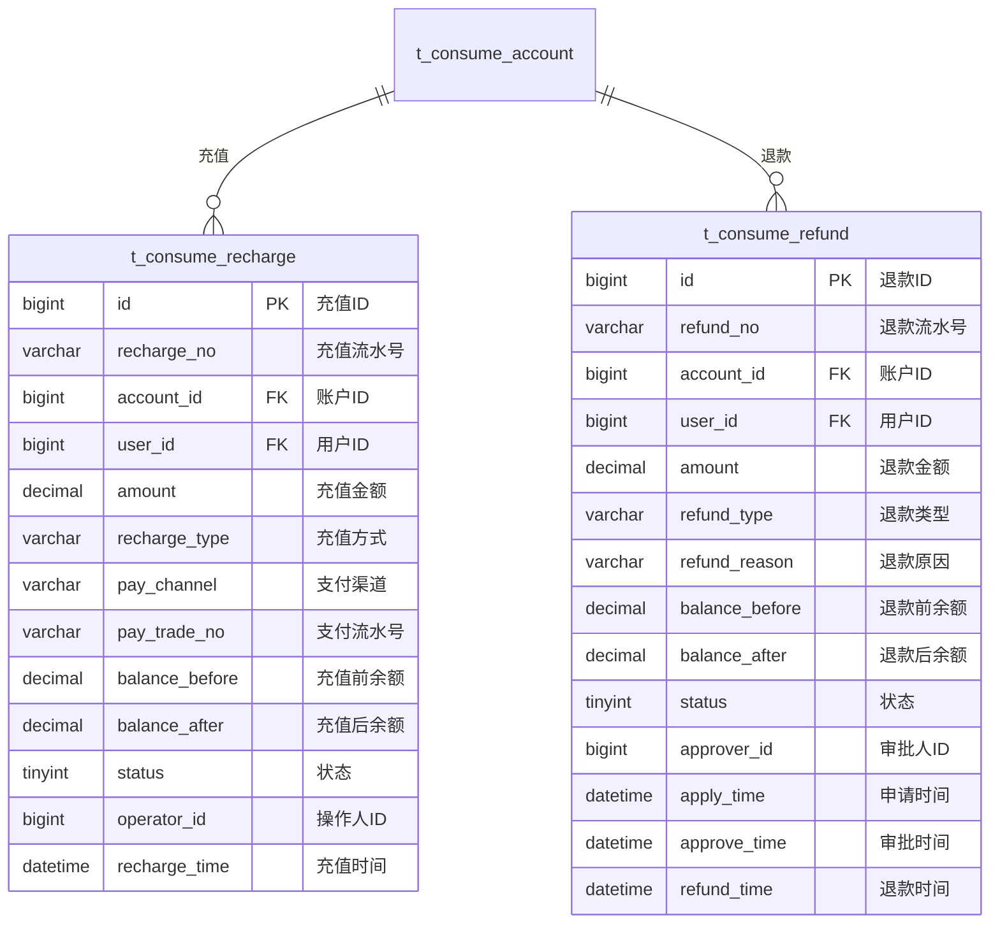

# 充值退款 - 数据结构设计

> **版本**: v1.0.0  
> **创建日期**: 2025-12-17

---

## 📊 ER图



---

## 📋 表结构详细设计

### t_consume_recharge (充值记录表)

```sql
CREATE TABLE t_consume_recharge (
    id BIGINT PRIMARY KEY AUTO_INCREMENT COMMENT '充值ID',
    recharge_no VARCHAR(32) NOT NULL COMMENT '充值流水号',
    account_id BIGINT NOT NULL COMMENT '账户ID',
    user_id BIGINT NOT NULL COMMENT '用户ID',
    amount DECIMAL(10,2) NOT NULL COMMENT '充值金额',
    recharge_type VARCHAR(20) NOT NULL COMMENT '充值方式:CASH/ONLINE/TRANSFER',
    pay_channel VARCHAR(20) COMMENT '支付渠道:WECHAT/ALIPAY/BANK',
    pay_trade_no VARCHAR(64) COMMENT '支付流水号',
    balance_before DECIMAL(10,2) NOT NULL COMMENT '充值前余额',
    balance_after DECIMAL(10,2) NOT NULL COMMENT '充值后余额',
    status TINYINT DEFAULT 1 COMMENT '状态:0待确认1成功2失败',
    operator_id BIGINT COMMENT '操作人ID',
    operator_name VARCHAR(50) COMMENT '操作人姓名',
    recharge_time DATETIME NOT NULL COMMENT '充值时间',
    remark VARCHAR(200) COMMENT '备注',
    create_time DATETIME NOT NULL DEFAULT CURRENT_TIMESTAMP COMMENT '创建时间',
    UNIQUE KEY uk_recharge_no (recharge_no),
    INDEX idx_user_id (user_id),
    INDEX idx_account_id (account_id),
    INDEX idx_recharge_time (recharge_time)
) ENGINE=InnoDB DEFAULT CHARSET=utf8mb4 COMMENT='充值记录表';
```

### t_consume_refund (退款记录表)

```sql
CREATE TABLE t_consume_refund (
    id BIGINT PRIMARY KEY AUTO_INCREMENT COMMENT '退款ID',
    refund_no VARCHAR(32) NOT NULL COMMENT '退款流水号',
    account_id BIGINT NOT NULL COMMENT '账户ID',
    user_id BIGINT NOT NULL COMMENT '用户ID',
    amount DECIMAL(10,2) NOT NULL COMMENT '退款金额',
    refund_type VARCHAR(20) NOT NULL COMMENT '退款类型:FULL/PARTIAL',
    refund_reason VARCHAR(200) NOT NULL COMMENT '退款原因',
    balance_before DECIMAL(10,2) NOT NULL COMMENT '退款前余额',
    balance_after DECIMAL(10,2) COMMENT '退款后余额',
    status TINYINT DEFAULT 0 COMMENT '状态:0待审批1审批通过2审批拒绝3已退款',
    applicant_id BIGINT NOT NULL COMMENT '申请人ID',
    approver_id BIGINT COMMENT '审批人ID',
    apply_time DATETIME NOT NULL COMMENT '申请时间',
    approve_time DATETIME COMMENT '审批时间',
    refund_time DATETIME COMMENT '退款时间',
    reject_reason VARCHAR(200) COMMENT '拒绝原因',
    create_time DATETIME NOT NULL DEFAULT CURRENT_TIMESTAMP COMMENT '创建时间',
    UNIQUE KEY uk_refund_no (refund_no),
    INDEX idx_user_id (user_id),
    INDEX idx_status (status),
    INDEX idx_apply_time (apply_time)
) ENGINE=InnoDB DEFAULT CHARSET=utf8mb4 COMMENT='退款记录表';
```

---

## 🔧 状态枚举

### 充值状态

| 值 | 说明 |
|------|------|
| 0 | 待确认 |
| 1 | 充值成功 |
| 2 | 充值失败 |

### 退款状态

| 值 | 说明 |
|------|------|
| 0 | 待审批 |
| 1 | 审批通过 |
| 2 | 审批拒绝 |
| 3 | 已退款 |

---

**📝 文档维护**: IOE-DREAM架构团队 | 2025-12-17
