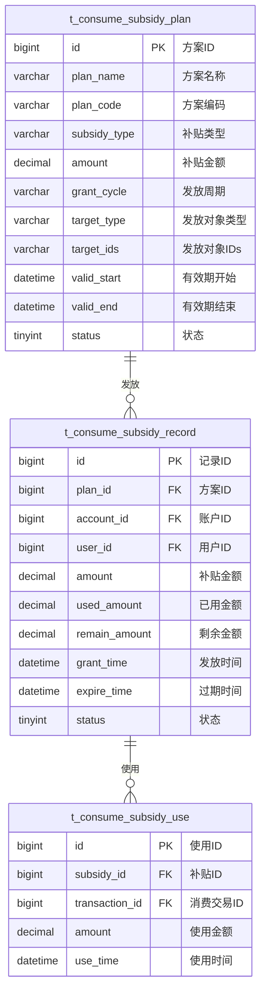

# 补贴管理 - 数据结构设计

> **版本**: v1.0.0  
> **创建日期**: 2025-12-17

---

## 📊 ER图



---

## 📋 表结构详细设计

### t_consume_subsidy_plan (补贴方案表)

```sql
CREATE TABLE t_consume_subsidy_plan (
    id BIGINT PRIMARY KEY AUTO_INCREMENT COMMENT '方案ID',
    plan_name VARCHAR(100) NOT NULL COMMENT '方案名称',
    plan_code VARCHAR(50) NOT NULL COMMENT '方案编码',
    subsidy_type VARCHAR(20) NOT NULL COMMENT '补贴类型:MEAL/TRANSPORT/WELFARE',
    amount DECIMAL(10,2) NOT NULL COMMENT '补贴金额',
    grant_cycle VARCHAR(20) NOT NULL COMMENT '发放周期:DAILY/WEEKLY/MONTHLY/ONCE',
    grant_day INT COMMENT '发放日(月度:1-28,周度:1-7)',
    grant_time TIME DEFAULT '00:00:00' COMMENT '发放时间',
    target_type VARCHAR(20) NOT NULL COMMENT '对象类型:ALL/DEPT/EMPLOYEE/ACCOUNT_KIND',
    target_ids TEXT COMMENT '对象IDs,逗号分隔',
    area_limit TEXT COMMENT '区域限制JSON',
    meal_limit TEXT COMMENT '餐别限制JSON',
    valid_start DATETIME COMMENT '有效期开始',
    valid_end DATETIME COMMENT '有效期结束',
    expire_days INT DEFAULT 30 COMMENT '到期天数(发放后多少天过期)',
    carry_over TINYINT DEFAULT 0 COMMENT '是否允许结转:0否1是',
    status TINYINT DEFAULT 1 COMMENT '状态:0禁用1启用',
    remark VARCHAR(500) COMMENT '备注',
    create_time DATETIME NOT NULL DEFAULT CURRENT_TIMESTAMP,
    update_time DATETIME NOT NULL DEFAULT CURRENT_TIMESTAMP ON UPDATE CURRENT_TIMESTAMP,
    UNIQUE KEY uk_plan_code (plan_code),
    INDEX idx_status (status),
    INDEX idx_grant_cycle (grant_cycle)
) ENGINE=InnoDB DEFAULT CHARSET=utf8mb4 COMMENT='补贴方案表';
```

### t_consume_subsidy_record (补贴发放记录表)

```sql
CREATE TABLE t_consume_subsidy_record (
    id BIGINT PRIMARY KEY AUTO_INCREMENT COMMENT '记录ID',
    plan_id BIGINT NOT NULL COMMENT '方案ID',
    plan_name VARCHAR(100) COMMENT '方案名称',
    account_id BIGINT NOT NULL COMMENT '账户ID',
    user_id BIGINT NOT NULL COMMENT '用户ID',
    user_name VARCHAR(50) COMMENT '用户姓名',
    amount DECIMAL(10,2) NOT NULL COMMENT '补贴金额',
    used_amount DECIMAL(10,2) DEFAULT 0.00 COMMENT '已使用金额',
    remain_amount DECIMAL(10,2) NOT NULL COMMENT '剩余金额',
    grant_time DATETIME NOT NULL COMMENT '发放时间',
    expire_time DATETIME NOT NULL COMMENT '过期时间',
    period VARCHAR(20) COMMENT '发放周期标识(如:2025-12)',
    status TINYINT DEFAULT 1 COMMENT '状态:0已过期1可用2已用完',
    create_time DATETIME NOT NULL DEFAULT CURRENT_TIMESTAMP,
    update_time DATETIME NOT NULL DEFAULT CURRENT_TIMESTAMP ON UPDATE CURRENT_TIMESTAMP,
    INDEX idx_account_id (account_id),
    INDEX idx_user_id (user_id),
    INDEX idx_plan_id (plan_id),
    INDEX idx_status_expire (status, expire_time),
    INDEX idx_grant_time (grant_time)
) ENGINE=InnoDB DEFAULT CHARSET=utf8mb4 COMMENT='补贴发放记录表';
```

### t_consume_subsidy_use (补贴使用明细表)

```sql
CREATE TABLE t_consume_subsidy_use (
    id BIGINT PRIMARY KEY AUTO_INCREMENT COMMENT '使用ID',
    subsidy_id BIGINT NOT NULL COMMENT '补贴记录ID',
    transaction_id BIGINT NOT NULL COMMENT '消费交易ID',
    trade_no VARCHAR(32) NOT NULL COMMENT '交易流水号',
    amount DECIMAL(10,2) NOT NULL COMMENT '使用金额',
    balance_before DECIMAL(10,2) NOT NULL COMMENT '使用前余额',
    balance_after DECIMAL(10,2) NOT NULL COMMENT '使用后余额',
    use_time DATETIME NOT NULL COMMENT '使用时间',
    create_time DATETIME NOT NULL DEFAULT CURRENT_TIMESTAMP,
    INDEX idx_subsidy_id (subsidy_id),
    INDEX idx_transaction_id (transaction_id),
    INDEX idx_use_time (use_time)
) ENGINE=InnoDB DEFAULT CHARSET=utf8mb4 COMMENT='补贴使用明细表';
```

---

## 🔧 补贴扣款逻辑

### 扣款优先级排序

```sql
-- 补贴扣款顺序：有效期最近优先，金额小优先
SELECT * FROM t_consume_subsidy_record
WHERE account_id = #{accountId}
  AND status = 1
  AND remain_amount > 0
  AND expire_time > NOW()
ORDER BY expire_time ASC, remain_amount ASC;
```

### 补贴使用限制检查

```json
{
  "areaLimit": [100, 101, 102],
  "mealLimit": ["BREAKFAST", "LUNCH", "DINNER"],
  "minAmount": 10.00
}
```

---

**📝 文档维护**: IOE-DREAM架构团队 | 2025-12-17
