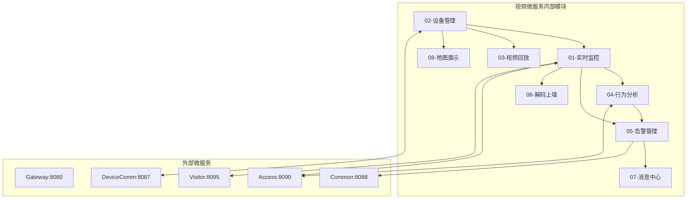
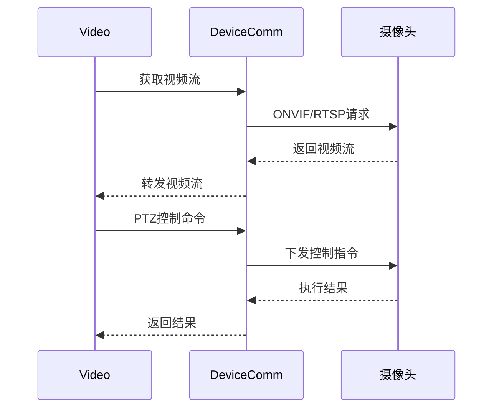
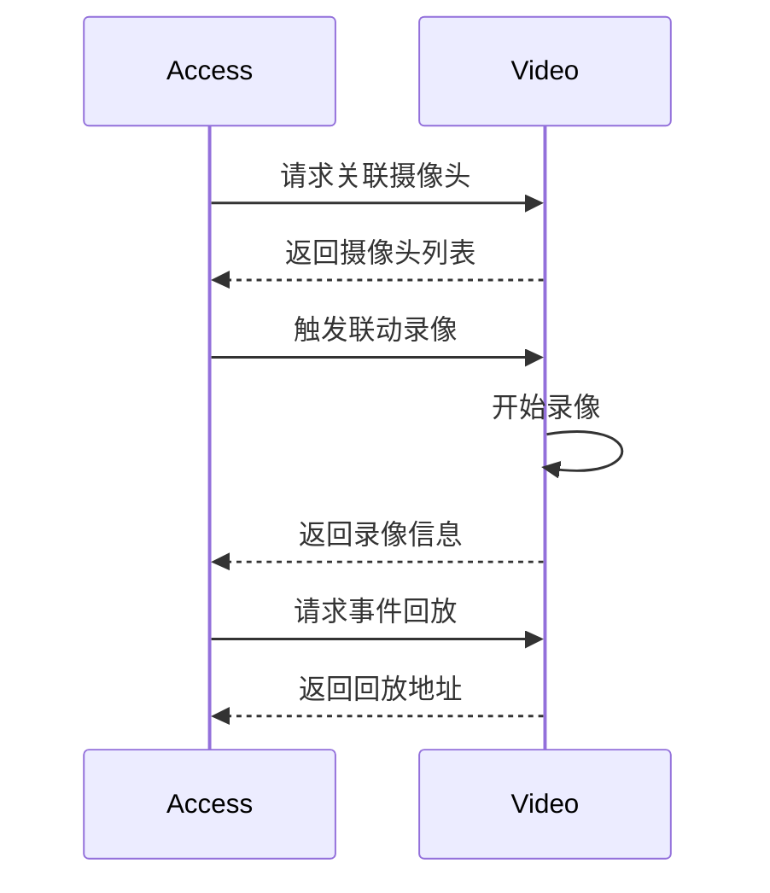
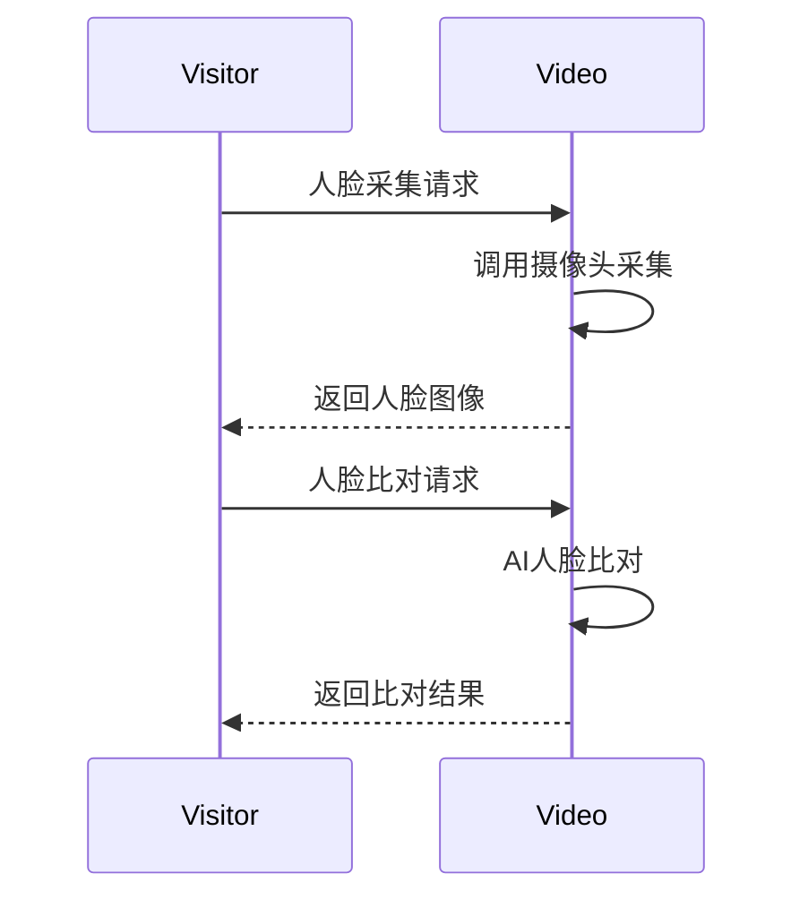
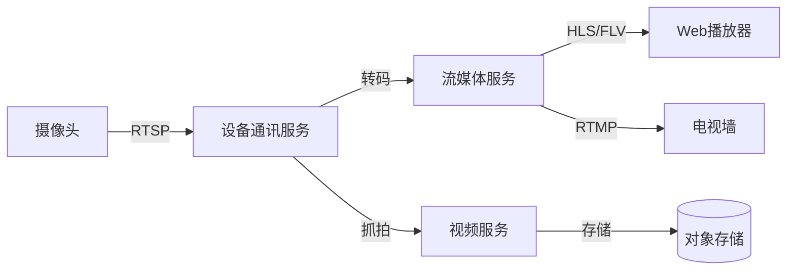
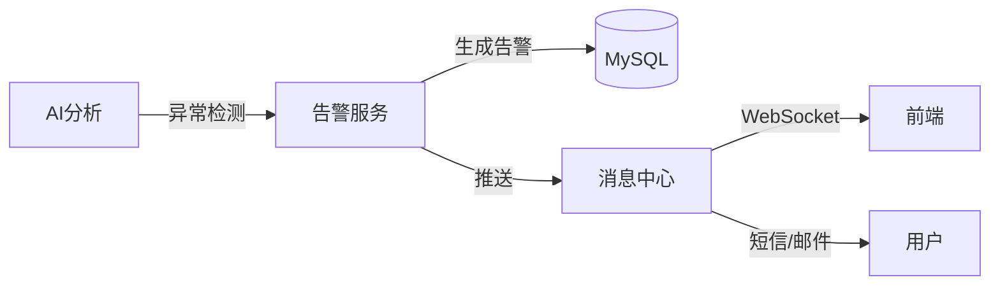

# 视频管理模块 - 模块间关联设计文档

> **版本**: v1.0.0  
> **微服务**: ioedream-video-service (8092)  
> **创建日期**: 2025-12-17

---

## 📊 模块关联全景图



---

## 🔗 内部模块关联详细设计

### 1. 设备管理 ↔ 实时监控

| 关联点 | 说明 | 数据流向 |
|--------|------|----------|
| 设备列表 | 监控时获取可用设备 | DEVICE → LIVE |
| 流地址 | 获取视频流地址 | DEVICE → LIVE |
| 状态同步 | 设备在线状态同步 | DEVICE → LIVE |

**关键接口**:
```java
// CameraDeviceService.java
List<CameraVO> getOnlineCameras(Long areaId);
StreamUrlVO getStreamUrl(Long cameraId, String streamType);

// LiveMonitorService.java
void startMonitor(Long cameraId, String clientId);
```

### 2. 实时监控 ↔ 行为分析

| 关联点 | 说明 | 数据流向 |
|--------|------|----------|
| 视频流 | AI分析实时视频流 | LIVE → AI |
| 分析结果 | 分析结果叠加显示 | AI → LIVE |
| 告警触发 | 异常行为触发告警 | AI → ALARM |

**关键接口**:
```java
// AIAnalysisService.java
void startAnalysis(Long cameraId, List<String> analysisTypes);
AIAnalysisResultVO getAnalysisResult(Long cameraId);
```

### 3. 告警管理 ↔ 消息中心

| 关联点 | 说明 | 数据流向 |
|--------|------|----------|
| 告警推送 | 告警产生时推送消息 | ALARM → MSG |
| 处理通知 | 告警处理结果通知 | ALARM → MSG |

**关键接口**:
```java
// VideoAlarmService.java
void createAlarm(VideoAlarmDTO alarm);

// VideoMessageService.java
void pushAlarmMessage(AlarmMessageDTO message);
```

### 4. 解码上墙 ↔ 实时监控

| 关联点 | 说明 | 数据流向 |
|--------|------|----------|
| 视频源 | 上墙使用监控视频源 | LIVE → WALL |
| 布局控制 | 电视墙布局管理 | WALL → LIVE |

**关键接口**:
```java
// VideoWallService.java
void setLayout(Long wallId, LayoutDTO layout);
void assignCamera(Long windowId, Long cameraId);
```

---

## 🌐 外部微服务关联设计

### 1. 视频服务 ↔ 设备通讯服务 (8087)



**关键API**:
```
GET  /api/device-comm/v1/video/stream/{cameraId}  # 获取视频流
POST /api/device-comm/v1/video/ptz/control        # PTZ控制
POST /api/device-comm/v1/video/capture            # 抓拍
```

### 2. 视频服务 ↔ 门禁服务 (8090)



**关键API**:
```
GET  /api/video/v1/camera/bindDevice/{deviceId}  # 获取关联摄像头
POST /api/video/v1/recording/start               # 启动录像
GET  /api/video/v1/playback/url                  # 获取回放地址
```

### 3. 视频服务 ↔ 访客服务 (8095)



**关键API**:
```
POST /api/video/v1/face/capture   # 人脸采集
POST /api/video/v1/face/compare   # 人脸比对
POST /api/video/v1/face/search    # 人脸搜索
```

---

## 📋 数据流转设计

### 视频流数据流



### 告警数据流



---

## 🔧 接口契约规范

| 调用方 | 被调用方 | 接口 | 超时 | 重试 |
|--------|----------|------|------|------|
| VID | DC | getStream | 5s | 2次 |
| ACC | VID | bindCamera | 2s | 2次 |
| VIS | VID | captureFace | 10s | 1次 |
| VID | CMN | pushMessage | 3s | 3次 |

---

## ⚠️ 关键注意事项

1. **视频流延迟**: 实时监控延迟控制在3秒以内
2. **存储管理**: 录像文件按保留策略自动清理
3. **并发控制**: 单摄像头最大支持20路并发观看
4. **AI资源**: AI分析需要GPU资源，合理调度
5. **带宽优化**: 支持多码流切换，自适应带宽

---

**📝 文档维护**: IOE-DREAM架构团队 | 2025-12-17
