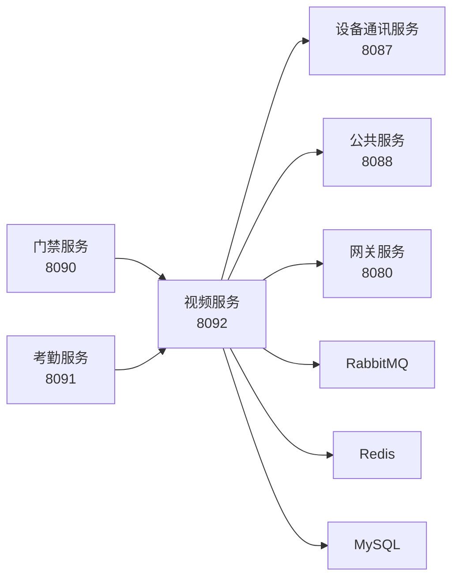

# 智能视频管理模块 - 模块概述

## 📋 模块定位

**智能视频模块**是IOE-DREAM安防系统的核心业务模块，作为`ioedream-video-service`(端口8092)独立微服务运行，通过**事件订阅中心**与设备通讯服务、门禁服务等协同工作，提供视频监控、AI分析、告警管理等核心能力。

## 🎯 核心价值

| 价值维度 | 说明 |
|----------|------|
| 实时监控 | 支持多协议视频流接入，提供流畅的实时预览体验 |
| 智能分析 | AI驱动的人脸识别、行为检测、异常告警 |
| 安全保障 | 五级权限体系，敏感数据加密，完整审计日志 |
| 高可用性 | 分布式架构，99.9%可用性SLA |

## 🛠️ 技术栈

| 类别 | 技术选型 | 版本 |
|------|----------|------|
| 框架 | Spring Boot + Spring Cloud | 3.5.8 / 2025.0.0 |
| 语言 | Java | 17 |
| 数据库 | MySQL (分库分表+读写分离) | 8.0+ |
| 缓存 | Redis + Caffeine (多级缓存) | 7.0+ |
| 消息队列 | RabbitMQ | 3.12+ |
| 流媒体协议 | RTSP, RTMP, HLS, WebRTC, HTTP-FLV | - |
| AI框架 | OpenCV, TensorFlow Lite, ONNX | - |
| 注册中心 | Nacos | 2.3+ |
| 认证框架 | Sa-Token | 1.38+ |

## 🔐 安全体系

采用**五级安全体系**：

| 等级 | 名称 | 权限范围 |
|------|------|----------|
| Level 5 | 绝密级 | 系统管理员，全部功能 |
| Level 4 | 机密级 | 安保主管，AI分析/下载/联动配置 |
| Level 3 | 秘密级 | 安保人员，告警处理/回放查看 |
| Level 2 | 内部级 | 普通员工，基础预览/查询 |
| Level 1 | 公开级 | 访客，受限预览 |

## 📦 子模块清单

| 序号 | 模块名称 | 说明 | 核心功能 |
|------|----------|------|----------|
| 01 | 实时监控 | 视频预览、云台控制 | 多协议流接入、PTZ控制、截图录制 |
| 02 | 设备管理交互 | 设备信息订阅 | 事件订阅、状态同步、离线告警 |
| 03 | 视频回放 | 录像检索、播放 | 多维检索、变速播放、下载管理 |
| 04 | 行为分析 | AI智能分析 | 人脸识别、行为检测、规则配置 |
| 05 | 告警管理 | 告警处理中心 | 告警接收、联动配置、推送管理 |
| 06 | 解码上墙 | 电视墙管理 | 解码器管理、布局配置、预案切换 |
| 07 | 消息中心 | 事件订阅推送 | WebSocket推送、消息存储、历史查询 |
| 08 | 地图展示 | GIS地图可视化 | 设备定位、区域划分、轨迹展示 |

## 🏗️ 四层架构

```
┌─────────────────────────────────────────────────────────────┐
│  Controller (接口控制层)                                     │
│  - 接收HTTP/WebSocket请求                                   │
│  - 参数校验(@Valid)                                         │
│  - 返回统一ResponseDTO                                      │
├─────────────────────────────────────────────────────────────┤
│  Service (核心业务层)                                        │
│  - 核心业务逻辑实现                                          │
│  - 事务管理(@Transactional)                                 │
│  - 权限校验                                                 │
├─────────────────────────────────────────────────────────────┤
│  Manager (流程管理层)                                        │
│  - 复杂流程编排                                              │
│  - 缓存管理                                                 │
│  - 第三方服务集成                                            │
├─────────────────────────────────────────────────────────────┤
│  DAO (数据访问层)                                            │
│  - 继承BaseMapper                                           │
│  - 使用@Mapper注解                                          │
│  - 统一Dao后缀命名                                          │
└─────────────────────────────────────────────────────────────┘
```

**禁止跨层访问**: Controller不能直接调用Manager/DAO

## ✅ 编码规范

### 必须遵守
- ✅ 使用 `@Resource` 注入依赖 (禁止@Autowired)
- ✅ 使用 `@Mapper` 注解 (禁止@Repository)
- ✅ 使用 `Dao` 后缀 (禁止Repository)
- ✅ 使用 `jakarta.*` 包 (禁止javax.*)
- ✅ 返回统一 `ResponseDTO` 格式
- ✅ 使用 `@Valid` 参数校验
- ✅ 使用 `LambdaQueryWrapper` (禁止字符串列名)

### 命名规范
| 类型 | 规范 | 示例 |
|------|------|------|
| Entity | XxxEntity | VideoDeviceEntity |
| DAO | XxxDao + @Mapper | VideoDeviceDao |
| Service | XxxService / XxxServiceImpl | VideoService |
| Controller | XxxController | VideoController |
| Form | XxxAddForm / XxxQueryForm | DeviceQueryForm |
| VO | XxxVO / XxxDetailVO | VideoDeviceVO |

## 📊 性能指标

| 指标 | 要求 | 监控方式 |
|------|------|----------|
| 起播时间 | ≤ 2秒 | 前端埋点 |
| API响应时间 | ≤ 500ms | APM |
| AI分析延迟 | ≤ 500ms | Prometheus |
| 告警推送延迟 | ≤ 3秒 | 日志统计 |
| 系统可用性 | ≥ 99.9% | 监控平台 |
| 并发视频流 | ≥ 500路 | 压测 |

## 🔗 服务依赖



## 📁 文档结构

```
05-视频管理模块/
├── 00-模块概述/
│   └── README.md           # 本文档
├── 01-实时监控/
│   ├── 功能说明.md
│   ├── 用户故事.md
│   ├── 数据结构设计.md
│   ├── 业务流程图.md
│   ├── 需求规格说明.md
│   ├── 概要设计.md
│   └── 详细设计.md
├── 02-设备管理交互/
│   ├── README.md           # 完整设计文档
│   ├── 功能说明.md
│   └── 数据结构设计.md
├── 03-视频回放/
│   ├── README.md           # 完整设计文档
│   ├── 功能说明.md
│   └── 数据结构设计.md
├── 04-行为分析/
│   ├── README.md           # 完整设计文档
│   └── 功能说明.md
├── 05-告警管理/
│   ├── README.md           # 完整设计文档
│   ├── 功能说明.md
│   └── 数据结构设计.md
├── 06-解码上墙/
│   └── README.md           # 完整设计文档
├── 07-消息中心/
│   └── README.md           # 完整设计文档
└── 08-地图展示/
    └── README.md           # 完整设计文档
```

## 🚀 快速开始

### 服务启动
```bash
# 1. 确保依赖服务已启动
# Nacos, MySQL, Redis, RabbitMQ

# 2. 启动视频服务
cd ioedream-video-service
mvn spring-boot:run -Dspring.profiles.active=dev
```

### 接口文档
- Swagger UI: http://localhost:8092/swagger-ui.html
- API Docs: http://localhost:8092/v3/api-docs

## 📞 联系方式

如有问题，请联系视频模块负责人或在项目Issue中反馈。
