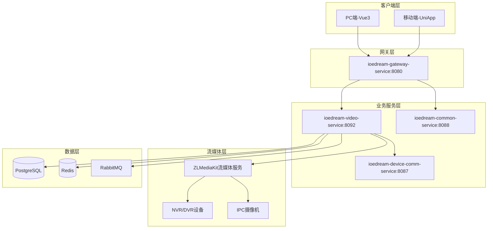

# 智能视频模块 - 概要设计说明书

## 1. 系统架构

### 1.1 整体架构图



### 1.2 模块划分

| 模块 | 职责 |
|------|------|
| 实时监控 | 视频预览、云台控制、截图、录像 |
| 设备管理交互 | 设备同步、状态管理、订阅推送 |
| 视频回放 | 录像检索、回放控制、下载 |
| 行为分析 | AI智能分析、人脸识别、行为检测 |
| 告警管理 | 告警接收、处理、推送、统计 |
| 解码上墙 | 解码器管理、电视墙、预案轮巡 |
| 消息中心 | 消息订阅、推送、通知管理 |
| 地图展示 | GIS地图、设备定位、热力图 |

---

## 2. 四层架构设计

### 2.1 层次职责

```
┌─────────────────────────────────────────┐
│ Controller层 - 接口暴露、参数校验、响应封装  │
├─────────────────────────────────────────┤
│ Service层 - 业务逻辑、事务管理             │
├─────────────────────────────────────────┤
│ Manager层 - 流程编排、缓存管理、第三方集成   │
├─────────────────────────────────────────┤
│ DAO层 - 数据访问、MyBatis-Plus操作        │
└─────────────────────────────────────────┘
```

### 2.2 Controller层设计

```java
@RestController
@RequestMapping("/ivs/v1")
@Tag(name = "视频监控")
public class MonitorController {
    
    @Resource
    private MonitorService monitorService;
    
    @GetMapping("/stream/{deviceId}")
    @SaCheckPermission("ivs:monitor:view")
    public ResponseDTO<StreamVO> getStream(@PathVariable Long deviceId) {
        return ResponseDTO.ok(monitorService.getStream(deviceId));
    }
}
```

### 2.3 Service层设计

```java
@Service
@Transactional(rollbackFor = Exception.class)
public class MonitorServiceImpl implements MonitorService {
    
    @Resource
    private StreamManager streamManager;
    
    @Override
    public StreamVO getStream(Long deviceId) {
        // 1. 权限校验
        // 2. 获取设备信息
        // 3. 请求流地址
        // 4. 返回结果
        return streamManager.requestStream(deviceId, StreamType.MAIN);
    }
}
```

### 2.4 Manager层设计

```java
public class StreamManager {
    
    @Resource
    private DeviceCommClient deviceCommClient;
    
    @Resource
    private RedisTemplate<String, String> redisTemplate;
    
    public StreamVO requestStream(Long deviceId, StreamType type) {
        // 1. 查询缓存
        // 2. 调用流媒体服务
        // 3. 更新缓存
        // 4. 返回流地址
    }
}
```

### 2.5 DAO层设计

```java
@Mapper
public interface DeviceDao extends BaseMapper<DeviceEntity> {
    
    @Select("SELECT * FROM ivs_device WHERE region_id = #{regionId}")
    List<DeviceEntity> selectByRegion(@Param("regionId") Long regionId);
}
```

---

## 3. 数据库概念模型

### 3.1 核心ER图

```
┌──────────┐    ┌──────────┐    ┌──────────┐
│ 区域      │───<│ 设备      │───<│ 通道      │
└──────────┘    └──────────┘    └──────────┘
                    │                │
                    │                │
                    ▼                ▼
              ┌──────────┐    ┌──────────┐
              │ 录像记录  │    │ 分析结果  │
              └──────────┘    └──────────┘
                    │                │
                    │                │
                    ▼                ▼
              ┌──────────┐    ┌──────────┐
              │ 告警记录  │    │ 告警处理  │
              └──────────┘    └──────────┘
```

### 3.2 核心实体

| 实体 | 主要属性 |
|------|----------|
| 区域(ivs_region) | ID、名称、父ID、层级 |
| 设备(ivs_device) | ID、名称、IP、状态、区域ID |
| 录像(ivs_record) | ID、设备ID、开始/结束时间、路径 |
| 告警(ivs_alarm) | ID、类型、级别、设备ID、时间、状态 |
| 分析结果(ivs_analysis_result) | ID、类型、置信度、快照URL |

---

## 4. 技术选型

### 4.1 后端技术栈

| 组件 | 技术选型 | 版本 | 说明 |
|------|----------|------|------|
| 基础框架 | Spring Boot | 3.5.8 | 微服务基础 |
| 微服务 | Spring Cloud | 2025.0.0 | 服务治理 |
| ORM | MyBatis-Plus | 3.5.x | 数据库操作 |
| 缓存 | Redis + Caffeine | - | 多级缓存 |
| 消息队列 | RabbitMQ | - | 异步消息 |
| 流媒体 | ZLMediaKit | - | 视频流转发 |

### 4.2 流媒体协议

| 协议 | 适用场景 | 延迟 |
|------|----------|------|
| RTSP | 设备直连 | ~1秒 |
| RTMP | 推流 | ~2秒 |
| HLS | 移动端/兼容性 | 3-5秒 |
| HTTP-FLV | Web低延迟 | ~2秒 |
| WebRTC | 超低延迟 | <500ms |

### 4.3 前端技术栈

| 端 | 技术选型 |
|------|----------|
| PC端 | Vue 3 + TypeScript + Element Plus |
| 移动端 | UniApp + Vue 3 |
| 播放器 | flv.js / hls.js |
| 地图 | 高德地图API |

---

## 5. 接口设计概要

### 5.1 接口规范

- URL格式: `/ivs/v1/{module}/{resource}`
- 统一响应: `ResponseDTO<T>`
- 认证方式: Sa-Token + JWT
- 权限控制: 5级安全等级

### 5.2 核心接口列表

| 模块 | 接口 | 方法 | 说明 |
|------|------|------|------|
| 监控 | /ivs/v1/stream/{deviceId} | GET | 获取视频流 |
| 监控 | /ivs/v1/ptz/control | POST | 云台控制 |
| 回放 | /ivs/v1/record/query | POST | 录像检索 |
| 回放 | /ivs/v1/playback/{recordId} | GET | 录像回放 |
| 告警 | /ivs/v1/alarm/list | GET | 告警列表 |
| 告警 | /ivs/v1/alarm/process | POST | 告警处理 |
| 设备 | /ivs/v1/device/tree | GET | 设备树 |
| 设备 | /ivs/v1/device/status | GET | 设备状态 |

---

## 6. 部署架构

### 6.1 部署拓扑

```
┌─────────────────────────────────────────┐
│               负载均衡层                  │
│          (Nginx / HAProxy)              │
└─────────────────────────────────────────┘
                    │
┌───────────────────┼───────────────────┐
│                   │                   │
▼                   ▼                   ▼
┌─────────┐   ┌─────────┐   ┌─────────┐
│Gateway-1│   │Gateway-2│   │Gateway-3│
└─────────┘   └─────────┘   └─────────┘
        │           │           │
        └───────────┼───────────┘
                    │
┌───────────────────┼───────────────────┐
│                   │                   │
▼                   ▼                   ▼
┌─────────┐   ┌─────────┐   ┌─────────┐
│Video-1  │   │Video-2  │   │Video-3  │
└─────────┘   └─────────┘   └─────────┘
        │           │           │
        └───────────┼───────────┘
                    │
┌───────────────────┼───────────────────┐
│                   │                   │
▼                   ▼                   ▼
┌─────────┐   ┌─────────┐   ┌─────────┐
│ZLMedia-1│   │ZLMedia-2│   │ZLMedia-3│
└─────────┘   └─────────┘   └─────────┘
```

### 6.2 容量规划

| 规模 | 设备数 | 并发流 | Video服务 | 流媒体服务 |
|------|--------|--------|-----------|------------|
| 小型 | <500 | 100 | 2节点 | 2节点 |
| 中型 | 500-2000 | 500 | 3节点 | 3节点 |
| 大型 | >2000 | 1000+ | 5+节点 | 5+节点 |

---

## 7. 安全设计

### 7.1 五级安全等级

| 级别 | 名称 | 权限范围 |
|------|------|----------|
| Level 5 | 绝密级 | 系统管理员，全部权限 |
| Level 4 | 机密级 | 安保主管，管理配置 |
| Level 3 | 秘密级 | 安保人员，操作权限 |
| Level 2 | 内部级 | 普通员工，查看权限 |
| Level 1 | 公开级 | 访客，最小权限 |

### 7.2 安全措施

- 传输加密: HTTPS/WSS
- 数据加密: AES-256
- 认证: Sa-Token + JWT
- 审计: 操作日志记录
- 防护: 接口限流、SQL注入防护
