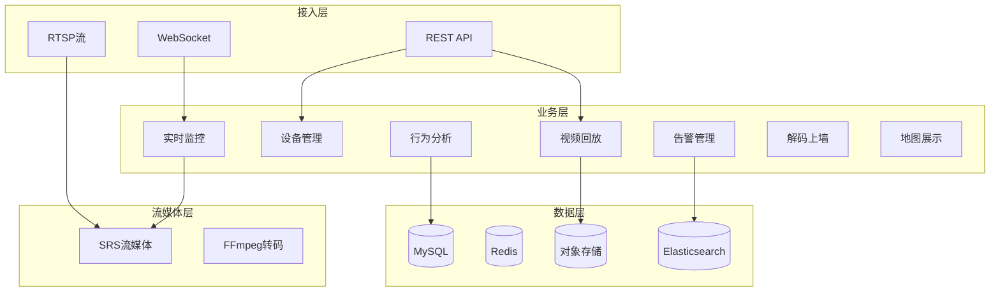
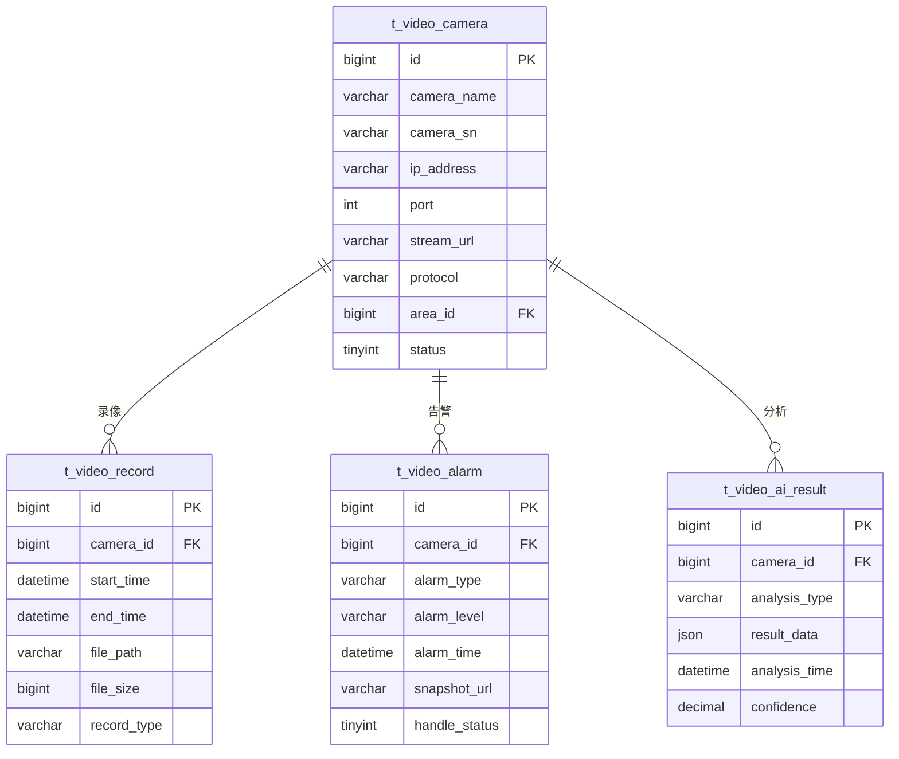

# 视频管理微服务 - 总体设计文档

> **版本**: v1.0.0  
> **微服务**: ioedream-video-service (8092)  
> **创建日期**: 2025-12-17

---

## 📋 模块概述

视频管理微服务负责企业视频监控的全面管理，包括实时监控、视频回放、AI行为分析、告警管理、解码上墙和地图展示等功能。

---

## 🏗️ 系统架构



---

## 📁 代码结构

```
ioedream-video-service/src/main/java/net/lab1024/sa/video/
├── VideoApplication.java                   # 启动类
├── controller/                             # Controller层
│   ├── CameraDeviceController.java        # 设备管理
│   ├── LiveMonitorController.java         # 实时监控
│   ├── PlaybackController.java            # 视频回放
│   ├── AIAnalysisController.java          # 行为分析
│   ├── VideoAlarmController.java          # 告警管理
│   ├── VideoWallController.java           # 解码上墙
│   └── VideoMapController.java            # 地图展示
├── service/                                # Service层
│   ├── CameraDeviceService.java
│   ├── LiveMonitorService.java
│   ├── PlaybackService.java
│   ├── AIAnalysisService.java
│   ├── VideoAlarmService.java
│   ├── VideoWallService.java
│   └── VideoMapService.java
├── dao/                                    # DAO层
│   ├── CameraDeviceDao.java
│   ├── VideoRecordDao.java
│   ├── VideoAlarmDao.java
│   └── VideoWallDao.java
├── domain/                                 # 领域对象
│   ├── entity/
│   ├── form/
│   └── vo/
└── manager/                                # Manager层
    ├── StreamManager.java
    └── AIAnalysisManager.java
```

---

## 🎯 核心功能模块

### 1. 实时监控
- 多画面分割显示（1/4/9/16画面）
- PTZ云台控制
- 实时抓拍
- 画面轮巡
- 电子放大

### 2. 设备管理
- 摄像头注册管理
- 设备分组管理
- 设备状态监控
- ONVIF设备发现
- 录像计划配置

### 3. 视频回放
- 时间轴回放
- 事件回放
- 下载录像
- 录像检索
- 多倍速播放

### 4. 行为分析
- 人员检测
- 越界检测
- 入侵检测
- 离岗检测
- 人群聚集检测
- 烟火检测

### 5. 告警管理
- 实时告警推送
- 告警联动
- 告警处理
- 告警统计
- 告警订阅

### 6. 解码上墙
- 电视墙管理
- 窗口布局配置
- 视频轮巡计划
- 预案管理

### 7. 地图展示
- 设备分布地图
- 实时状态显示
- 告警定位
- 区域热力图

---

## 📊 数据库设计

### 核心表结构

| 表名 | 说明 |
|------|------|
| t_video_camera | 摄像头设备表 |
| t_video_record | 录像记录表 |
| t_video_alarm | 视频告警表 |
| t_video_wall | 电视墙配置表 |
| t_video_wall_window | 墙窗口配置表 |
| t_video_ai_config | AI分析配置表 |
| t_video_ai_result | AI分析结果表 |

### ER图



---

## 🔧 API接口设计

### 实时监控

| 方法 | 路径 | 说明 |
|------|------|------|
| GET | /api/video/v1/live/stream/{cameraId} | 获取视频流 |
| POST | /api/video/v1/live/ptz/control | PTZ控制 |
| POST | /api/video/v1/live/capture | 实时抓拍 |

### 视频回放

| 方法 | 路径 | 说明 |
|------|------|------|
| GET | /api/video/v1/playback/list | 录像列表 |
| GET | /api/video/v1/playback/url | 获取回放地址 |
| POST | /api/video/v1/playback/download | 下载录像 |

### 告警管理

| 方法 | 路径 | 说明 |
|------|------|------|
| GET | /api/video/v1/alarm/list | 告警列表 |
| PUT | /api/video/v1/alarm/handle | 处理告警 |
| GET | /api/video/v1/alarm/statistics | 告警统计 |

### AI分析

| 方法 | 路径 | 说明 |
|------|------|------|
| POST | /api/video/v1/ai/start | 启动分析 |
| POST | /api/video/v1/ai/stop | 停止分析 |
| GET | /api/video/v1/ai/result | 分析结果 |

---

## 📈 性能指标

| 指标项 | 要求 |
|--------|------|
| 视频流延迟 | ≤ 3s |
| 单摄像头并发 | ≥ 20路 |
| 录像检索时间 | ≤ 2s |
| AI分析延迟 | ≤ 500ms |
| 告警推送延迟 | ≤ 1s |
| 录像保存周期 | ≥ 30天 |

---

## 🔐 安全要求

- 视频流传输加密
- 录像文件完整性校验
- 设备访问鉴权
- 敏感区域视频脱敏
- 操作审计日志

---

**📝 文档维护**: IOE-DREAM架构团队 | 2025-12-17
