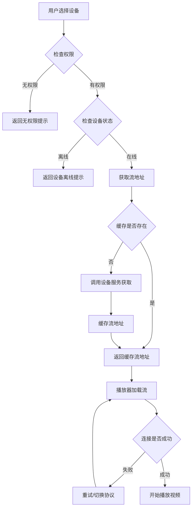
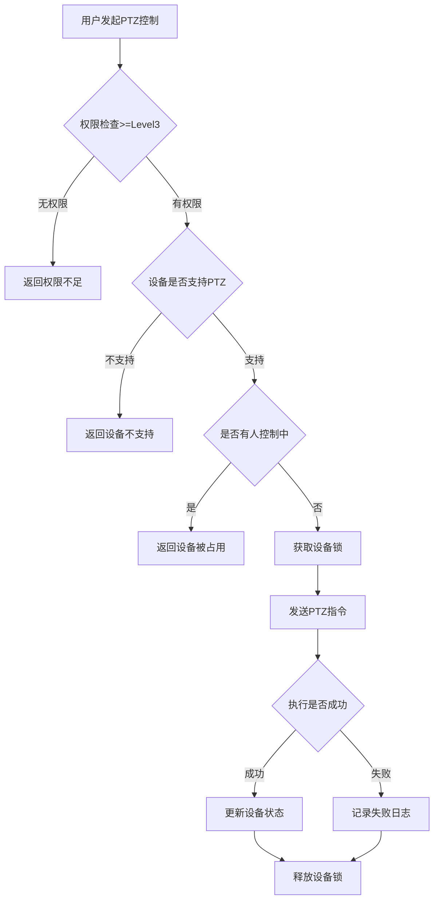
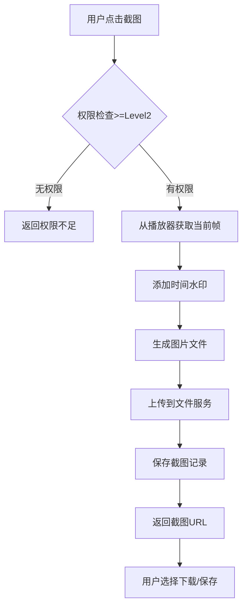
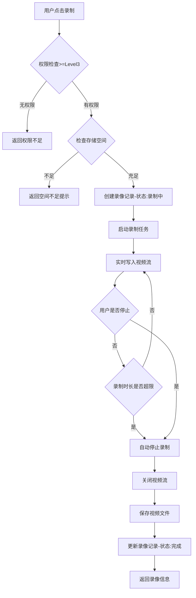
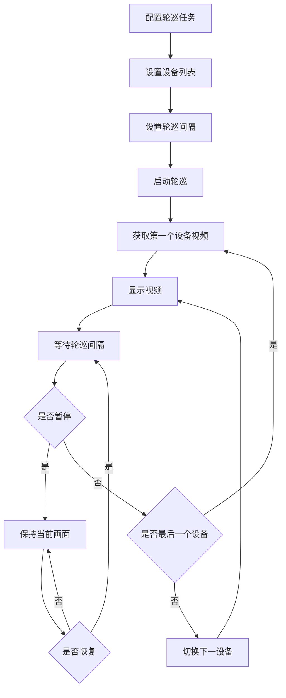
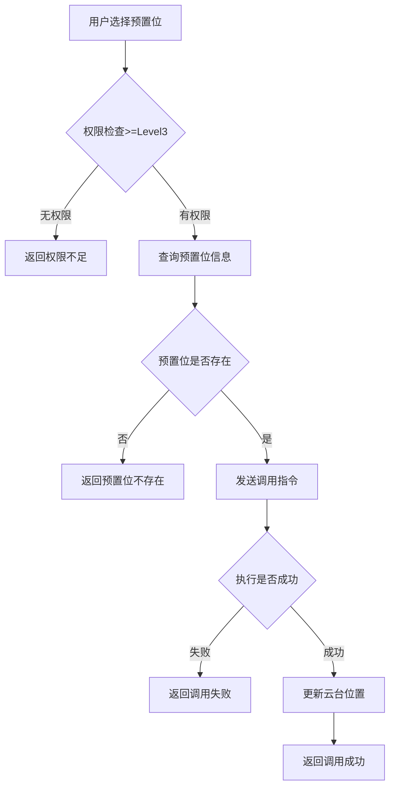

# 实时监控模块 - 业务流程图

## 视频预览流程

```mermaid
flowchart TD
    A[用户选择设备] --> B{检查权限}
    B -->|无权限| C[返回无权限提示]
    B -->|有权限| D{检查设备状态}
    D -->|离线| E[返回设备离线提示]
    D -->|在线| F[获取流地址]
    F --> G{缓存是否存在}
    G -->|是| H[返回缓存流地址]
    G -->|否| I[调用设备服务获取]
    I --> J[缓存流地址]
    J --> H
    H --> K[播放器加载流]
    K --> L{连接是否成功}
    L -->|失败| M[重试/切换协议]
    M --> K
    L -->|成功| N[开始播放视频]
```

## 云台控制流程

```mermaid
flowchart TD
    A[用户发起PTZ控制] --> B{权限检查>=Level3}
    B -->|无权限| C[返回权限不足]
    B -->|有权限| D{设备是否支持PTZ}
    D -->|不支持| E[返回设备不支持]
    D -->|支持| F{是否有人控制中}
    F -->|是| G[返回设备被占用]
    F -->|否| H[获取设备锁]
    H --> I[发送PTZ指令]
    I --> J{执行是否成功}
    J -->|失败| K[记录失败日志]
    J -->|成功| L[更新设备状态]
    L --> M[释放设备锁]
    K --> M
```

## 视频截图流程

```mermaid
flowchart TD
    A[用户点击截图] --> B{权限检查>=Level2}
    B -->|无权限| C[返回权限不足]
    B -->|有权限| D[从播放器获取当前帧]
    D --> E[添加时间水印]
    E --> F[生成图片文件]
    F --> G[上传到文件服务]
    G --> H[保存截图记录]
    H --> I[返回截图URL]
    I --> J[用户选择下载/保存]
```

## 手动录制流程

```mermaid
flowchart TD
    A[用户点击录制] --> B{权限检查>=Level3}
    B -->|无权限| C[返回权限不足]
    B -->|有权限| D{检查存储空间}
    D -->|不足| E[返回空间不足提示]
    D -->|充足| F[创建录像记录-状态:录制中]
    F --> G[启动录制任务]
    G --> H[实时写入视频流]
    H --> I{用户是否停止}
    I -->|否| J{录制时长是否超限}
    J -->|否| H
    J -->|是| K[自动停止录制]
    I -->|是| K
    K --> L[关闭视频流]
    L --> M[保存视频文件]
    M --> N[更新录像记录-状态:完成]
    N --> O[返回录像信息]
```

## 画面轮巡流程

```mermaid
flowchart TD
    A[配置轮巡任务] --> B[设置设备列表]
    B --> C[设置轮巡间隔]
    C --> D[启动轮巡]
    D --> E[获取第一个设备视频]
    E --> F[显示视频]
    F --> G[等待轮巡间隔]
    G --> H{是否暂停}
    H -->|是| I[保持当前画面]
    I --> J{是否恢复}
    J -->|是| G
    J -->|否| I
    H -->|否| K{是否最后一个设备}
    K -->|是| E
    K -->|否| L[切换下一设备]
    L --> F
```

## 预置位调用流程

```mermaid
flowchart TD
    A[用户选择预置位] --> B{权限检查>=Level3}
    B -->|无权限| C[返回权限不足]
    B -->|有权限| D[查询预置位信息]
    D --> E{预置位是否存在}
    E -->|否| F[返回预置位不存在]
    E -->|是| G[发送调用指令]
    G --> H{执行是否成功}
    H -->|失败| I[返回调用失败]
    H -->|成功| J[更新云台位置]
    J --> K[返回调用成功]
```
