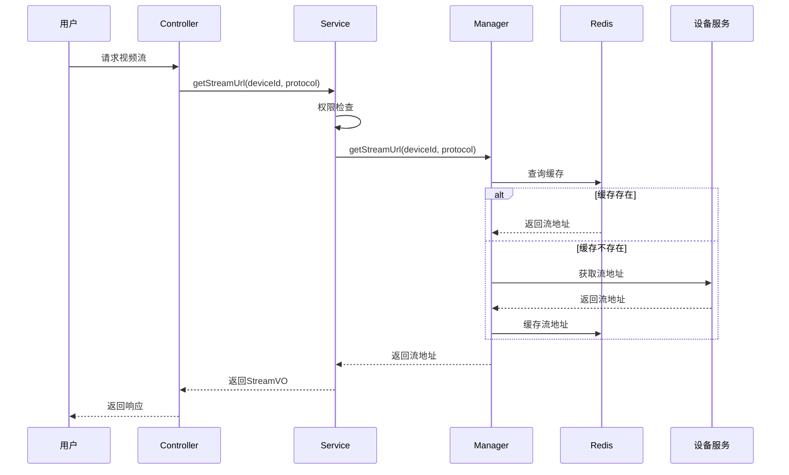
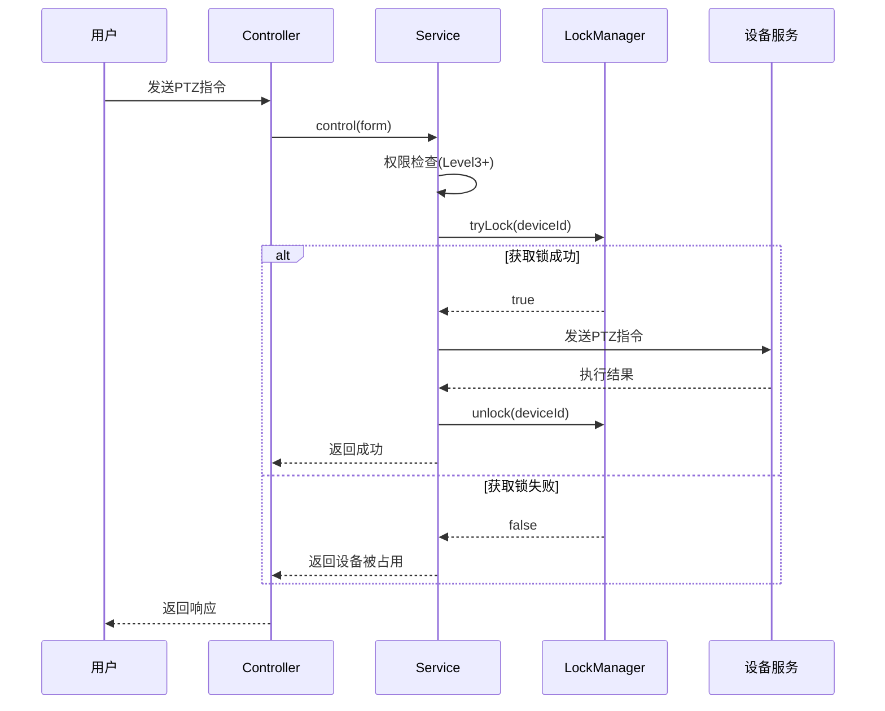

# 实时监控模块 - 详细设计

## 类结构设计

### Controller层

```java
@RestController
@RequestMapping("/ivs/v1/monitor")
@SecurityLevel(value = 2)
public class MonitorController {
    
    @Resource
    private MonitorService monitorService;
    
    /**
     * 获取视频流地址
     * @param deviceId 设备ID
     * @param protocol 协议类型
     * @return 流地址信息
     */
    @GetMapping("/stream/{deviceId}")
    public ResponseDTO<StreamVO> getStream(
            @PathVariable Long deviceId,
            @RequestParam(defaultValue = "ws-flv") String protocol) {
        return ResponseDTO.ok(monitorService.getStreamUrl(deviceId, protocol));
    }
    
    /**
     * 视频截图
     * @param deviceId 设备ID
     * @return 截图信息
     */
    @PostMapping("/snapshot/{deviceId}")
    public ResponseDTO<SnapshotVO> snapshot(@PathVariable Long deviceId) {
        return ResponseDTO.ok(monitorService.captureSnapshot(deviceId));
    }
    
    /**
     * 开始录制
     * @param deviceId 设备ID
     * @return 录制任务信息
     */
    @PostMapping("/record/start/{deviceId}")
    @SecurityLevel(value = 3)
    public ResponseDTO<RecordVO> startRecord(@PathVariable Long deviceId) {
        return ResponseDTO.ok(monitorService.startRecord(deviceId));
    }
    
    /**
     * 停止录制
     * @param recordId 录制ID
     * @return 录像信息
     */
    @PostMapping("/record/stop/{recordId}")
    @SecurityLevel(value = 3)
    public ResponseDTO<RecordVO> stopRecord(@PathVariable Long recordId) {
        return ResponseDTO.ok(monitorService.stopRecord(recordId));
    }
}
```

```java
@RestController
@RequestMapping("/ivs/v1/ptz")
@SecurityLevel(value = 3)
public class PTZController {
    
    @Resource
    private PTZService ptzService;
    
    /**
     * 云台方向控制
     * @param form 控制参数
     * @return 执行结果
     */
    @PostMapping("/control")
    public ResponseDTO<Void> control(@Valid @RequestBody PTZControlForm form) {
        ptzService.control(form);
        return ResponseDTO.ok();
    }
    
    /**
     * 设置预置位
     * @param form 预置位参数
     * @return 预置位信息
     */
    @PostMapping("/preset")
    public ResponseDTO<PresetVO> setPreset(@Valid @RequestBody PresetForm form) {
        return ResponseDTO.ok(ptzService.setPreset(form));
    }
    
    /**
     * 调用预置位
     * @param presetId 预置位ID
     * @return 执行结果
     */
    @PostMapping("/preset/call/{presetId}")
    public ResponseDTO<Void> callPreset(@PathVariable Long presetId) {
        ptzService.callPreset(presetId);
        return ResponseDTO.ok();
    }
    
    /**
     * 获取预置位列表
     * @param deviceId 设备ID
     * @return 预置位列表
     */
    @GetMapping("/preset/list/{deviceId}")
    public ResponseDTO<List<PresetVO>> listPresets(@PathVariable Long deviceId) {
        return ResponseDTO.ok(ptzService.listPresets(deviceId));
    }
}
```

### Service层

```java
@Service
@Transactional(rollbackFor = Exception.class)
public class MonitorServiceImpl implements MonitorService {
    
    @Resource
    private StreamManager streamManager;
    
    @Resource
    private SnapshotDao snapshotDao;
    
    @Resource
    private LocalRecordDao localRecordDao;
    
    @Override
    public StreamVO getStreamUrl(Long deviceId, String protocol) {
        // 1. 权限检查
        SecurityUtils.checkDevicePermission(deviceId);
        
        // 2. 设备状态检查
        DeviceEntity device = checkDeviceOnline(deviceId);
        
        // 3. 获取流地址(优先缓存)
        String streamUrl = streamManager.getStreamUrl(deviceId, protocol);
        
        return StreamVO.builder()
                .deviceId(deviceId)
                .streamUrl(streamUrl)
                .protocol(protocol)
                .build();
    }
    
    @Override
    public SnapshotVO captureSnapshot(Long deviceId) {
        // 1. 权限检查
        SecurityUtils.checkDevicePermission(deviceId);
        
        // 2. 获取当前帧
        byte[] imageData = streamManager.captureFrame(deviceId);
        
        // 3. 添加水印
        imageData = addWatermark(imageData, deviceId);
        
        // 4. 上传文件
        String filePath = fileService.upload(imageData, "snapshot", ".jpg");
        
        // 5. 保存记录
        SnapshotEntity entity = new SnapshotEntity();
        entity.setDeviceId(deviceId);
        entity.setUserId(SecurityUtils.getCurrentUserId());
        entity.setCaptureTime(LocalDateTime.now());
        entity.setFilePath(filePath);
        entity.setFileSize((long) imageData.length);
        entity.setTriggerType(0); // 手动
        snapshotDao.insert(entity);
        
        return SnapshotVO.from(entity);
    }
    
    @Override
    public RecordVO startRecord(Long deviceId) {
        // 1. 权限检查
        SecurityUtils.checkDevicePermission(deviceId);
        
        // 2. 检查存储空间
        checkStorageSpace();
        
        // 3. 创建录像记录
        LocalRecordEntity entity = new LocalRecordEntity();
        entity.setDeviceId(deviceId);
        entity.setUserId(SecurityUtils.getCurrentUserId());
        entity.setStartTime(LocalDateTime.now());
        entity.setStatus(0); // 录制中
        entity.setTriggerType(0); // 手动
        localRecordDao.insert(entity);
        
        // 4. 启动录制任务
        streamManager.startRecord(entity.getRecordId(), deviceId);
        
        return RecordVO.from(entity);
    }
    
    @Override
    public RecordVO stopRecord(Long recordId) {
        // 1. 获取录像记录
        LocalRecordEntity entity = localRecordDao.selectById(recordId);
        if (entity == null) {
            throw new BusinessException("录像记录不存在");
        }
        
        // 2. 停止录制
        String filePath = streamManager.stopRecord(recordId);
        
        // 3. 更新记录
        entity.setEndTime(LocalDateTime.now());
        entity.setDuration(calculateDuration(entity.getStartTime(), entity.getEndTime()));
        entity.setFilePath(filePath);
        entity.setFileSize(getFileSize(filePath));
        entity.setStatus(1); // 完成
        localRecordDao.updateById(entity);
        
        return RecordVO.from(entity);
    }
}
```

### Manager层

```java
public class StreamManager {
    
    @Resource
    private RedisTemplate<String, String> redisTemplate;
    
    @Resource
    private DeviceGatewayClient deviceClient;
    
    private static final String STREAM_CACHE_KEY = "stream:%d:%s";
    private static final long CACHE_EXPIRE = 5 * 60; // 5分钟
    
    /**
     * 获取流地址
     * @param deviceId 设备ID
     * @param protocol 协议
     * @return 流地址
     */
    public String getStreamUrl(Long deviceId, String protocol) {
        String cacheKey = String.format(STREAM_CACHE_KEY, deviceId, protocol);
        
        // 1. 查缓存
        String streamUrl = redisTemplate.opsForValue().get(cacheKey);
        if (StringUtils.hasText(streamUrl)) {
            return streamUrl;
        }
        
        // 2. 调用设备服务获取
        streamUrl = deviceClient.getStreamUrl(deviceId, protocol);
        
        // 3. 缓存
        redisTemplate.opsForValue().set(cacheKey, streamUrl, CACHE_EXPIRE, TimeUnit.SECONDS);
        
        return streamUrl;
    }
    
    /**
     * 抓取当前帧
     * @param deviceId 设备ID
     * @return 图像数据
     */
    public byte[] captureFrame(Long deviceId) {
        String streamUrl = getStreamUrl(deviceId, "rtsp");
        return FFmpegUtil.captureFrame(streamUrl);
    }
    
    /**
     * 开始录制
     * @param recordId 录制ID
     * @param deviceId 设备ID
     */
    public void startRecord(Long recordId, Long deviceId) {
        String streamUrl = getStreamUrl(deviceId, "rtsp");
        String outputPath = generateRecordPath(recordId);
        FFmpegUtil.startRecord(streamUrl, outputPath, recordId);
    }
    
    /**
     * 停止录制
     * @param recordId 录制ID
     * @return 文件路径
     */
    public String stopRecord(Long recordId) {
        return FFmpegUtil.stopRecord(recordId);
    }
}
```

### DAO层

```java
@Mapper
public interface SnapshotDao extends BaseMapper<SnapshotEntity> {
    
    /**
     * 查询设备截图列表
     * @param deviceId 设备ID
     * @param startTime 开始时间
     * @param endTime 结束时间
     * @return 截图列表
     */
    @Select("SELECT * FROM ivs_snapshot " +
            "WHERE device_id = #{deviceId} " +
            "AND capture_time BETWEEN #{startTime} AND #{endTime} " +
            "ORDER BY capture_time DESC")
    List<SnapshotEntity> selectByDeviceAndTime(
            @Param("deviceId") Long deviceId,
            @Param("startTime") LocalDateTime startTime,
            @Param("endTime") LocalDateTime endTime);
}

@Mapper
public interface PresetDao extends BaseMapper<PresetEntity> {
    
    /**
     * 查询设备预置位列表
     * @param deviceId 设备ID
     * @return 预置位列表
     */
    @Select("SELECT * FROM ivs_ptz_preset " +
            "WHERE device_id = #{deviceId} " +
            "ORDER BY preset_no")
    List<PresetEntity> selectByDevice(@Param("deviceId") Long deviceId);
}
```

## 接口详细设计

### 获取视频流

**接口**: `GET /ivs/v1/monitor/stream/{deviceId}`

| 参数 | 类型 | 必填 | 说明 |
|------|------|------|------|
| deviceId | Long | 是 | 设备ID |
| protocol | String | 否 | 协议(默认ws-flv) |

**响应**:
```json
{
  "code": 200,
  "message": "success",
  "data": {
    "deviceId": 1001,
    "streamUrl": "ws://192.168.1.100:8080/live/1001.flv",
    "protocol": "ws-flv"
  }
}
```

**错误码**:
| 错误码 | 说明 |
|--------|------|
| 404001 | 设备不存在 |
| 404002 | 设备离线 |
| 403001 | 无权限访问该设备 |

### 云台控制

**接口**: `POST /ivs/v1/ptz/control`

**请求体**:
```json
{
  "deviceId": 1001,
  "command": "LEFT",
  "speed": 50,
  "duration": 1000
}
```

| 参数 | 类型 | 必填 | 说明 |
|------|------|------|------|
| deviceId | Long | 是 | 设备ID |
| command | String | 是 | 指令(UP/DOWN/LEFT/RIGHT/ZOOM_IN/ZOOM_OUT等) |
| speed | Integer | 否 | 速度(1-100) |
| duration | Integer | 否 | 持续时间(ms) |

**响应**:
```json
{
  "code": 200,
  "message": "success"
}
```

## 时序图

### 视频预览时序



### 云台控制时序


