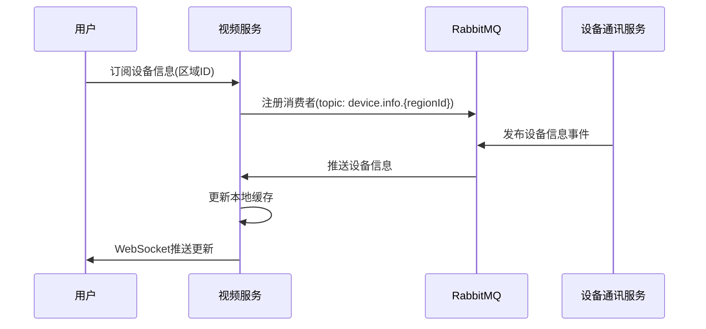
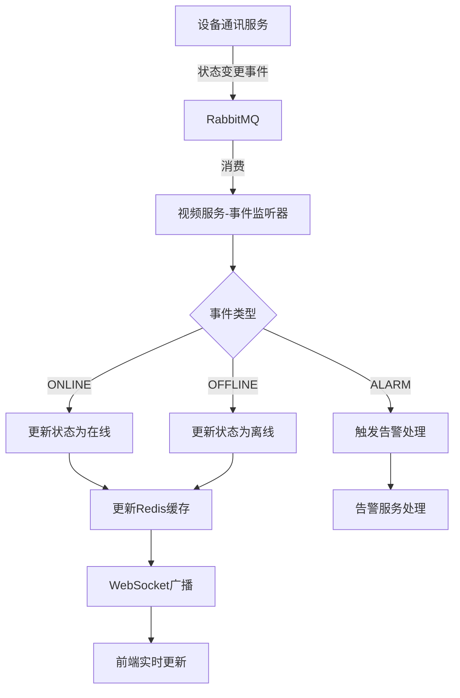
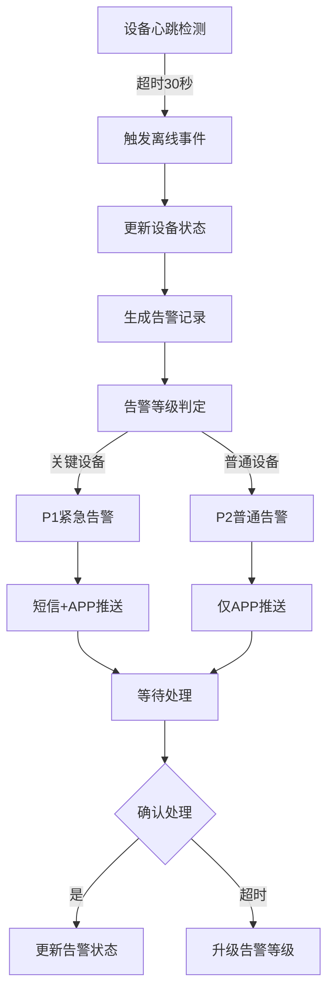
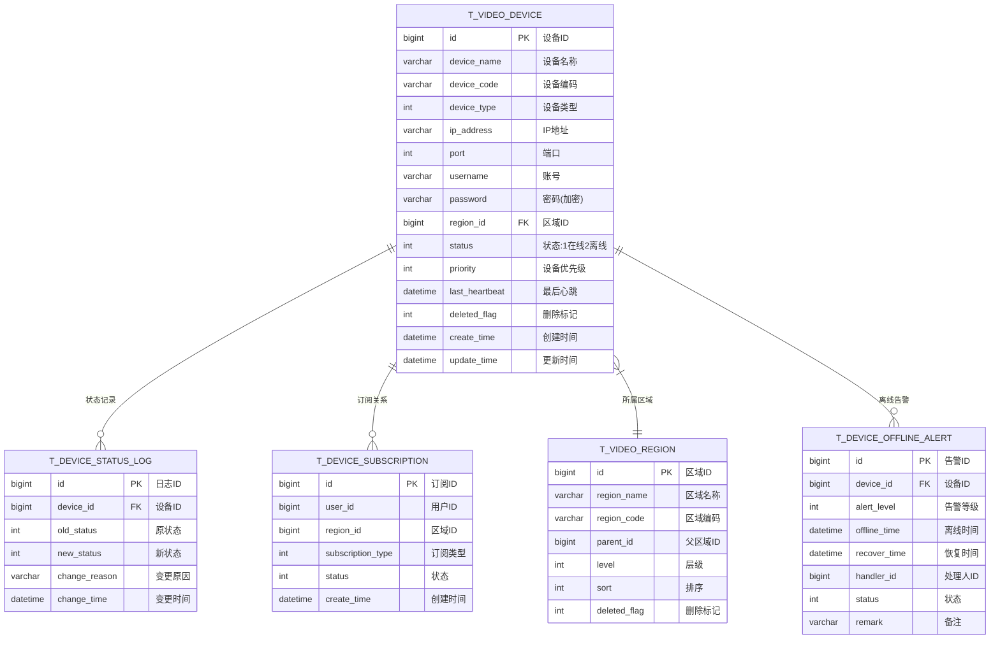

# 设备管理交互模块 - 完整设计文档

## 📋 模块概述

### 模块定位
设备管理交互模块是视频服务与设备通讯服务之间的桥梁，负责设备信息的订阅、同步和状态管理，通过事件订阅中心实现实时数据交互。

### 核心价值
- **统一设备管理**: 集中管理所有视频监控设备
- **实时状态同步**: 通过事件订阅实时感知设备状态
- **智能告警推送**: 设备异常时自动触发告警

### 依赖服务
| 服务 | 端口 | 交互方式 |
|------|------|----------|
| ioedream-device-comm-service | 8087 | 事件订阅/RabbitMQ |
| ioedream-common-service | 8088 | REST API |
| ioedream-gateway-service | 8080 | API网关 |

---

## 👥 用户故事

### US-DEV-001: 设备状态监控
**作为** 安保主管  
**我希望** 实时查看所有视频设备的在线状态  
**以便** 及时发现设备故障并安排维护

**验收标准**:
1. 设备状态变更后3秒内界面更新
2. 支持按区域、类型、状态筛选设备
3. 离线设备高亮显示并置顶

### US-DEV-002: 设备信息订阅
**作为** 系统管理员  
**我希望** 订阅指定区域的设备信息变更  
**以便** 只关注负责区域的设备状态

**验收标准**:
1. 支持按区域订阅设备
2. 订阅后自动接收增量更新
3. 支持取消订阅

### US-DEV-003: 设备离线告警
**作为** 安保人员  
**我希望** 设备离线时收到告警通知  
**以便** 快速响应设备故障

**验收标准**:
1. 设备离线30秒后触发告警
2. 告警推送至Web端和移动端
3. 告警需确认处理

### US-DEV-004: 设备树查询
**作为** 普通用户  
**我希望** 通过树形结构查找设备  
**以便** 快速定位目标摄像机

**验收标准**:
1. 按区域层级展示设备树
2. 支持设备名称/IP模糊搜索
3. 显示各节点设备数量统计

---

## 📊 业务流程图

### 设备信息订阅流程



### 设备状态同步流程



### 设备离线告警流程



---

## 🗄️ 数据结构设计

### ER图



### 核心表结构

```sql
-- 视频设备表
CREATE TABLE t_video_device (
    id              BIGINT PRIMARY KEY AUTO_INCREMENT COMMENT '设备ID',
    device_name     VARCHAR(100) NOT NULL COMMENT '设备名称',
    device_code     VARCHAR(64) NOT NULL COMMENT '设备编码',
    device_type     TINYINT NOT NULL DEFAULT 131 COMMENT '设备类型:131-IPC,118-NVR,111-DVR',
    ip_address      VARCHAR(64) NOT NULL COMMENT 'IP地址',
    port            INT NOT NULL DEFAULT 554 COMMENT '端口',
    username        VARCHAR(64) COMMENT '账号',
    password        VARCHAR(256) COMMENT '密码(AES加密)',
    region_id       BIGINT NOT NULL COMMENT '区域ID',
    status          TINYINT NOT NULL DEFAULT 2 COMMENT '状态:1-在线,2-离线',
    priority        TINYINT NOT NULL DEFAULT 2 COMMENT '优先级:1-关键,2-普通,3-低',
    channel_count   INT DEFAULT 1 COMMENT '通道数',
    manufacturer    VARCHAR(64) COMMENT '厂商',
    model           VARCHAR(64) COMMENT '型号',
    last_heartbeat  DATETIME COMMENT '最后心跳时间',
    deleted_flag    TINYINT NOT NULL DEFAULT 0 COMMENT '删除标记',
    create_time     DATETIME NOT NULL DEFAULT CURRENT_TIMESTAMP,
    update_time     DATETIME NOT NULL DEFAULT CURRENT_TIMESTAMP ON UPDATE CURRENT_TIMESTAMP,
    UNIQUE KEY uk_device_code (device_code),
    INDEX idx_region_id (region_id),
    INDEX idx_status (status)
) ENGINE=InnoDB DEFAULT CHARSET=utf8mb4 COMMENT='视频设备表';

-- 设备状态日志表
CREATE TABLE t_device_status_log (
    id              BIGINT PRIMARY KEY AUTO_INCREMENT COMMENT '日志ID',
    device_id       BIGINT NOT NULL COMMENT '设备ID',
    old_status      TINYINT COMMENT '原状态',
    new_status      TINYINT NOT NULL COMMENT '新状态',
    change_reason   VARCHAR(256) COMMENT '变更原因',
    change_time     DATETIME NOT NULL DEFAULT CURRENT_TIMESTAMP COMMENT '变更时间',
    INDEX idx_device_id (device_id),
    INDEX idx_change_time (change_time)
) ENGINE=InnoDB DEFAULT CHARSET=utf8mb4 COMMENT='设备状态日志表';

-- 设备订阅表
CREATE TABLE t_device_subscription (
    id                BIGINT PRIMARY KEY AUTO_INCREMENT COMMENT '订阅ID',
    user_id           BIGINT NOT NULL COMMENT '用户ID',
    region_id         BIGINT COMMENT '区域ID(null表示全部)',
    subscription_type TINYINT NOT NULL DEFAULT 1 COMMENT '订阅类型:1-设备信息,2-状态变更,3-告警',
    status            TINYINT NOT NULL DEFAULT 1 COMMENT '状态:1-有效,2-已取消',
    create_time       DATETIME NOT NULL DEFAULT CURRENT_TIMESTAMP,
    UNIQUE KEY uk_user_region_type (user_id, region_id, subscription_type),
    INDEX idx_region_id (region_id)
) ENGINE=InnoDB DEFAULT CHARSET=utf8mb4 COMMENT='设备订阅表';

-- 设备离线告警表
CREATE TABLE t_device_offline_alert (
    id              BIGINT PRIMARY KEY AUTO_INCREMENT COMMENT '告警ID',
    device_id       BIGINT NOT NULL COMMENT '设备ID',
    alert_level     TINYINT NOT NULL DEFAULT 2 COMMENT '告警等级:1-紧急,2-普通,3-低',
    offline_time    DATETIME NOT NULL COMMENT '离线时间',
    recover_time    DATETIME COMMENT '恢复时间',
    handler_id      BIGINT COMMENT '处理人ID',
    handle_time     DATETIME COMMENT '处理时间',
    status          TINYINT NOT NULL DEFAULT 1 COMMENT '状态:1-待处理,2-已处理,3-已恢复',
    remark          VARCHAR(512) COMMENT '备注',
    create_time     DATETIME NOT NULL DEFAULT CURRENT_TIMESTAMP,
    INDEX idx_device_id (device_id),
    INDEX idx_status (status),
    INDEX idx_offline_time (offline_time)
) ENGINE=InnoDB DEFAULT CHARSET=utf8mb4 COMMENT='设备离线告警表';
```

---

## 🔌 接口设计

### RESTful API

| 方法 | 路径 | 说明 | 权限 |
|------|------|------|------|
| GET | /api/v1/video/devices | 设备分页列表 | Level 2+ |
| GET | /api/v1/video/devices/{id} | 设备详情 | Level 2+ |
| GET | /api/v1/video/devices/tree | 设备树 | Level 2+ |
| GET | /api/v1/video/devices/status | 设备状态统计 | Level 2+ |
| POST | /api/v1/video/subscriptions | 创建订阅 | Level 2+ |
| DELETE | /api/v1/video/subscriptions/{id} | 取消订阅 | Level 2+ |
| GET | /api/v1/video/alerts/offline | 离线告警列表 | Level 3+ |
| PUT | /api/v1/video/alerts/offline/{id}/handle | 处理告警 | Level 3+ |

### 请求/响应示例

```java
// 设备分页查询请求
public class DeviceQueryForm extends PageParam {
    /** 区域ID */
    private Long regionId;
    /** 设备状态:1-在线,2-离线 */
    private Integer status;
    /** 设备类型 */
    private Integer deviceType;
    /** 搜索关键词(设备名称/IP) */
    private String keyword;
}

// 设备响应VO
public class VideoDeviceVO {
    /** 设备ID */
    private Long id;
    /** 设备名称 */
    private String deviceName;
    /** 设备编码 */
    private String deviceCode;
    /** 设备类型 */
    private Integer deviceType;
    /** IP地址 */
    private String ipAddress;
    /** 区域ID */
    private Long regionId;
    /** 区域名称 */
    private String regionName;
    /** 状态 */
    private Integer status;
    /** 最后心跳时间 */
    private LocalDateTime lastHeartbeat;
}
```

### WebSocket推送

```json
{
  "type": "DEVICE_STATUS_CHANGE",
  "data": {
    "deviceId": 1001,
    "deviceName": "大门摄像机",
    "oldStatus": 1,
    "newStatus": 2,
    "changeTime": "2024-01-15T10:30:00Z"
  }
}
```

---

## 📈 性能指标

| 指标 | 要求 | 监控方式 |
|------|------|----------|
| 状态同步延迟 | ≤ 3秒 | Prometheus |
| 设备列表响应 | ≤ 500ms | APM |
| 设备树加载 | ≤ 1秒 | APM |
| WebSocket推送 | ≤ 1秒 | 日志统计 |
| 并发订阅数 | ≥ 1000 | Redis |

---

## ✅ 验收标准

### 功能验收
- [ ] 设备状态实时同步,延迟≤3秒
- [ ] 设备树支持10层级以上区域结构
- [ ] 设备搜索支持名称/IP模糊匹配
- [ ] 离线告警30秒内触发
- [ ] 告警推送到达率≥99%

### 性能验收
- [ ] 1000台设备状态查询<500ms
- [ ] 支持1000并发WebSocket连接
- [ ] 消息队列消费延迟<100ms

### 安全验收
- [ ] 设备密码AES加密存储
- [ ] API权限校验完整
- [ ] 操作日志完整记录
