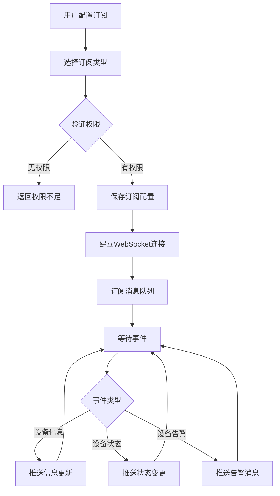
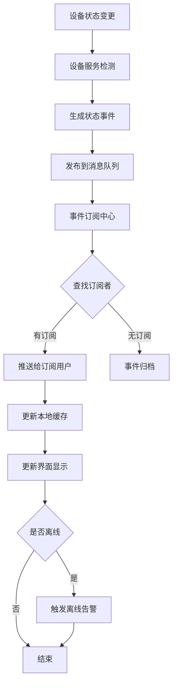
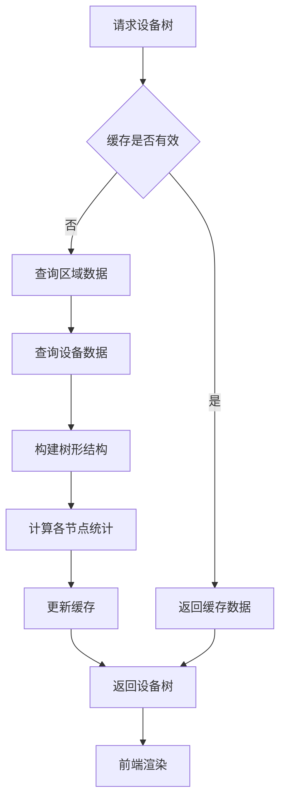
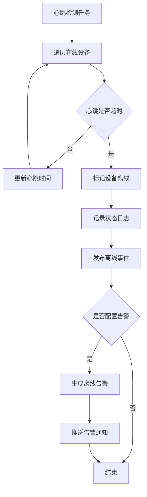
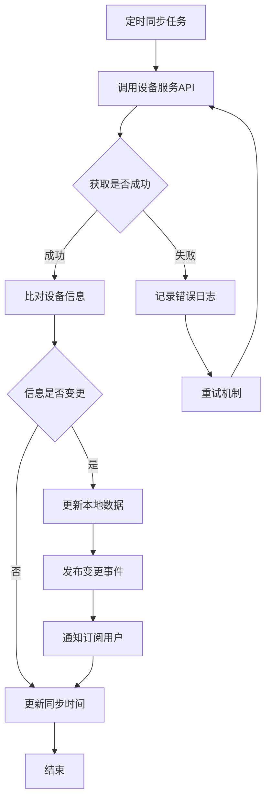
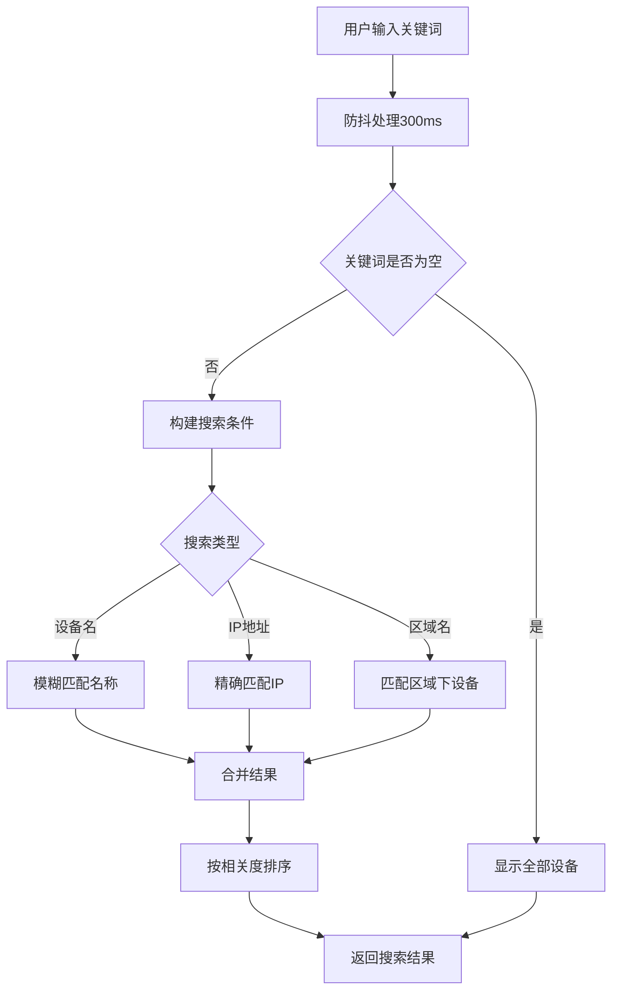

# 设备管理交互模块 - 业务流程图

## 设备信息订阅流程

```mermaid
flowchart TD
    A[用户配置订阅] --> B[选择订阅类型]
    B --> C{验证权限}
    C -->|无权限| D[返回权限不足]
    C -->|有权限| E[保存订阅配置]
    E --> F[建立WebSocket连接]
    F --> G[订阅消息队列]
    G --> H[等待事件]
    H --> I{事件类型}
    I -->|设备信息| J[推送信息更新]
    I -->|设备状态| K[推送状态变更]
    I -->|设备告警| L[推送告警消息]
    J --> H
    K --> H
    L --> H
```

## 设备状态同步流程

```mermaid
flowchart TD
    A[设备状态变更] --> B[设备服务检测]
    B --> C[生成状态事件]
    C --> D[发布到消息队列]
    D --> E[事件订阅中心]
    E --> F{查找订阅者}
    F -->|有订阅| G[推送给订阅用户]
    F -->|无订阅| H[事件归档]
    G --> I[更新本地缓存]
    I --> J[更新界面显示]
    J --> K{是否离线}
    K -->|是| L[触发离线告警]
    K -->|否| M[结束]
    L --> M
```

## 设备树加载流程

```mermaid
flowchart TD
    A[请求设备树] --> B{缓存是否有效}
    B -->|是| C[返回缓存数据]
    B -->|否| D[查询区域数据]
    D --> E[查询设备数据]
    E --> F[构建树形结构]
    F --> G[计算各节点统计]
    G --> H[更新缓存]
    H --> I[返回设备树]
    C --> I
    I --> J[前端渲染]
```

## 设备离线检测流程

```mermaid
flowchart TD
    A[心跳检测任务] --> B[遍历在线设备]
    B --> C{心跳是否超时}
    C -->|否| D[更新心跳时间]
    C -->|是| E[标记设备离线]
    E --> F[记录状态日志]
    F --> G[发布离线事件]
    G --> H{是否配置告警}
    H -->|是| I[生成离线告警]
    H -->|否| J[结束]
    I --> K[推送告警通知]
    K --> J
    D --> B
```

## 设备信息同步流程

```mermaid
flowchart TD
    A[定时同步任务] --> B[调用设备服务API]
    B --> C{获取是否成功}
    C -->|失败| D[记录错误日志]
    C -->|成功| E[比对设备信息]
    E --> F{信息是否变更}
    F -->|否| G[更新同步时间]
    F -->|是| H[更新本地数据]
    H --> I[发布变更事件]
    I --> J[通知订阅用户]
    J --> G
    D --> K[重试机制]
    K --> B
    G --> L[结束]
```

## 设备搜索流程

```mermaid
flowchart TD
    A[用户输入关键词] --> B[防抖处理300ms]
    B --> C{关键词是否为空}
    C -->|是| D[显示全部设备]
    C -->|否| E[构建搜索条件]
    E --> F{搜索类型}
    F -->|设备名| G[模糊匹配名称]
    F -->|IP地址| H[精确匹配IP]
    F -->|区域名| I[匹配区域下设备]
    G --> J[合并结果]
    H --> J
    I --> J
    J --> K[按相关度排序]
    K --> L[返回搜索结果]
    D --> L
```
