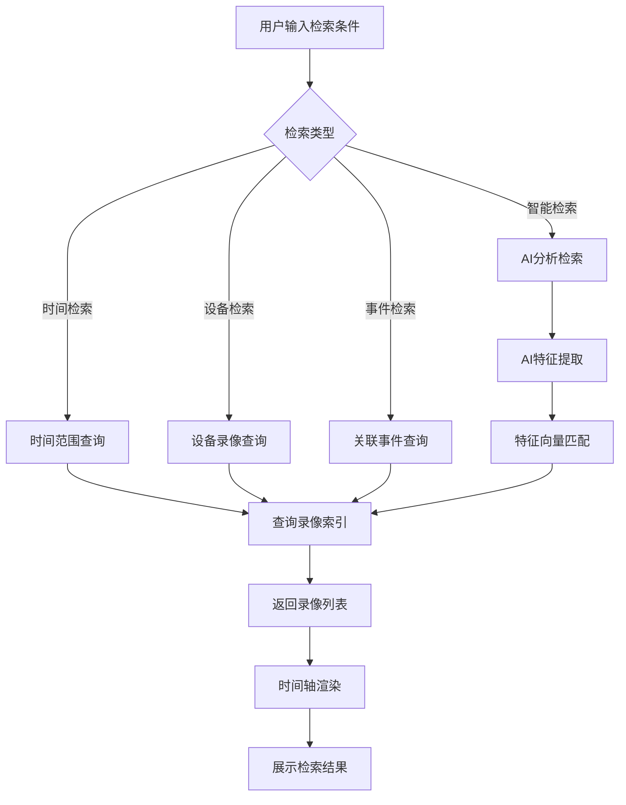
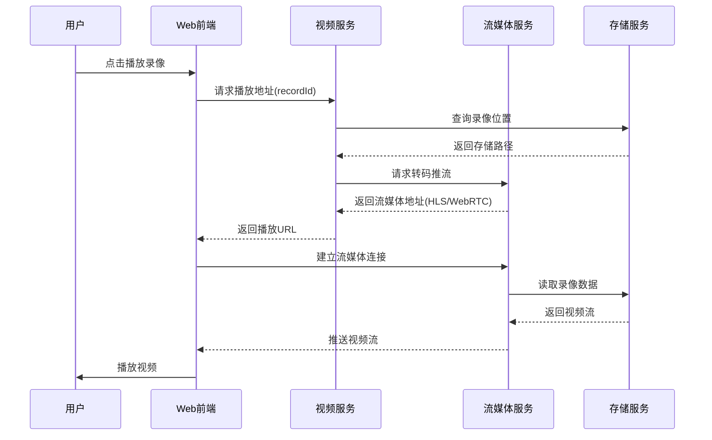
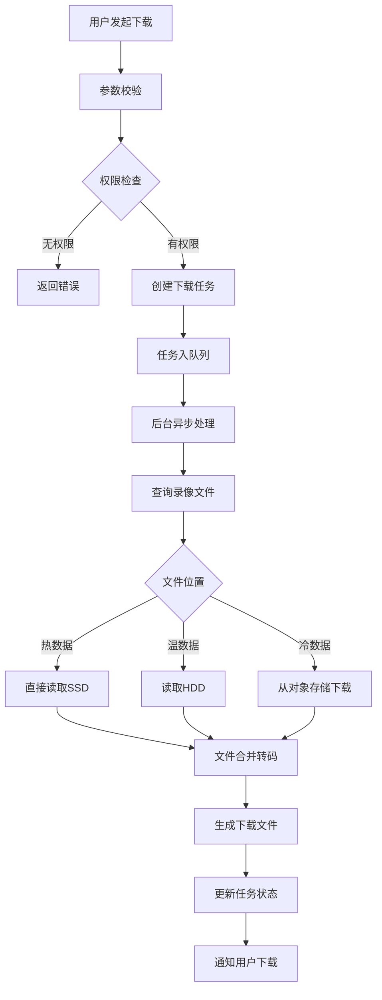
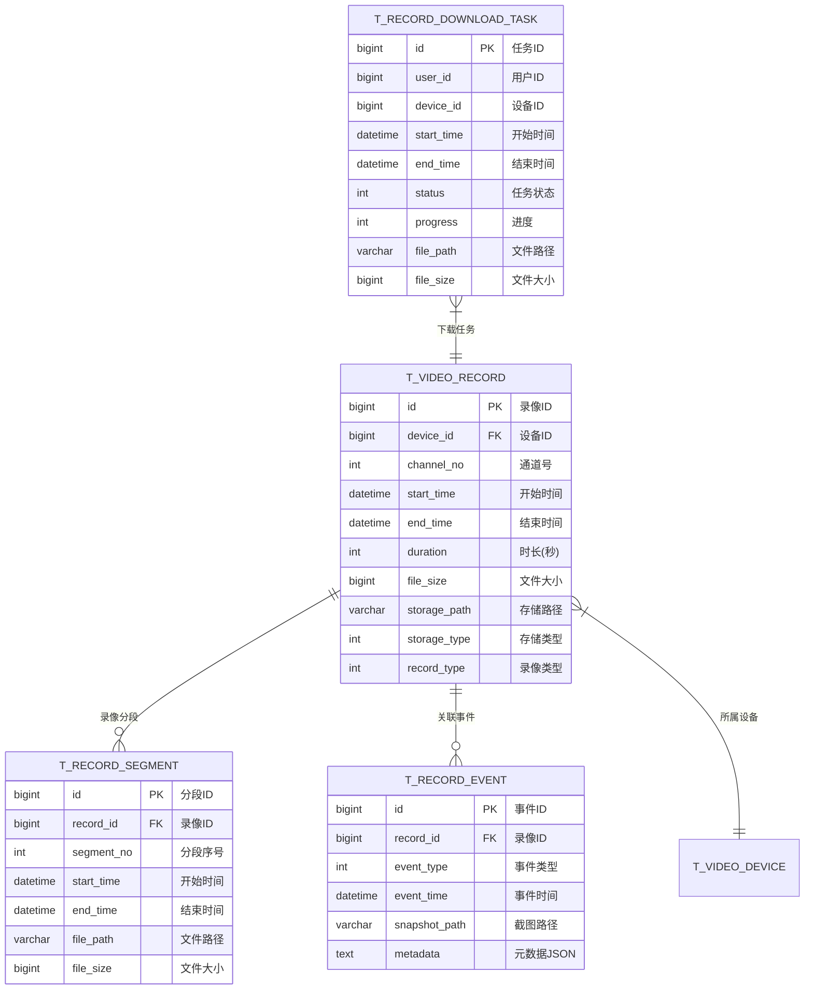

# 视频回放模块 - 完整设计文档

## 📋 模块概述

### 模块定位
视频回放模块提供历史录像的检索、播放、下载功能，支持多维度智能检索，是视频监控系统的核心功能模块。

### 核心价值
- **高效检索**: 支持时间/设备/事件/人脸等多维检索
- **流畅回放**: 支持多倍速播放、逐帧分析
- **智能分析**: AI辅助的人脸/车牌/行为检索

---

## 👥 用户故事

### US-PB-001: 时间段录像检索
**作为** 安保人员  
**我希望** 按时间段检索指定设备的录像  
**以便** 快速定位事件发生时段的视频

**验收标准**:
1. 支持精确到秒的时间范围选择
2. 检索结果2秒内返回
3. 时间轴直观显示有录像时段

### US-PB-002: 录像播放控制
**作为** 安保人员  
**我希望** 灵活控制录像播放速度和进度  
**以便** 仔细分析关键画面

**验收标准**:
1. 支持0.25x-16x变速播放
2. 支持逐帧前进/后退
3. 进度跳转响应<1秒

### US-PB-003: 录像下载
**作为** 安保主管  
**我希望** 下载指定时段的录像文件  
**以便** 保存证据或归档留存

**验收标准**:
1. 支持时间段裁剪下载
2. 下载速度≥10MB/s
3. 下载任务可管理

### US-PB-004: 人脸检索
**作为** 安保主管  
**我希望** 通过人脸图片检索相关录像  
**以便** 追踪特定人员的活动轨迹

**验收标准**:
1. 人脸匹配准确率≥95%
2. 检索结果按时间排序
3. 支持跨设备联合检索

---

## 📊 业务流程图

### 录像检索流程



### 录像播放流程



### 录像下载流程



---

## 🗄️ 数据结构设计

### ER图



### 核心表结构

```sql
-- 录像记录表
CREATE TABLE t_video_record (
    id              BIGINT PRIMARY KEY AUTO_INCREMENT COMMENT '录像ID',
    device_id       BIGINT NOT NULL COMMENT '设备ID',
    channel_no      INT NOT NULL DEFAULT 1 COMMENT '通道号',
    start_time      DATETIME NOT NULL COMMENT '开始时间',
    end_time        DATETIME NOT NULL COMMENT '结束时间',
    duration        INT NOT NULL COMMENT '时长(秒)',
    file_size       BIGINT NOT NULL DEFAULT 0 COMMENT '文件大小(字节)',
    storage_path    VARCHAR(512) NOT NULL COMMENT '存储路径',
    storage_type    TINYINT NOT NULL DEFAULT 1 COMMENT '存储类型:1-SSD热,2-HDD温,3-对象存储冷',
    record_type     TINYINT NOT NULL DEFAULT 1 COMMENT '录像类型:1-定时,2-告警,3-手动',
    codec           VARCHAR(32) DEFAULT 'H.264' COMMENT '编码格式',
    resolution      VARCHAR(32) DEFAULT '1920x1080' COMMENT '分辨率',
    deleted_flag    TINYINT NOT NULL DEFAULT 0 COMMENT '删除标记',
    create_time     DATETIME NOT NULL DEFAULT CURRENT_TIMESTAMP,
    INDEX idx_device_time (device_id, start_time),
    INDEX idx_start_time (start_time),
    INDEX idx_storage_type (storage_type)
) ENGINE=InnoDB DEFAULT CHARSET=utf8mb4 COMMENT='录像记录表'
PARTITION BY RANGE (TO_DAYS(start_time)) (
    PARTITION p_default VALUES LESS THAN MAXVALUE
);

-- 录像分段表
CREATE TABLE t_record_segment (
    id              BIGINT PRIMARY KEY AUTO_INCREMENT COMMENT '分段ID',
    record_id       BIGINT NOT NULL COMMENT '录像ID',
    segment_no      INT NOT NULL COMMENT '分段序号',
    start_time      DATETIME NOT NULL COMMENT '开始时间',
    end_time        DATETIME NOT NULL COMMENT '结束时间',
    file_path       VARCHAR(512) NOT NULL COMMENT '文件路径',
    file_size       BIGINT NOT NULL DEFAULT 0 COMMENT '文件大小',
    INDEX idx_record_id (record_id)
) ENGINE=InnoDB DEFAULT CHARSET=utf8mb4 COMMENT='录像分段表';

-- 录像关联事件表
CREATE TABLE t_record_event (
    id              BIGINT PRIMARY KEY AUTO_INCREMENT COMMENT '事件ID',
    record_id       BIGINT NOT NULL COMMENT '录像ID',
    event_type      TINYINT NOT NULL COMMENT '事件类型:1-移动检测,2-人脸识别,3-越界,4-徘徊',
    event_time      DATETIME NOT NULL COMMENT '事件时间',
    snapshot_path   VARCHAR(512) COMMENT '截图路径',
    confidence      DECIMAL(5,2) COMMENT '置信度',
    metadata        JSON COMMENT '元数据',
    INDEX idx_record_id (record_id),
    INDEX idx_event_time (event_time),
    INDEX idx_event_type (event_type)
) ENGINE=InnoDB DEFAULT CHARSET=utf8mb4 COMMENT='录像关联事件表';

-- 下载任务表
CREATE TABLE t_record_download_task (
    id              BIGINT PRIMARY KEY AUTO_INCREMENT COMMENT '任务ID',
    user_id         BIGINT NOT NULL COMMENT '用户ID',
    device_id       BIGINT NOT NULL COMMENT '设备ID',
    device_name     VARCHAR(100) COMMENT '设备名称',
    start_time      DATETIME NOT NULL COMMENT '开始时间',
    end_time        DATETIME NOT NULL COMMENT '结束时间',
    status          TINYINT NOT NULL DEFAULT 1 COMMENT '状态:1-等待,2-处理中,3-完成,4-失败',
    progress        TINYINT NOT NULL DEFAULT 0 COMMENT '进度百分比',
    file_path       VARCHAR(512) COMMENT '文件路径',
    file_size       BIGINT DEFAULT 0 COMMENT '文件大小',
    error_msg       VARCHAR(512) COMMENT '错误信息',
    expire_time     DATETIME COMMENT '过期时间',
    create_time     DATETIME NOT NULL DEFAULT CURRENT_TIMESTAMP,
    update_time     DATETIME NOT NULL DEFAULT CURRENT_TIMESTAMP ON UPDATE CURRENT_TIMESTAMP,
    INDEX idx_user_id (user_id),
    INDEX idx_status (status)
) ENGINE=InnoDB DEFAULT CHARSET=utf8mb4 COMMENT='下载任务表';
```

---

## 🔌 接口设计

### RESTful API

| 方法 | 路径 | 说明 | 权限 |
|------|------|------|------|
| GET | /api/v1/video/records | 录像列表检索 | Level 2+ |
| GET | /api/v1/video/records/timeline | 时间轴数据 | Level 2+ |
| GET | /api/v1/video/records/{id}/play | 获取播放地址 | Level 2+ |
| POST | /api/v1/video/records/search/face | 人脸检索 | Level 4+ |
| POST | /api/v1/video/records/search/plate | 车牌检索 | Level 3+ |
| POST | /api/v1/video/downloads | 创建下载任务 | Level 3+ |
| GET | /api/v1/video/downloads | 下载任务列表 | Level 3+ |
| GET | /api/v1/video/downloads/{id}/file | 下载文件 | Level 3+ |
| DELETE | /api/v1/video/downloads/{id} | 取消下载任务 | Level 3+ |

### 请求/响应示例

```java
// 录像检索请求
public class RecordQueryForm extends PageParam {
    @NotNull(message = "设备ID不能为空")
    private Long deviceId;
    @NotNull(message = "开始时间不能为空")
    private LocalDateTime startTime;
    @NotNull(message = "结束时间不能为空")
    private LocalDateTime endTime;
    /** 录像类型:1-定时,2-告警,3-手动 */
    private Integer recordType;
}

// 时间轴数据响应
public class TimelineVO {
    /** 日期 */
    private LocalDate date;
    /** 时间段列表 */
    private List<TimeSegment> segments;
    
    @Data
    public static class TimeSegment {
        /** 开始时间(分钟,0-1440) */
        private Integer startMinute;
        /** 结束时间(分钟) */
        private Integer endMinute;
        /** 录像类型 */
        private Integer recordType;
    }
}

// 下载任务创建请求
public class DownloadTaskForm {
    @NotNull(message = "设备ID不能为空")
    private Long deviceId;
    @NotNull(message = "开始时间不能为空")
    private LocalDateTime startTime;
    @NotNull(message = "结束时间不能为空")
    private LocalDateTime endTime;
    /** 文件格式:mp4/avi */
    private String format = "mp4";
}
```

---

## 📈 性能指标

| 指标 | 要求 | 监控方式 |
|------|------|----------|
| 检索响应时间 | ≤ 2秒 | APM |
| 起播时间 | ≤ 3秒 | 前端埋点 |
| 进度跳转响应 | ≤ 1秒 | 前端埋点 |
| 下载速度 | ≥ 10MB/s | 任务统计 |
| 并发回放数 | 单用户≤4路 | 限流控制 |
| 人脸检索响应 | ≤ 5秒 | APM |

---

## ✅ 验收标准

### 功能验收
- [ ] 时间/设备/事件多维度检索正常
- [ ] 时间轴准确显示有录像时段
- [ ] 0.25x-16x变速播放正常
- [ ] 逐帧播放响应流畅
- [ ] 录像下载任务管理完整

### 性能验收
- [ ] 30天录像检索<2秒
- [ ] 4路并发回放流畅
- [ ] 冷数据起播<5秒

### 安全验收
- [ ] 下载任务权限校验
- [ ] 下载文件设置过期时间
- [ ] 敏感操作日志记录
