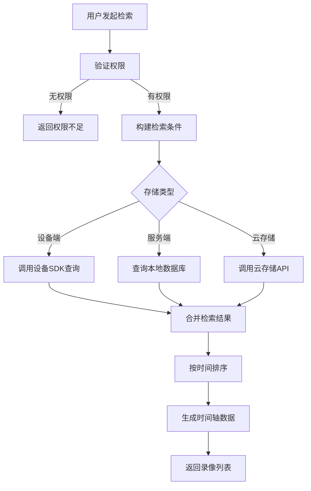
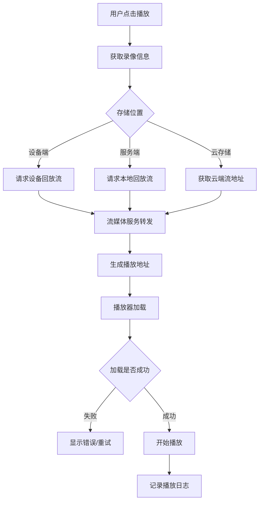
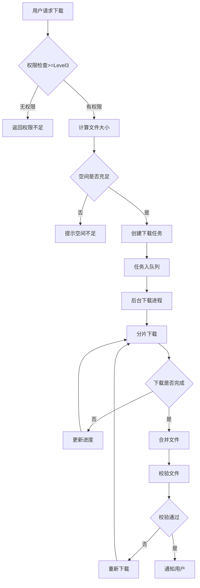
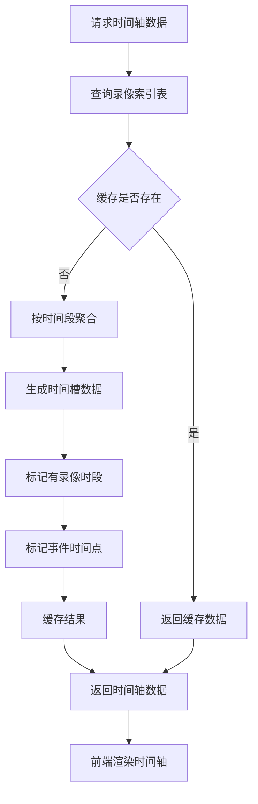
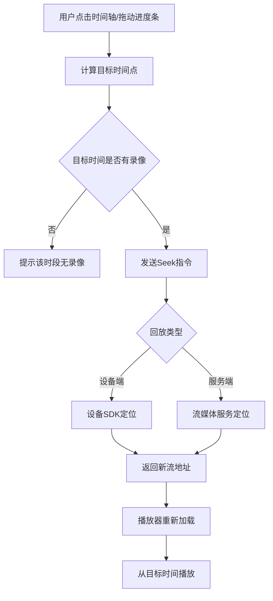
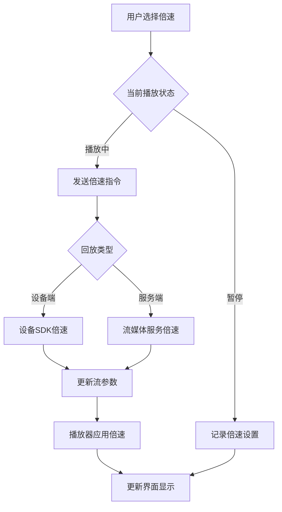

# 视频回放模块 - 业务流程图

## 录像检索流程

```mermaid
flowchart TD
    A[用户发起检索] --> B[验证权限]
    B -->|无权限| C[返回权限不足]
    B -->|有权限| D[构建检索条件]
    D --> E{存储类型}
    E -->|设备端| F[调用设备SDK查询]
    E -->|服务端| G[查询本地数据库]
    E -->|云存储| H[调用云存储API]
    F --> I[合并检索结果]
    G --> I
    H --> I
    I --> J[按时间排序]
    J --> K[生成时间轴数据]
    K --> L[返回录像列表]
```

## 录像播放流程

```mermaid
flowchart TD
    A[用户点击播放] --> B[获取录像信息]
    B --> C{存储位置}
    C -->|设备端| D[请求设备回放流]
    C -->|服务端| E[请求本地回放流]
    C -->|云存储| F[获取云端流地址]
    D --> G[流媒体服务转发]
    E --> G
    F --> G
    G --> H[生成播放地址]
    H --> I[播放器加载]
    I --> J{加载是否成功}
    J -->|失败| K[显示错误/重试]
    J -->|成功| L[开始播放]
    L --> M[记录播放日志]
```

## 录像下载流程

```mermaid
flowchart TD
    A[用户请求下载] --> B{权限检查>=Level3}
    B -->|无权限| C[返回权限不足]
    B -->|有权限| D[计算文件大小]
    D --> E{空间是否充足}
    E -->|否| F[提示空间不足]
    E -->|是| G[创建下载任务]
    G --> H[任务入队列]
    H --> I[后台下载进程]
    I --> J[分片下载]
    J --> K{下载是否完成}
    K -->|否| L[更新进度]
    L --> J
    K -->|是| M[合并文件]
    M --> N[校验文件]
    N --> O{校验通过}
    O -->|否| P[重新下载]
    O -->|是| Q[通知用户]
    P --> J
```

## 时间轴加载流程

```mermaid
flowchart TD
    A[请求时间轴数据] --> B[查询录像索引表]
    B --> C{缓存是否存在}
    C -->|是| D[返回缓存数据]
    C -->|否| E[按时间段聚合]
    E --> F[生成时间槽数据]
    F --> G[标记有录像时段]
    G --> H[标记事件时间点]
    H --> I[缓存结果]
    I --> J[返回时间轴数据]
    D --> J
    J --> K[前端渲染时间轴]
```

## 进度跳转流程

```mermaid
flowchart TD
    A[用户点击时间轴/拖动进度条] --> B[计算目标时间点]
    B --> C{目标时间是否有录像}
    C -->|否| D[提示该时段无录像]
    C -->|是| E[发送Seek指令]
    E --> F{回放类型}
    F -->|设备端| G[设备SDK定位]
    F -->|服务端| H[流媒体服务定位]
    G --> I[返回新流地址]
    H --> I
    I --> J[播放器重新加载]
    J --> K[从目标时间播放]
```

## 倍速播放流程

```mermaid
flowchart TD
    A[用户选择倍速] --> B{当前播放状态}
    B -->|暂停| C[记录倍速设置]
    B -->|播放中| D[发送倍速指令]
    D --> E{回放类型}
    E -->|设备端| F[设备SDK倍速]
    E -->|服务端| G[流媒体服务倍速]
    F --> H[更新流参数]
    G --> H
    H --> I[播放器应用倍速]
    I --> J[更新界面显示]
    C --> J
```
