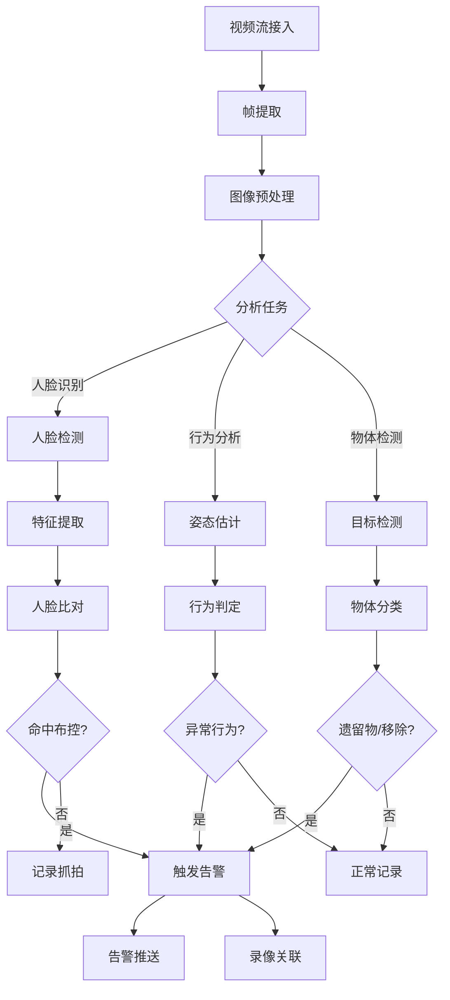
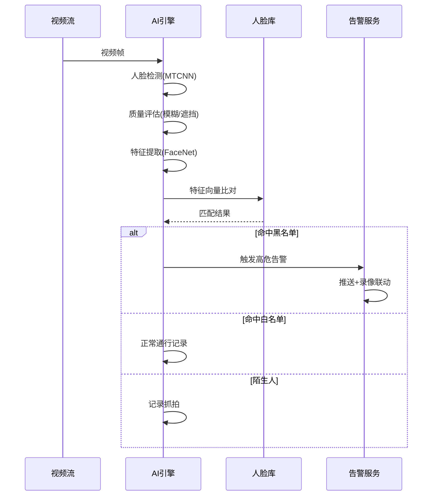
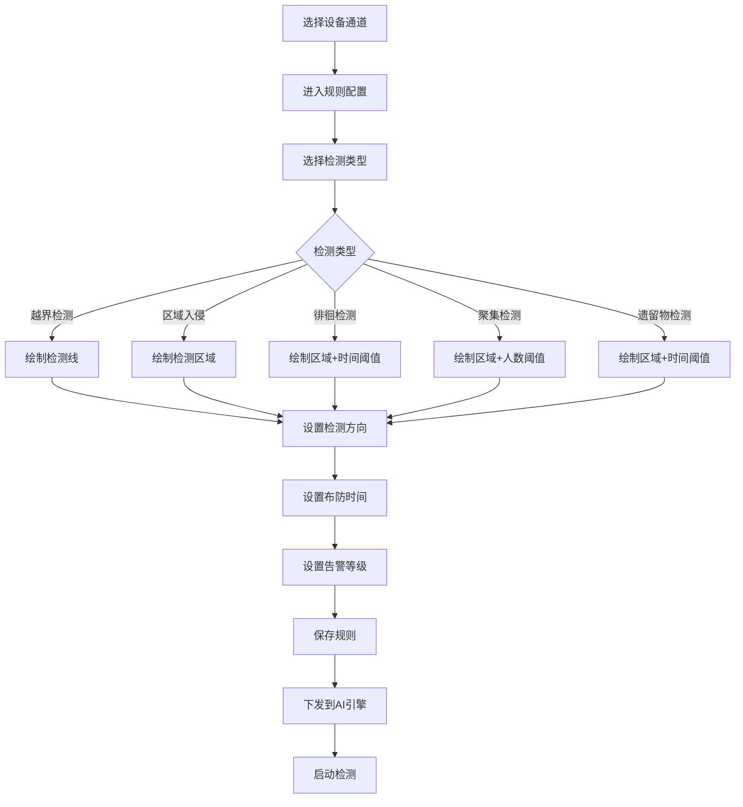
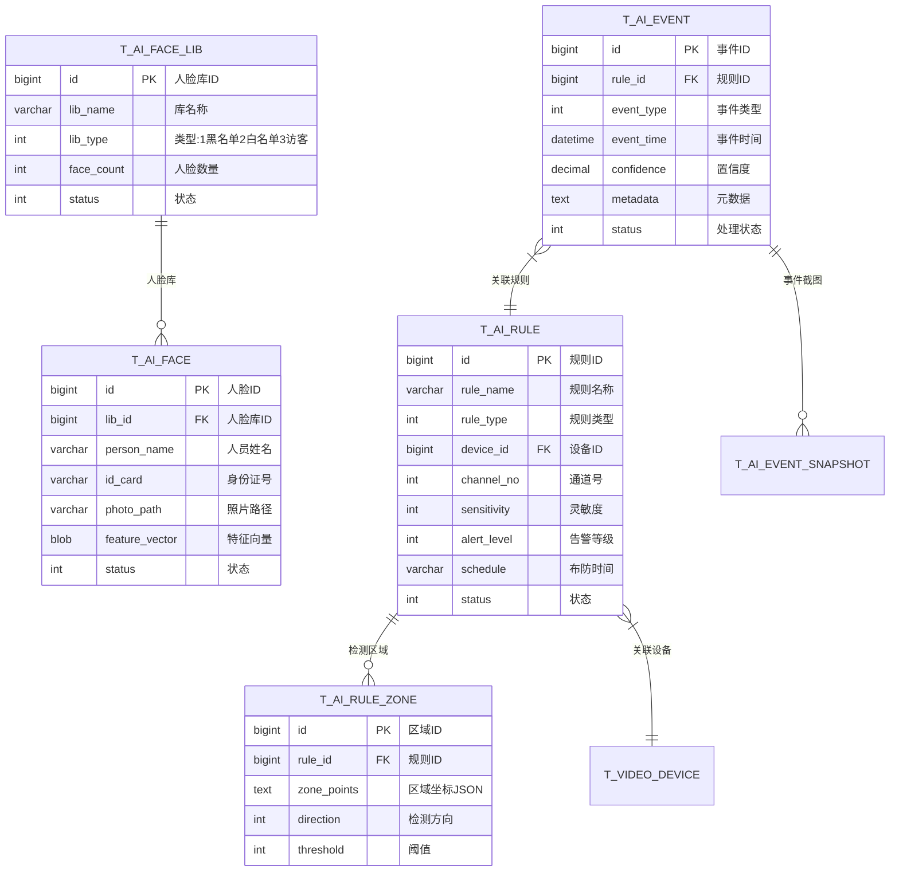

# 行为分析模块 - 完整设计文档

## 📋 模块概述

### 模块定位
行为分析模块基于AI视觉算法，对视频画面进行智能分析，实现人脸识别、行为检测、异常告警等功能，是视频监控系统的智能核心。

### 核心价值
- **智能识别**: 人脸/车牌/物体识别，准确率≥95%
- **行为检测**: 越界/徘徊/聚集/遗留物等异常行为自动告警
- **轨迹追踪**: 跨镜头人员轨迹追踪分析

### AI能力架构

```
┌─────────────────────────────────────────────────────────────┐
│                     AI行为分析引擎                           │
├─────────────────────────────────────────────────────────────┤
│  ┌─────────────┐  ┌─────────────┐  ┌─────────────┐         │
│  │ 人脸识别    │  │ 行为检测    │  │ 物体检测    │         │
│  │ FaceNet    │  │ OpenPose   │  │ YOLO v8    │         │
│  └─────────────┘  └─────────────┘  └─────────────┘         │
│         │                │                │                │
│         └────────────────┴────────────────┘                │
│                         │                                   │
│              ┌──────────┴──────────┐                       │
│              │   TensorFlow Lite   │                       │
│              │   (边缘推理引擎)     │                       │
│              └─────────────────────┘                       │
└─────────────────────────────────────────────────────────────┘
```

---

## 👥 用户故事

### US-AI-001: 人脸识别布控
**作为** 安保主管  
**我希望** 设置人脸布控名单并实时告警  
**以便** 及时发现可疑人员进入监控区域

**验收标准**:
1. 人脸识别准确率≥95%
2. 布控命中后3秒内告警
3. 支持黑白名单管理

### US-AI-002: 越界检测
**作为** 安保人员  
**我希望** 在指定区域设置越界检测规则  
**以便** 有人非法进入时自动告警

**验收标准**:
1. 支持绘制任意形状检测区域
2. 检测延迟<500ms
3. 误报率<5%

### US-AI-003: 人员徘徊检测
**作为** 安保人员  
**我希望** 检测人员在敏感区域的徘徊行为  
**以便** 及时发现可疑行为并预警

**验收标准**:
1. 支持设置徘徊时间阈值
2. 支持设置检测区域
3. 徘徊检测准确率≥90%

### US-AI-004: 人员轨迹追踪
**作为** 安保主管  
**我希望** 追踪特定人员的跨镜头活动轨迹  
**以便** 还原人员活动路线

**验收标准**:
1. 支持跨镜头ReID
2. 轨迹时间线展示
3. 支持导出轨迹报告

---

## 📊 业务流程图

### AI分析总体流程



### 人脸识别流程



### 行为检测规则配置流程



---

## 🗄️ 数据结构设计

### ER图



### 核心表结构

```sql
-- 人脸库表
CREATE TABLE t_ai_face_lib (
    id              BIGINT PRIMARY KEY AUTO_INCREMENT COMMENT '人脸库ID',
    lib_name        VARCHAR(100) NOT NULL COMMENT '库名称',
    lib_type        TINYINT NOT NULL COMMENT '类型:1-黑名单,2-白名单,3-访客,4-员工',
    lib_code        VARCHAR(64) NOT NULL COMMENT '库编码',
    face_count      INT NOT NULL DEFAULT 0 COMMENT '人脸数量',
    description     VARCHAR(512) COMMENT '描述',
    status          TINYINT NOT NULL DEFAULT 1 COMMENT '状态:1-启用,2-禁用',
    deleted_flag    TINYINT NOT NULL DEFAULT 0,
    create_time     DATETIME NOT NULL DEFAULT CURRENT_TIMESTAMP,
    update_time     DATETIME NOT NULL DEFAULT CURRENT_TIMESTAMP ON UPDATE CURRENT_TIMESTAMP,
    UNIQUE KEY uk_lib_code (lib_code)
) ENGINE=InnoDB DEFAULT CHARSET=utf8mb4 COMMENT='人脸库表';

-- 人脸信息表
CREATE TABLE t_ai_face (
    id              BIGINT PRIMARY KEY AUTO_INCREMENT COMMENT '人脸ID',
    lib_id          BIGINT NOT NULL COMMENT '人脸库ID',
    person_name     VARCHAR(64) NOT NULL COMMENT '人员姓名',
    person_code     VARCHAR(64) COMMENT '人员编码',
    id_card         VARCHAR(18) COMMENT '身份证号',
    phone           VARCHAR(20) COMMENT '手机号',
    photo_path      VARCHAR(512) NOT NULL COMMENT '照片路径',
    feature_vector  BLOB COMMENT '特征向量(512维)',
    feature_version VARCHAR(32) COMMENT '特征版本',
    quality_score   DECIMAL(5,2) COMMENT '图片质量分',
    status          TINYINT NOT NULL DEFAULT 1 COMMENT '状态:1-有效,2-无效',
    expire_time     DATETIME COMMENT '过期时间',
    deleted_flag    TINYINT NOT NULL DEFAULT 0,
    create_time     DATETIME NOT NULL DEFAULT CURRENT_TIMESTAMP,
    INDEX idx_lib_id (lib_id),
    INDEX idx_person_code (person_code)
) ENGINE=InnoDB DEFAULT CHARSET=utf8mb4 COMMENT='人脸信息表';

-- AI检测规则表
CREATE TABLE t_ai_rule (
    id              BIGINT PRIMARY KEY AUTO_INCREMENT COMMENT '规则ID',
    rule_name       VARCHAR(100) NOT NULL COMMENT '规则名称',
    rule_type       TINYINT NOT NULL COMMENT '规则类型:1-越界,2-入侵,3-徘徊,4-聚集,5-遗留,6-移除',
    device_id       BIGINT NOT NULL COMMENT '设备ID',
    channel_no      INT NOT NULL DEFAULT 1 COMMENT '通道号',
    sensitivity     TINYINT NOT NULL DEFAULT 50 COMMENT '灵敏度(1-100)',
    alert_level     TINYINT NOT NULL DEFAULT 2 COMMENT '告警等级:1-紧急,2-普通,3-低',
    schedule        JSON COMMENT '布防时间JSON',
    linkage_config  JSON COMMENT '联动配置JSON',
    status          TINYINT NOT NULL DEFAULT 1 COMMENT '状态:1-启用,2-禁用',
    deleted_flag    TINYINT NOT NULL DEFAULT 0,
    create_time     DATETIME NOT NULL DEFAULT CURRENT_TIMESTAMP,
    update_time     DATETIME NOT NULL DEFAULT CURRENT_TIMESTAMP ON UPDATE CURRENT_TIMESTAMP,
    INDEX idx_device_id (device_id),
    INDEX idx_rule_type (rule_type)
) ENGINE=InnoDB DEFAULT CHARSET=utf8mb4 COMMENT='AI检测规则表';

-- AI检测区域表
CREATE TABLE t_ai_rule_zone (
    id              BIGINT PRIMARY KEY AUTO_INCREMENT COMMENT '区域ID',
    rule_id         BIGINT NOT NULL COMMENT '规则ID',
    zone_name       VARCHAR(64) COMMENT '区域名称',
    zone_points     JSON NOT NULL COMMENT '区域坐标点[[x1,y1],[x2,y2],...]',
    direction       TINYINT COMMENT '检测方向:1-进入,2-离开,3-双向',
    threshold_time  INT COMMENT '时间阈值(秒)',
    threshold_count INT COMMENT '数量阈值',
    INDEX idx_rule_id (rule_id)
) ENGINE=InnoDB DEFAULT CHARSET=utf8mb4 COMMENT='AI检测区域表';

-- AI事件表
CREATE TABLE t_ai_event (
    id              BIGINT PRIMARY KEY AUTO_INCREMENT COMMENT '事件ID',
    rule_id         BIGINT COMMENT '规则ID',
    device_id       BIGINT NOT NULL COMMENT '设备ID',
    channel_no      INT NOT NULL DEFAULT 1 COMMENT '通道号',
    event_type      TINYINT NOT NULL COMMENT '事件类型',
    event_time      DATETIME NOT NULL COMMENT '事件时间',
    confidence      DECIMAL(5,2) COMMENT '置信度',
    target_type     VARCHAR(32) COMMENT '目标类型:person/vehicle/object',
    target_id       BIGINT COMMENT '目标ID(人脸ID/车辆ID)',
    snapshot_path   VARCHAR(512) COMMENT '截图路径',
    video_path      VARCHAR(512) COMMENT '录像路径',
    metadata        JSON COMMENT '元数据',
    status          TINYINT NOT NULL DEFAULT 1 COMMENT '状态:1-待处理,2-已处理,3-已忽略',
    handler_id      BIGINT COMMENT '处理人ID',
    handle_time     DATETIME COMMENT '处理时间',
    handle_remark   VARCHAR(512) COMMENT '处理备注',
    create_time     DATETIME NOT NULL DEFAULT CURRENT_TIMESTAMP,
    INDEX idx_device_time (device_id, event_time),
    INDEX idx_event_type (event_type),
    INDEX idx_status (status),
    INDEX idx_event_time (event_time)
) ENGINE=InnoDB DEFAULT CHARSET=utf8mb4 COMMENT='AI事件表';

-- AI事件截图表
CREATE TABLE t_ai_event_snapshot (
    id              BIGINT PRIMARY KEY AUTO_INCREMENT COMMENT '截图ID',
    event_id        BIGINT NOT NULL COMMENT '事件ID',
    snapshot_type   TINYINT NOT NULL COMMENT '类型:1-全景,2-特写,3-人脸',
    snapshot_path   VARCHAR(512) NOT NULL COMMENT '截图路径',
    bbox            JSON COMMENT '检测框坐标',
    create_time     DATETIME NOT NULL DEFAULT CURRENT_TIMESTAMP,
    INDEX idx_event_id (event_id)
) ENGINE=InnoDB DEFAULT CHARSET=utf8mb4 COMMENT='AI事件截图表';
```

---

## 🔌 接口设计

### RESTful API

| 方法 | 路径 | 说明 | 权限 |
|------|------|------|------|
| GET | /api/v1/ai/face-libs | 人脸库列表 | Level 3+ |
| POST | /api/v1/ai/face-libs | 创建人脸库 | Level 4+ |
| POST | /api/v1/ai/faces | 添加人脸 | Level 3+ |
| DELETE | /api/v1/ai/faces/{id} | 删除人脸 | Level 4+ |
| POST | /api/v1/ai/faces/search | 人脸搜索(1:N) | Level 3+ |
| GET | /api/v1/ai/rules | 检测规则列表 | Level 3+ |
| POST | /api/v1/ai/rules | 创建检测规则 | Level 4+ |
| PUT | /api/v1/ai/rules/{id} | 更新规则 | Level 4+ |
| PUT | /api/v1/ai/rules/{id}/status | 启用/禁用规则 | Level 4+ |
| GET | /api/v1/ai/events | AI事件列表 | Level 3+ |
| PUT | /api/v1/ai/events/{id}/handle | 处理事件 | Level 3+ |
| GET | /api/v1/ai/events/statistics | 事件统计 | Level 3+ |

### 请求/响应示例

```java
// 人脸添加请求
public class FaceAddForm {
    @NotNull(message = "人脸库ID不能为空")
    private Long libId;
    @NotBlank(message = "人员姓名不能为空")
    @Size(max = 64)
    private String personName;
    private String personCode;
    private String idCard;
    @NotBlank(message = "照片不能为空")
    private String photoBase64; // Base64编码的照片
}

// 检测规则创建请求
public class AiRuleForm {
    @NotBlank(message = "规则名称不能为空")
    private String ruleName;
    @NotNull(message = "规则类型不能为空")
    private Integer ruleType;
    @NotNull(message = "设备ID不能为空")
    private Long deviceId;
    private Integer channelNo = 1;
    private Integer sensitivity = 50;
    private Integer alertLevel = 2;
    /** 检测区域列表 */
    private List<RuleZoneForm> zones;
    /** 布防时间段 */
    private List<ScheduleForm> schedules;
}

// AI事件响应
public class AiEventVO {
    private Long id;
    private Long deviceId;
    private String deviceName;
    private Integer eventType;
    private String eventTypeName;
    private LocalDateTime eventTime;
    private BigDecimal confidence;
    private String snapshotUrl;
    private String videoUrl;
    private Integer status;
    private String handlerName;
    private LocalDateTime handleTime;
}
```

---

## 📈 性能指标

| 指标 | 要求 | 说明 |
|------|------|------|
| 人脸检测速度 | ≤ 50ms/帧 | 1080P分辨率 |
| 人脸识别准确率 | ≥ 95% | 正脸,光线良好 |
| 行为检测延迟 | ≤ 500ms | 从发生到告警 |
| 误报率 | ≤ 5% | 所有检测类型 |
| 漏报率 | ≤ 2% | 所有检测类型 |
| 人脸库容量 | ≥ 10万 | 单库 |
| 1:N比对速度 | ≤ 100ms | 10万人脸库 |

---

## ✅ 验收标准

### 功能验收
- [ ] 人脸库CRUD功能完整
- [ ] 支持6种行为检测规则配置
- [ ] 检测区域支持多边形绘制
- [ ] 布防时间支持周期配置
- [ ] AI事件支持处理流程

### 性能验收
- [ ] 人脸识别准确率≥95%
- [ ] 行为检测误报率≤5%
- [ ] 10万人脸1:N比对<100ms

### 安全验收
- [ ] 人脸数据加密存储
- [ ] API权限控制完整
- [ ] 敏感操作审计日志
