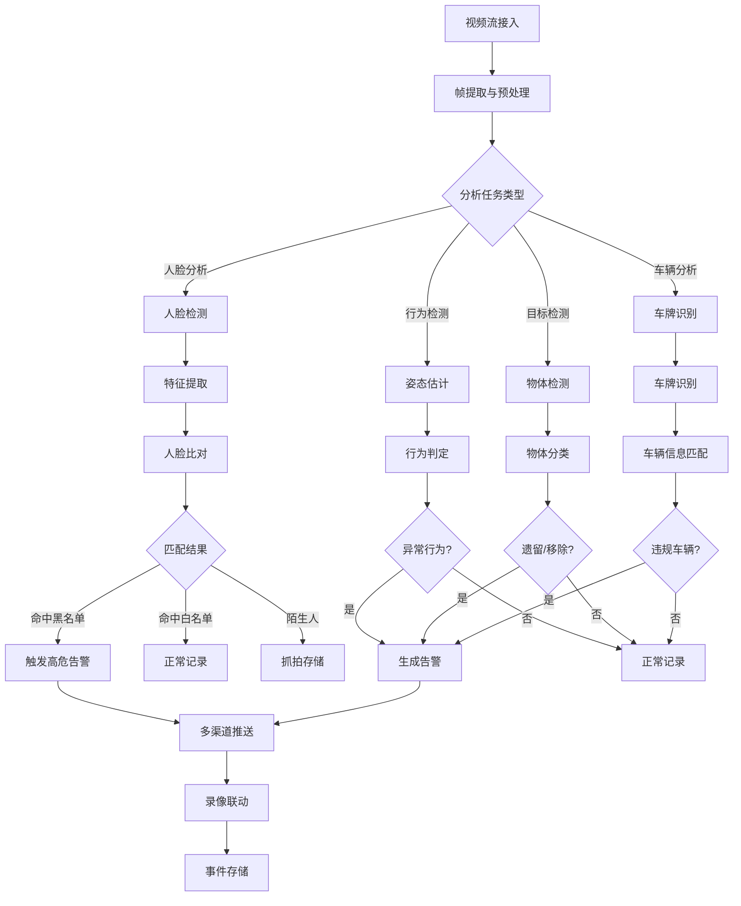
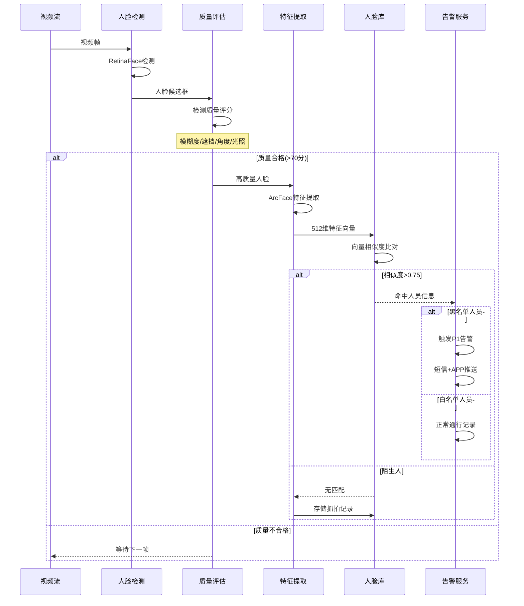
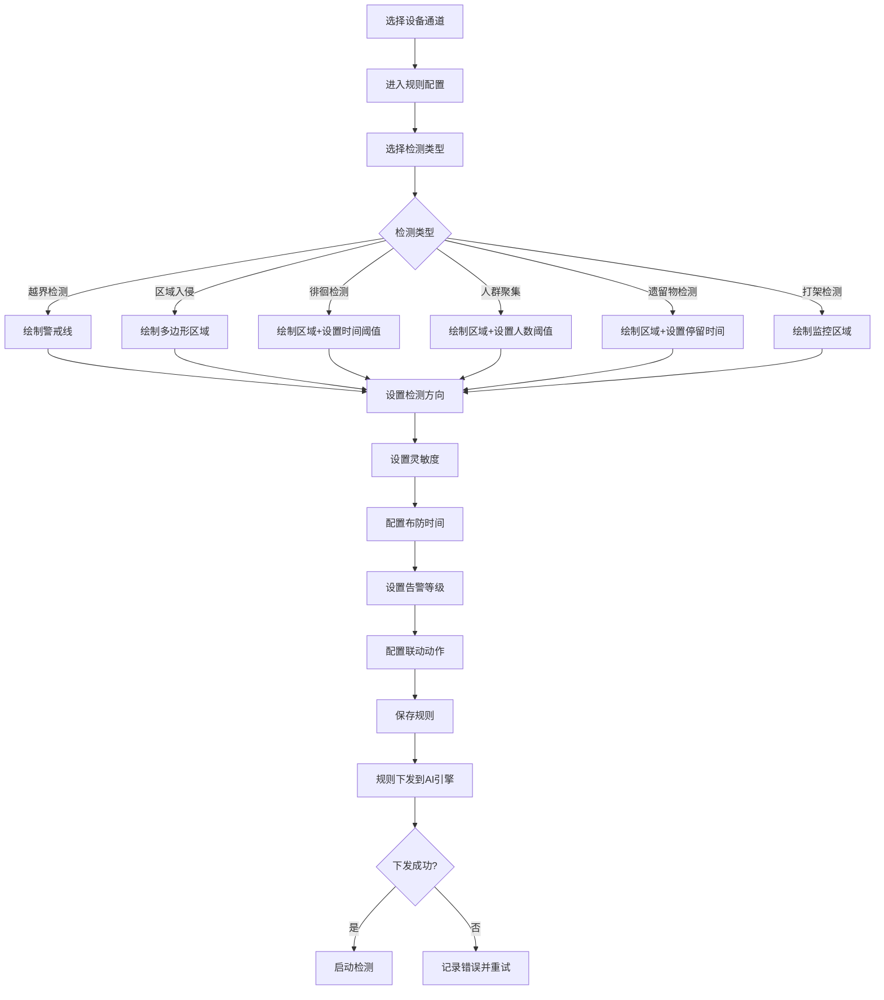
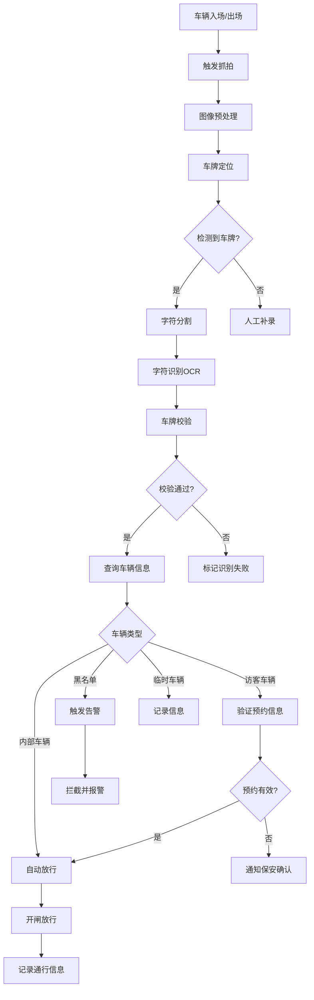
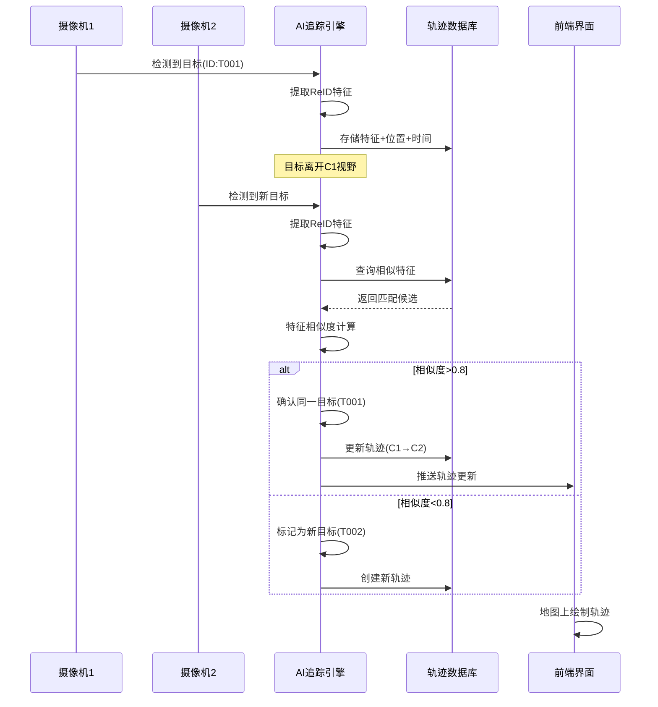
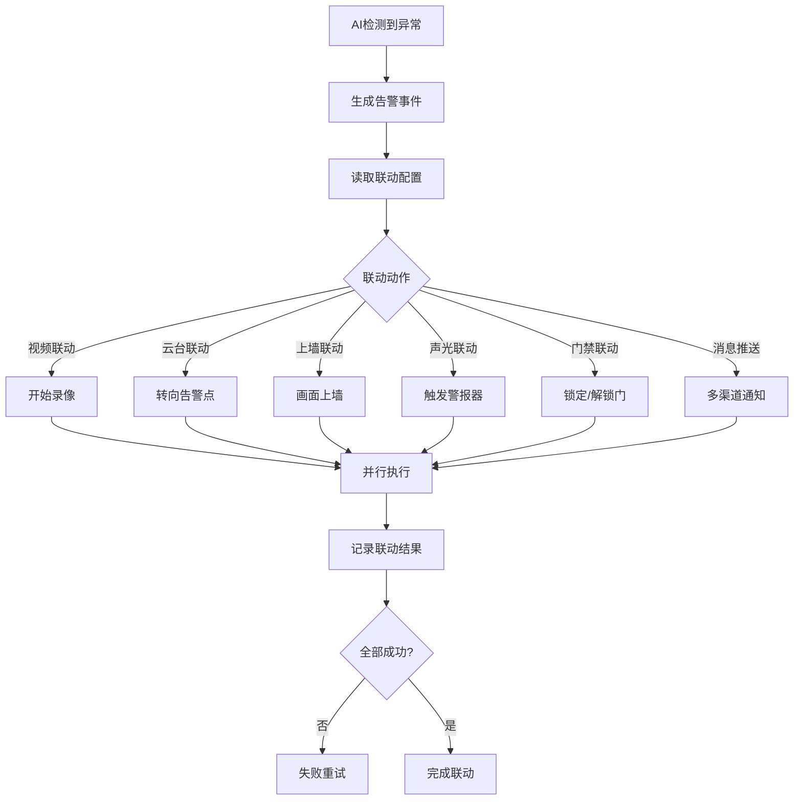
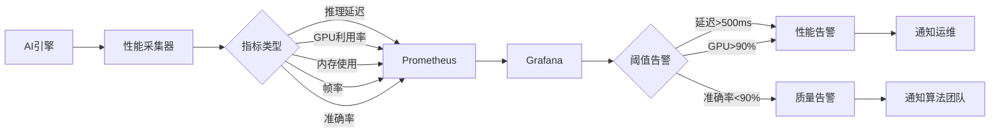

# 行为分析模块 - 业务流程图

## 1. AI分析总体流程

```mermaid
flowchart TD
    A[视频流接入] --> B[帧提取与预处理]
    B --> C{分析任务类型}
    
    C -->|人脸分析| D[人脸检测]
    C -->|行为检测| E[姿态估计]
    C -->|目标检测| F[物体检测]
    C -->|车辆分析| G[车牌识别]
    
    D --> H[特征提取]
    H --> I[人脸比对]
    I --> J{匹配结果}
    J -->|命中黑名单| K[触发高危告警]
    J -->|命中白名单| L[正常记录]
    J -->|陌生人| M[抓拍存储]
    
    E --> N[行为判定]
    N --> O{异常行为?}
    O -->|是| P[生成告警]
    O -->|否| Q[正常记录]
    
    F --> R[物体分类]
    R --> S{遗留/移除?}
    S -->|是| P
    S -->|否| Q
    
    G --> T[车牌识别]
    T --> U[车辆信息匹配]
    U --> V{违规车辆?}
    V -->|是| P
    V -->|否| Q
    
    K --> W[多渠道推送]
    P --> W
    W --> X[录像联动]
    X --> Y[事件存储]
```

## 2. 人脸识别业务流程

```mermaid
sequenceDiagram
    participant VS as 视频流
    participant FD as 人脸检测
    participant QA as 质量评估
    participant FE as 特征提取
    participant DB as 人脸库
    participant AL as 告警服务
    
    VS->>FD: 视频帧
    FD->>FD: RetinaFace检测
    FD->>QA: 人脸候选框
    
    QA->>QA: 检测质量评分
    Note over QA: 模糊度/遮挡/角度/光照
    
    alt 质量合格(>70分)
        QA->>FE: 高质量人脸
        FE->>FE: ArcFace特征提取
        FE->>DB: 512维特征向量
        DB->>DB: 向量相似度比对
        
        alt 相似度>0.75
            DB-->>AL: 命中人员信息
            alt 黑名单人员
                AL->>AL: 触发P1告警
                AL->>AL: 短信+APP推送
            else 白名单人员
                AL->>AL: 正常通行记录
            end
        else 陌生人
            DB-->>FE: 无匹配
            FE->>DB: 存储抓拍记录
        end
    else 质量不合格
        QA-->>VS: 等待下一帧
    end
```

## 3. 行为检测规则配置流程

```mermaid
flowchart TD
    A[选择设备通道] --> B[进入规则配置]
    B --> C[选择检测类型]
    
    C --> D{检测类型}
    D -->|越界检测| E[绘制警戒线]
    D -->|区域入侵| F[绘制多边形区域]
    D -->|徘徊检测| G[绘制区域+设置时间阈值]
    D -->|人群聚集| H[绘制区域+设置人数阈值]
    D -->|遗留物检测| I[绘制区域+设置停留时间]
    D -->|打架检测| J[绘制监控区域]
    
    E --> K[设置检测方向]
    F --> K
    G --> K
    H --> K
    I --> K
    J --> K
    
    K --> L[设置灵敏度]
    L --> M[配置布防时间]
    M --> N[设置告警等级]
    N --> O[配置联动动作]
    O --> P[保存规则]
    P --> Q[规则下发到AI引擎]
    Q --> R{下发成功?}
    R -->|是| S[启动检测]
    R -->|否| T[记录错误并重试]
```

## 4. 车牌识别流程

```mermaid
flowchart TD
    A[车辆入场/出场] --> B[触发抓拍]
    B --> C[图像预处理]
    C --> D[车牌定位]
    D --> E{检测到车牌?}
    
    E -->|是| F[字符分割]
    E -->|否| G[人工补录]
    
    F --> H[字符识别OCR]
    H --> I[车牌校验]
    I --> J{校验通过?}
    
    J -->|是| K[查询车辆信息]
    J -->|否| L[标记识别失败]
    
    K --> M{车辆类型}
    M -->|内部车辆| N[自动放行]
    M -->|访客车辆| O[验证预约信息]
    M -->|黑名单| P[触发告警]
    M -->|临时车辆| Q[记录信息]
    
    O --> R{预约有效?}
    R -->|是| N
    R -->|否| S[通知保安确认]
    
    N --> T[开闸放行]
    T --> U[记录通行信息]
    P --> V[拦截并报警]
```

## 5. 跨镜头追踪流程

```mermaid
sequenceDiagram
    participant C1 as 摄像机1
    participant C2 as 摄像机2
    participant AI as AI追踪引擎
    participant DB as 轨迹数据库
    participant UI as 前端界面
    
    C1->>AI: 检测到目标(ID:T001)
    AI->>AI: 提取ReID特征
    AI->>DB: 存储特征+位置+时间
    
    Note over AI: 目标离开C1视野
    
    C2->>AI: 检测到新目标
    AI->>AI: 提取ReID特征
    AI->>DB: 查询相似特征
    DB-->>AI: 返回匹配候选
    
    AI->>AI: 特征相似度计算
    alt 相似度>0.8
        AI->>AI: 确认同一目标(T001)
        AI->>DB: 更新轨迹(C1→C2)
        AI->>UI: 推送轨迹更新
    else 相似度<0.8
        AI->>AI: 标记为新目标(T002)
        AI->>DB: 创建新轨迹
    end
    
    UI->>UI: 地图上绘制轨迹
```

## 6. 告警联动流程

```mermaid
flowchart TD
    A[AI检测到异常] --> B[生成告警事件]
    B --> C[读取联动配置]
    C --> D{联动动作}
    
    D -->|视频联动| E[开始录像]
    D -->|云台联动| F[转向告警点]
    D -->|上墙联动| G[画面上墙]
    D -->|声光联动| H[触发警报器]
    D -->|门禁联动| I[锁定/解锁门]
    D -->|消息推送| J[多渠道通知]
    
    E --> K[并行执行]
    F --> K
    G --> K
    H --> K
    I --> K
    J --> K
    
    K --> L[记录联动结果]
    L --> M{全部成功?}
    M -->|否| N[失败重试]
    M -->|是| O[完成联动]
```

## 7. 性能监控流程

```mermaid
flowchart LR
    A[AI引擎] --> B[性能采集器]
    B --> C{指标类型}
    
    C -->|推理延迟| D[Prometheus]
    C -->|GPU利用率| D
    C -->|内存使用| D
    C -->|帧率| D
    C -->|准确率| D
    
    D --> E[Grafana]
    E --> F{阈值告警}
    
    F -->|延迟>500ms| G[性能告警]
    F -->|GPU>90%| G
    F -->|准确率<90%| H[质量告警]
    
    G --> I[通知运维]
    H --> J[通知算法团队]
```
