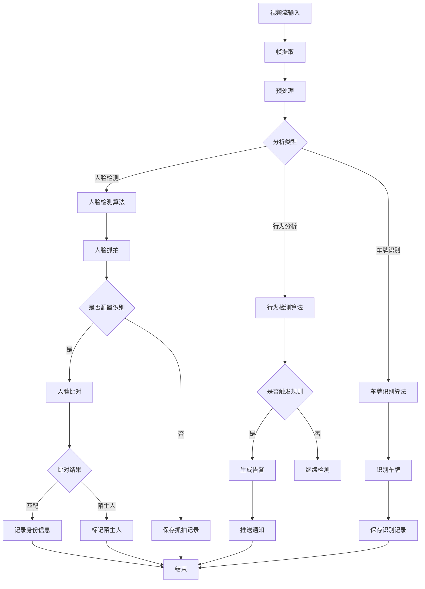
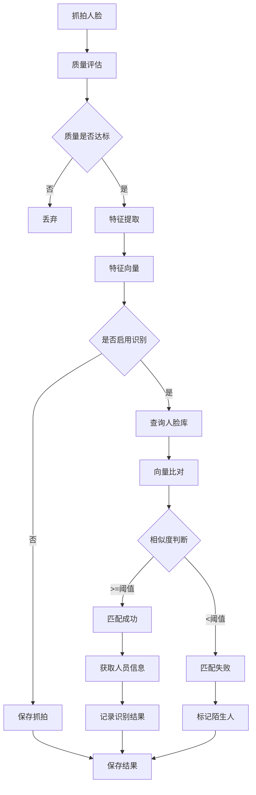
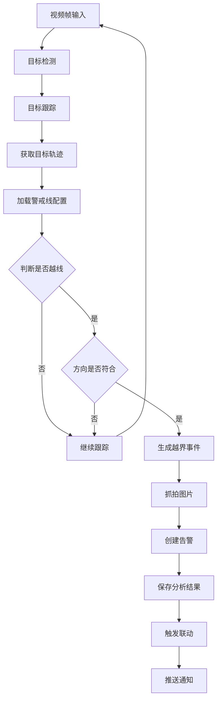
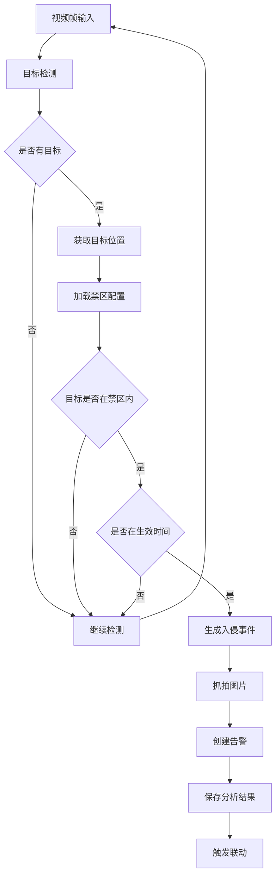
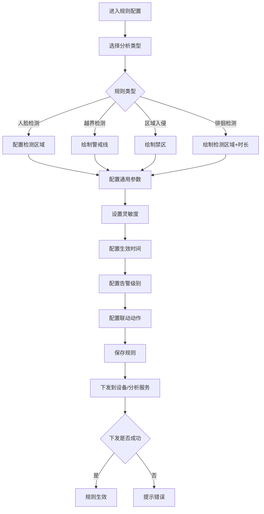

# 行为分析模块 - 业务流程图

## AI分析主流程

```mermaid
flowchart TD
    A[视频流输入] --> B[帧提取]
    B --> C[预处理]
    C --> D{分析类型}
    D -->|人脸检测| E[人脸检测算法]
    D -->|行为分析| F[行为检测算法]
    D -->|车牌识别| G[车牌识别算法]
    E --> H[人脸抓拍]
    H --> I{是否配置识别}
    I -->|是| J[人脸比对]
    I -->|否| K[保存抓拍记录]
    J --> L{比对结果}
    L -->|匹配| M[记录身份信息]
    L -->|陌生人| N[标记陌生人]
    F --> O{是否触发规则}
    O -->|是| P[生成告警]
    O -->|否| Q[继续检测]
    G --> R[识别车牌]
    R --> S[保存识别记录]
    P --> T[推送通知]
    K --> U[结束]
    M --> U
    N --> U
    S --> U
    T --> U
```

## 人脸识别流程

```mermaid
flowchart TD
    A[抓拍人脸] --> B[质量评估]
    B --> C{质量是否达标}
    C -->|否| D[丢弃]
    C -->|是| E[特征提取]
    E --> F[特征向量]
    F --> G{是否启用识别}
    G -->|否| H[保存抓拍]
    G -->|是| I[查询人脸库]
    I --> J[向量比对]
    J --> K{相似度判断}
    K -->|>=阈值| L[匹配成功]
    K -->|<阈值| M[匹配失败]
    L --> N[获取人员信息]
    N --> O[记录识别结果]
    M --> P[标记陌生人]
    H --> Q[保存结果]
    O --> Q
    P --> Q
```

## 越界检测流程

```mermaid
flowchart TD
    A[视频帧输入] --> B[目标检测]
    B --> C[目标跟踪]
    C --> D[获取目标轨迹]
    D --> E[加载警戒线配置]
    E --> F{判断是否越线}
    F -->|否| G[继续跟踪]
    F -->|是| H{方向是否符合}
    H -->|否| G
    H -->|是| I[生成越界事件]
    I --> J[抓拍图片]
    J --> K[创建告警]
    K --> L[保存分析结果]
    L --> M[触发联动]
    M --> N[推送通知]
    G --> A
```

## 区域入侵检测流程

```mermaid
flowchart TD
    A[视频帧输入] --> B[目标检测]
    B --> C{是否有目标}
    C -->|否| D[继续检测]
    C -->|是| E[获取目标位置]
    E --> F[加载禁区配置]
    F --> G{目标是否在禁区内}
    G -->|否| D
    G -->|是| H{是否在生效时间}
    H -->|否| D
    H -->|是| I[生成入侵事件]
    I --> J[抓拍图片]
    J --> K[创建告警]
    K --> L[保存分析结果]
    L --> M[触发联动]
    D --> A
```

## 分析规则配置流程

```mermaid
flowchart TD
    A[进入规则配置] --> B[选择分析类型]
    B --> C{规则类型}
    C -->|人脸检测| D[配置检测区域]
    C -->|越界检测| E[绘制警戒线]
    C -->|区域入侵| F[绘制禁区]
    C -->|徘徊检测| G[绘制检测区域+时长]
    D --> H[配置通用参数]
    E --> H
    F --> H
    G --> H
    H --> I[设置灵敏度]
    I --> J[配置生效时间]
    J --> K[配置告警级别]
    K --> L[配置联动动作]
    L --> M[保存规则]
    M --> N[下发到设备/分析服务]
    N --> O{下发是否成功}
    O -->|是| P[规则生效]
    O -->|否| Q[提示错误]
```
