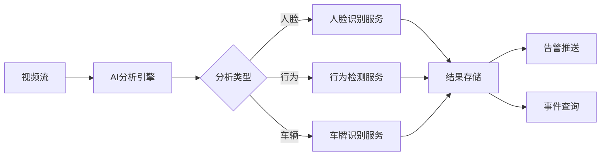

# 行为分析模块 - 详细设计

## 1. 类设计

### 1.1 Controller层

```java
@RestController
@RequestMapping("/ivs/v1/analysis")
public class AnalysisController {
    @Resource
    private AnalysisService analysisService;
    
    @GetMapping("/algorithms")
    public ResponseDTO<List<AlgorithmVO>> getAlgorithms();
    
    @PostMapping("/rule")
    public ResponseDTO<Long> createRule(@Valid @RequestBody RuleAddForm form);
    
    @PutMapping("/rule/{ruleId}")
    public ResponseDTO<Void> updateRule(@PathVariable Long ruleId, @Valid @RequestBody RuleUpdateForm form);
    
    @DeleteMapping("/rule/{ruleId}")
    public ResponseDTO<Void> deleteRule(@PathVariable Long ruleId);
    
    @GetMapping("/results")
    public ResponseDTO<PageResult<AnalysisResultVO>> queryResults(@Valid AnalysisQueryForm form);
    
    @PostMapping("/face/search")
    public ResponseDTO<List<FaceMatchVO>> searchFace(@Valid @RequestBody FaceSearchForm form);
}
```

### 1.2 Service层

```java
@Service
@Transactional(rollbackFor = Exception.class)
public class AnalysisServiceImpl implements AnalysisService {
    @Resource
    private AiRuleDao aiRuleDao;
    @Resource
    private AiFaceDao aiFaceDao;
    @Resource
    private AiEventDao aiEventDao;
    @Resource
    private AiEngineManager aiEngineManager;
    
    @Override
    public Long createRule(RuleAddForm form) {
        // 1. 校验设备是否支持该算法
        // 2. 构建规则实体
        // 3. 保存规则
        // 4. 下发规则到AI引擎
    }
    
    @Override
    public List<FaceMatchVO> searchFace(FaceSearchForm form) {
        // 1. 提取人脸特征
        // 2. 向量相似度搜索
        // 3. 返回匹配结果
    }
}
```

### 1.3 Manager层

```java
public class AiEngineManager {
    /**
     * 下发分析规则到AI引擎
     */
    public boolean deployRule(Long ruleId, AiRuleEntity rule);
    
    /**
     * 提取人脸特征向量
     */
    public float[] extractFaceFeature(byte[] imageData);
    
    /**
     * 执行向量相似度搜索
     */
    public List<FaceMatchResult> searchByVector(float[] vector, Long faceLibId, float threshold);
}
```

## 2. 核心算法流程

### 2.1 人脸识别流程

```
输入图像 → 人脸检测(RetinaFace) → 质量评估 → 特征提取(ArcFace) 
    → 向量比对 → 返回匹配结果
```

### 2.2 行为检测流程

```
视频帧 → 目标检测(YOLOv8) → 目标跟踪(DeepSORT) → 轨迹分析 
    → 规则匹配 → 生成告警
```

## 3. 接口详细设计

### 3.1 创建分析规则

**请求**:
```http
POST /ivs/v1/analysis/rule
Content-Type: application/json

{
  "ruleName": "大门越界检测",
  "ruleType": "CROSS_LINE",
  "deviceId": 1001,
  "channelNo": 1,
  "config": {
    "lines": [{"x1":100,"y1":200,"x2":500,"y2":200}],
    "direction": "BOTH",
    "sensitivity": 50
  },
  "schedules": [{"startTime":"08:00","endTime":"20:00"}],
  "alarmLevel": 2
}
```

**响应**:
```json
{
  "code": 200,
  "data": 10001,
  "message": "success"
}
```

### 3.2 人脸搜索

**请求**:
```http
POST /ivs/v1/analysis/face/search
Content-Type: multipart/form-data

image: [二进制图片数据]
faceLibId: 1
threshold: 0.75
topN: 10
```

**响应**:
```json
{
  "code": 200,
  "data": [
    {
      "faceId": 1001,
      "personName": "张三",
      "similarity": 0.92,
      "faceUrl": "https://xxx/face.jpg"
    }
  ]
}
```

## 4. 数据流设计


