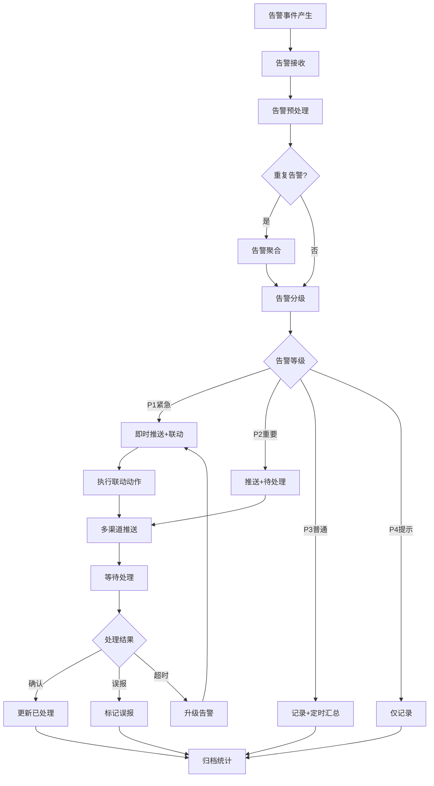
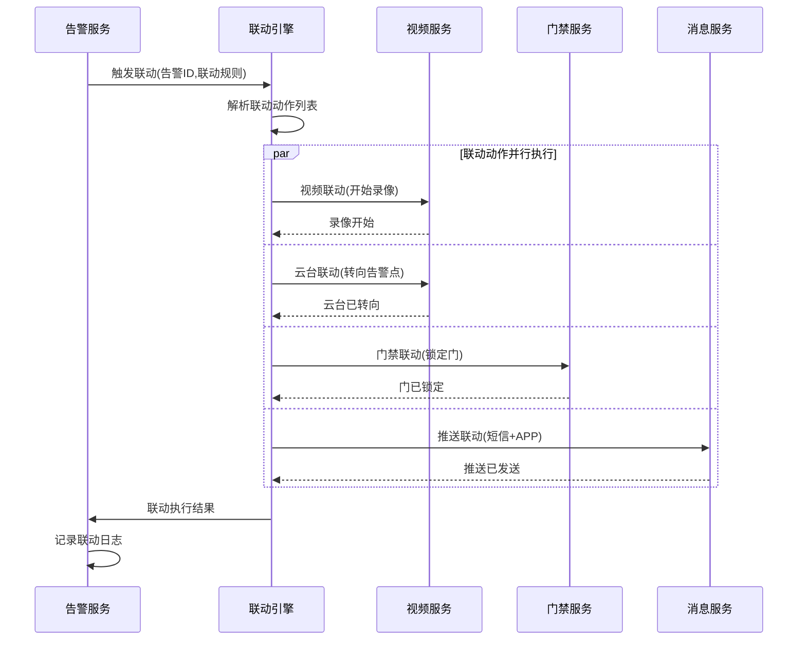
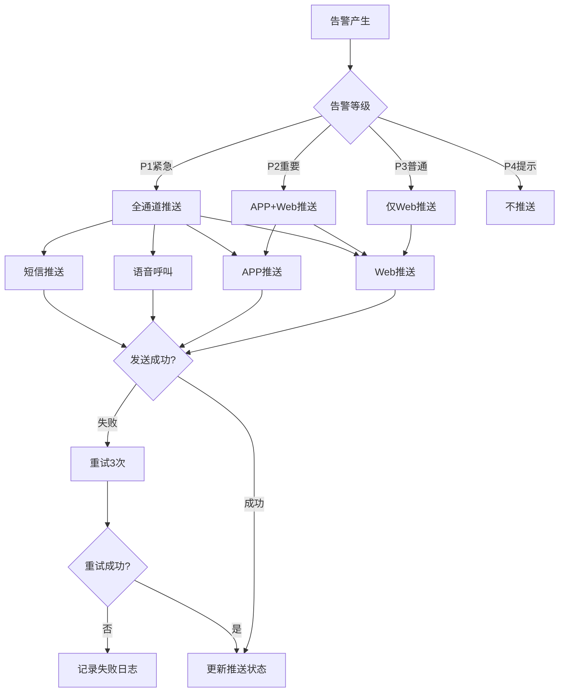
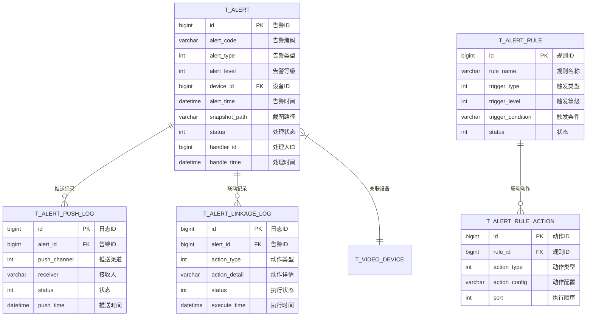

# 告警管理模块 - 完整设计文档

## 📋 模块概述

### 模块定位
告警管理模块是视频监控系统的事件中枢，负责接收、处理、推送各类告警事件，支持多种联动响应机制。

### 核心价值
- **统一告警中心**: 汇聚设备告警、AI告警、系统告警
- **智能分级处理**: 按告警等级自动路由处理
- **多渠道推送**: Web、APP、短信、语音多通道告警

### 告警来源

```
┌─────────────────────────────────────────────────────────────┐
│                      告警管理中心                            │
├─────────────────────────────────────────────────────────────┤
│  ┌─────────────┐  ┌─────────────┐  ┌─────────────┐         │
│  │ 设备告警    │  │ AI告警      │  │ 系统告警    │         │
│  │ ·离线      │  │ ·越界检测   │  │ ·存储不足   │         │
│  │ ·故障      │  │ ·人脸布控   │  │ ·服务异常   │         │
│  │ ·遮挡      │  │ ·行为异常   │  │ ·网络异常   │         │
│  └──────┬──────┘  └──────┬──────┘  └──────┬──────┘         │
│         └────────────────┴────────────────┘                │
│                         │                                   │
│              ┌──────────┴──────────┐                       │
│              │    告警处理引擎      │                       │
│              │  分级·过滤·聚合·推送  │                       │
│              └─────────────────────┘                       │
└─────────────────────────────────────────────────────────────┘
```

---

## 👥 用户故事

### US-ALT-001: 实时告警接收
**作为** 安保人员  
**我希望** 实时接收各类告警通知  
**以便** 第一时间响应安全事件

**验收标准**:
1. 告警延迟≤3秒
2. 支持声音+弹窗提醒
3. 告警按等级排序显示

### US-ALT-002: 告警处理
**作为** 安保人员  
**我希望** 快速处理和确认告警  
**以便** 记录事件处置结果

**验收标准**:
1. 支持单条/批量处理
2. 必须填写处理备注
3. 处理后更新告警状态

### US-ALT-003: 告警联动
**作为** 系统管理员  
**我希望** 配置告警联动策略  
**以便** 高危告警自动触发响应动作

**验收标准**:
1. 支持配置多种联动动作
2. 联动执行自动记录
3. 联动失败有补偿机制

### US-ALT-004: 告警统计
**作为** 安保主管  
**我希望** 查看告警统计分析  
**以便** 了解安防态势和改进方向

**验收标准**:
1. 支持按时间/类型/区域统计
2. 支持趋势图表展示
3. 支持导出统计报表

---

## 📊 业务流程图

### 告警处理总体流程



### 告警联动流程



### 告警推送流程



---

## 🗄️ 数据结构设计

### ER图



### 核心表结构

```sql
-- 告警记录表
CREATE TABLE t_alert (
    id              BIGINT PRIMARY KEY AUTO_INCREMENT COMMENT '告警ID',
    alert_code      VARCHAR(64) NOT NULL COMMENT '告警编码',
    alert_type      TINYINT NOT NULL COMMENT '告警类型:1-设备告警,2-AI告警,3-系统告警',
    alert_subtype   VARCHAR(32) NOT NULL COMMENT '告警子类型',
    alert_level     TINYINT NOT NULL DEFAULT 2 COMMENT '告警等级:1-P1紧急,2-P2重要,3-P3普通,4-P4提示',
    device_id       BIGINT COMMENT '设备ID',
    device_name     VARCHAR(100) COMMENT '设备名称',
    channel_no      INT DEFAULT 1 COMMENT '通道号',
    region_id       BIGINT COMMENT '区域ID',
    region_name     VARCHAR(100) COMMENT '区域名称',
    alert_time      DATETIME NOT NULL COMMENT '告警时间',
    alert_content   VARCHAR(512) NOT NULL COMMENT '告警内容',
    snapshot_path   VARCHAR(512) COMMENT '截图路径',
    video_path      VARCHAR(512) COMMENT '录像路径',
    source_id       BIGINT COMMENT '来源ID(AI事件ID等)',
    source_type     VARCHAR(32) COMMENT '来源类型',
    status          TINYINT NOT NULL DEFAULT 1 COMMENT '状态:1-待处理,2-处理中,3-已处理,4-已忽略',
    handler_id      BIGINT COMMENT '处理人ID',
    handler_name    VARCHAR(64) COMMENT '处理人',
    handle_time     DATETIME COMMENT '处理时间',
    handle_result   TINYINT COMMENT '处理结果:1-确认,2-误报,3-无法处理',
    handle_remark   VARCHAR(512) COMMENT '处理备注',
    aggregate_count INT DEFAULT 1 COMMENT '聚合数量',
    deleted_flag    TINYINT NOT NULL DEFAULT 0,
    create_time     DATETIME NOT NULL DEFAULT CURRENT_TIMESTAMP,
    update_time     DATETIME NOT NULL DEFAULT CURRENT_TIMESTAMP ON UPDATE CURRENT_TIMESTAMP,
    UNIQUE KEY uk_alert_code (alert_code),
    INDEX idx_device_time (device_id, alert_time),
    INDEX idx_alert_level (alert_level),
    INDEX idx_status (status),
    INDEX idx_alert_time (alert_time)
) ENGINE=InnoDB DEFAULT CHARSET=utf8mb4 COMMENT='告警记录表';

-- 告警联动规则表
CREATE TABLE t_alert_rule (
    id                BIGINT PRIMARY KEY AUTO_INCREMENT COMMENT '规则ID',
    rule_name         VARCHAR(100) NOT NULL COMMENT '规则名称',
    rule_code         VARCHAR(64) NOT NULL COMMENT '规则编码',
    trigger_type      TINYINT NOT NULL COMMENT '触发类型:1-告警类型,2-告警等级,3-设备',
    trigger_condition JSON NOT NULL COMMENT '触发条件JSON',
    priority          INT NOT NULL DEFAULT 100 COMMENT '优先级',
    status            TINYINT NOT NULL DEFAULT 1 COMMENT '状态:1-启用,2-禁用',
    description       VARCHAR(512) COMMENT '描述',
    deleted_flag      TINYINT NOT NULL DEFAULT 0,
    create_time       DATETIME NOT NULL DEFAULT CURRENT_TIMESTAMP,
    update_time       DATETIME NOT NULL DEFAULT CURRENT_TIMESTAMP ON UPDATE CURRENT_TIMESTAMP,
    UNIQUE KEY uk_rule_code (rule_code)
) ENGINE=InnoDB DEFAULT CHARSET=utf8mb4 COMMENT='告警联动规则表';

-- 告警联动动作表
CREATE TABLE t_alert_rule_action (
    id              BIGINT PRIMARY KEY AUTO_INCREMENT COMMENT '动作ID',
    rule_id         BIGINT NOT NULL COMMENT '规则ID',
    action_type     TINYINT NOT NULL COMMENT '动作类型:1-录像,2-云台,3-门禁,4-广播,5-短信,6-APP推送',
    action_config   JSON NOT NULL COMMENT '动作配置JSON',
    timeout         INT DEFAULT 30 COMMENT '超时时间(秒)',
    retry_count     TINYINT DEFAULT 3 COMMENT '重试次数',
    sort            INT NOT NULL DEFAULT 0 COMMENT '执行顺序',
    INDEX idx_rule_id (rule_id)
) ENGINE=InnoDB DEFAULT CHARSET=utf8mb4 COMMENT='告警联动动作表';

-- 告警推送日志表
CREATE TABLE t_alert_push_log (
    id              BIGINT PRIMARY KEY AUTO_INCREMENT COMMENT '日志ID',
    alert_id        BIGINT NOT NULL COMMENT '告警ID',
    push_channel    TINYINT NOT NULL COMMENT '推送渠道:1-Web,2-APP,3-短信,4-语音,5-邮件',
    receiver        VARCHAR(128) NOT NULL COMMENT '接收人',
    receiver_phone  VARCHAR(20) COMMENT '接收人手机',
    push_content    VARCHAR(512) COMMENT '推送内容',
    status          TINYINT NOT NULL DEFAULT 1 COMMENT '状态:1-待发送,2-已发送,3-发送失败',
    retry_count     TINYINT DEFAULT 0 COMMENT '重试次数',
    error_msg       VARCHAR(256) COMMENT '错误信息',
    push_time       DATETIME COMMENT '推送时间',
    create_time     DATETIME NOT NULL DEFAULT CURRENT_TIMESTAMP,
    INDEX idx_alert_id (alert_id),
    INDEX idx_push_time (push_time)
) ENGINE=InnoDB DEFAULT CHARSET=utf8mb4 COMMENT='告警推送日志表';

-- 告警联动执行日志表
CREATE TABLE t_alert_linkage_log (
    id              BIGINT PRIMARY KEY AUTO_INCREMENT COMMENT '日志ID',
    alert_id        BIGINT NOT NULL COMMENT '告警ID',
    rule_id         BIGINT COMMENT '规则ID',
    action_type     TINYINT NOT NULL COMMENT '动作类型',
    action_detail   VARCHAR(512) COMMENT '动作详情',
    target_service  VARCHAR(64) COMMENT '目标服务',
    target_id       BIGINT COMMENT '目标ID',
    status          TINYINT NOT NULL DEFAULT 1 COMMENT '状态:1-执行中,2-成功,3-失败',
    error_msg       VARCHAR(256) COMMENT '错误信息',
    execute_time    DATETIME NOT NULL DEFAULT CURRENT_TIMESTAMP COMMENT '执行时间',
    complete_time   DATETIME COMMENT '完成时间',
    duration        INT COMMENT '耗时(ms)',
    INDEX idx_alert_id (alert_id),
    INDEX idx_execute_time (execute_time)
) ENGINE=InnoDB DEFAULT CHARSET=utf8mb4 COMMENT='告警联动执行日志表';

-- 告警统计表(按小时聚合)
CREATE TABLE t_alert_statistics (
    id              BIGINT PRIMARY KEY AUTO_INCREMENT COMMENT '统计ID',
    stat_date       DATE NOT NULL COMMENT '统计日期',
    stat_hour       TINYINT NOT NULL COMMENT '统计小时(0-23)',
    alert_type      TINYINT NOT NULL COMMENT '告警类型',
    alert_level     TINYINT NOT NULL COMMENT '告警等级',
    region_id       BIGINT COMMENT '区域ID',
    total_count     INT NOT NULL DEFAULT 0 COMMENT '告警总数',
    handled_count   INT NOT NULL DEFAULT 0 COMMENT '已处理数',
    false_count     INT NOT NULL DEFAULT 0 COMMENT '误报数',
    avg_handle_time INT COMMENT '平均处理时长(秒)',
    create_time     DATETIME NOT NULL DEFAULT CURRENT_TIMESTAMP,
    UNIQUE KEY uk_stat (stat_date, stat_hour, alert_type, alert_level, region_id),
    INDEX idx_stat_date (stat_date)
) ENGINE=InnoDB DEFAULT CHARSET=utf8mb4 COMMENT='告警统计表';
```

---

## 🔌 接口设计

### RESTful API

| 方法 | 路径 | 说明 | 权限 |
|------|------|------|------|
| GET | /api/v1/alerts | 告警列表 | Level 2+ |
| GET | /api/v1/alerts/{id} | 告警详情 | Level 2+ |
| PUT | /api/v1/alerts/{id}/handle | 处理告警 | Level 3+ |
| PUT | /api/v1/alerts/batch-handle | 批量处理 | Level 3+ |
| GET | /api/v1/alerts/statistics | 告警统计 | Level 3+ |
| GET | /api/v1/alerts/rules | 联动规则列表 | Level 4+ |
| POST | /api/v1/alerts/rules | 创建联动规则 | Level 4+ |
| PUT | /api/v1/alerts/rules/{id} | 更新规则 | Level 4+ |
| DELETE | /api/v1/alerts/rules/{id} | 删除规则 | Level 5 |

### WebSocket告警推送

```json
{
  "type": "ALERT_NEW",
  "data": {
    "id": 10001,
    "alertCode": "ALT202401150001",
    "alertType": 2,
    "alertTypeName": "AI告警",
    "alertLevel": 1,
    "alertLevelName": "P1紧急",
    "deviceName": "大门摄像机",
    "alertContent": "检测到黑名单人员",
    "alertTime": "2024-01-15T10:30:00Z",
    "snapshotUrl": "/api/v1/files/snapshots/xxx.jpg"
  }
}
```

---

## 📈 性能指标

| 指标 | 要求 | 监控方式 |
|------|------|----------|
| 告警处理延迟 | ≤ 3秒 | Prometheus |
| 推送到达率 | ≥ 99% | 日志统计 |
| 联动执行成功率 | ≥ 99% | 日志统计 |
| 告警列表响应 | ≤ 500ms | APM |
| 并发告警处理 | ≥ 1000/秒 | 压测 |

---

## ✅ 验收标准

### 功能验收
- [ ] 支持设备/AI/系统三类告警
- [ ] 告警四级分类正确
- [ ] 联动规则配置生效
- [ ] 多渠道推送正常
- [ ] 告警处理流程完整

### 性能验收
- [ ] 告警延迟≤3秒
- [ ] 推送到达率≥99%
- [ ] 支持1000/秒并发告警

### 安全验收
- [ ] 告警数据权限隔离
- [ ] 敏感操作审计记录
- [ ] 推送内容脱敏处理
