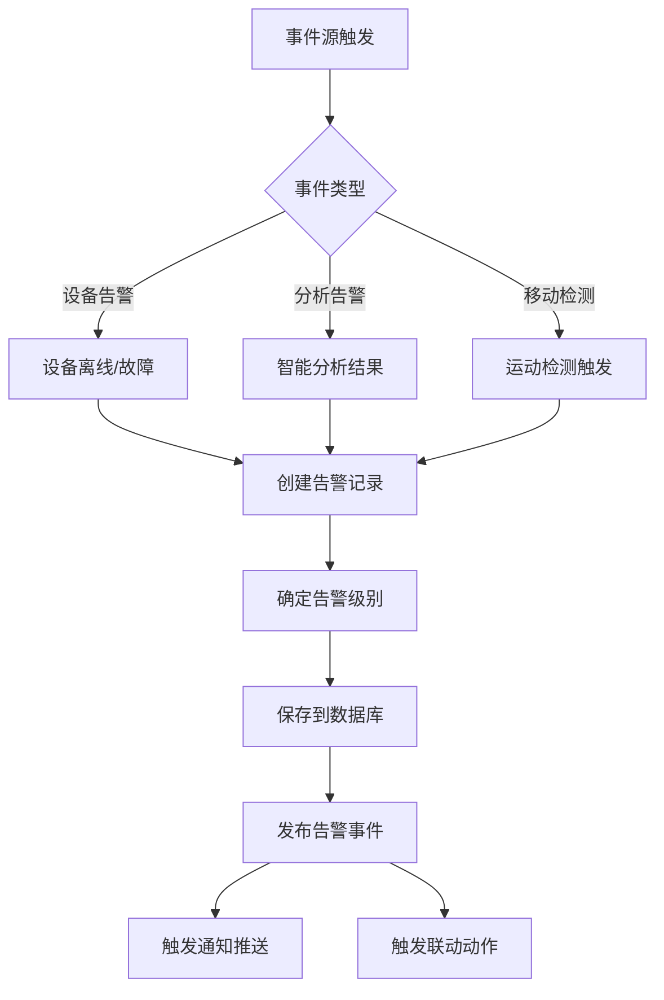
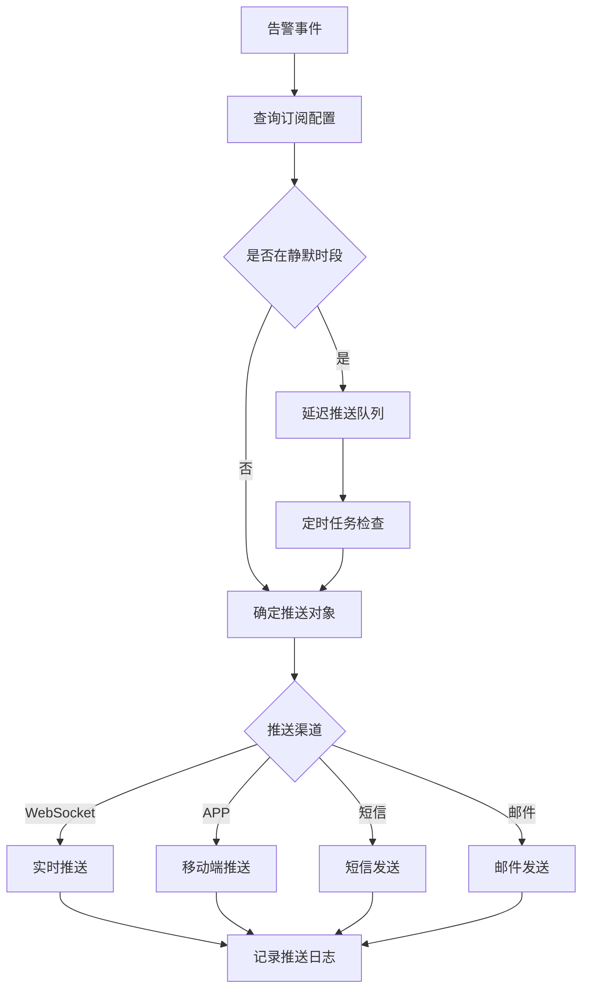
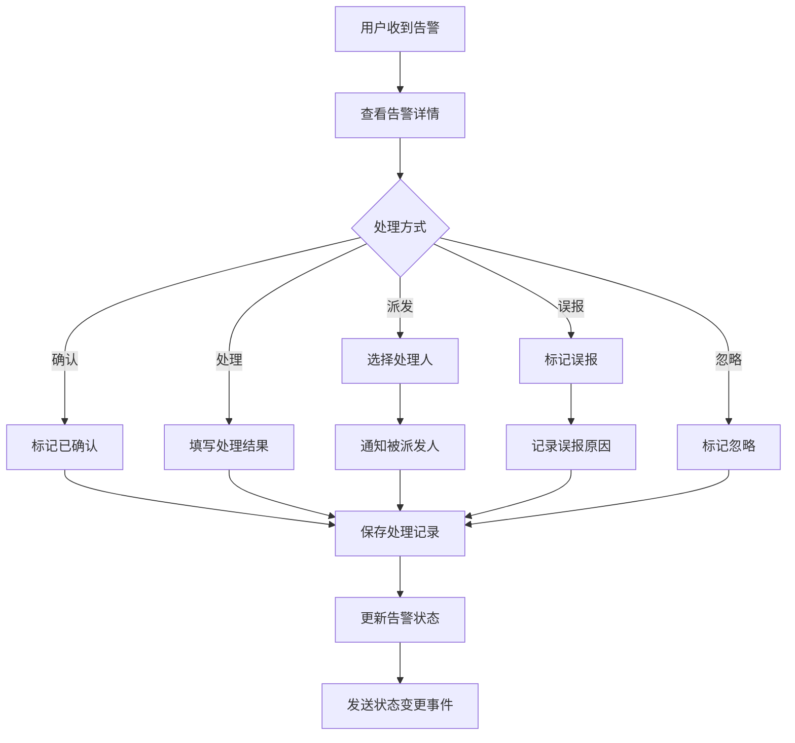
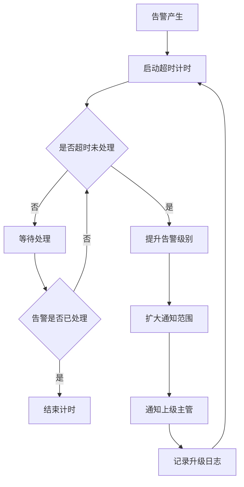
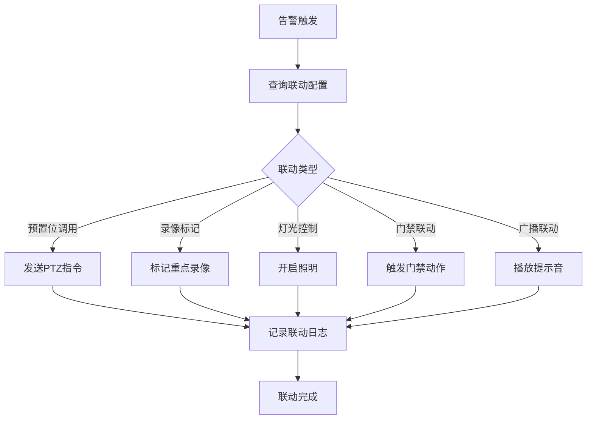
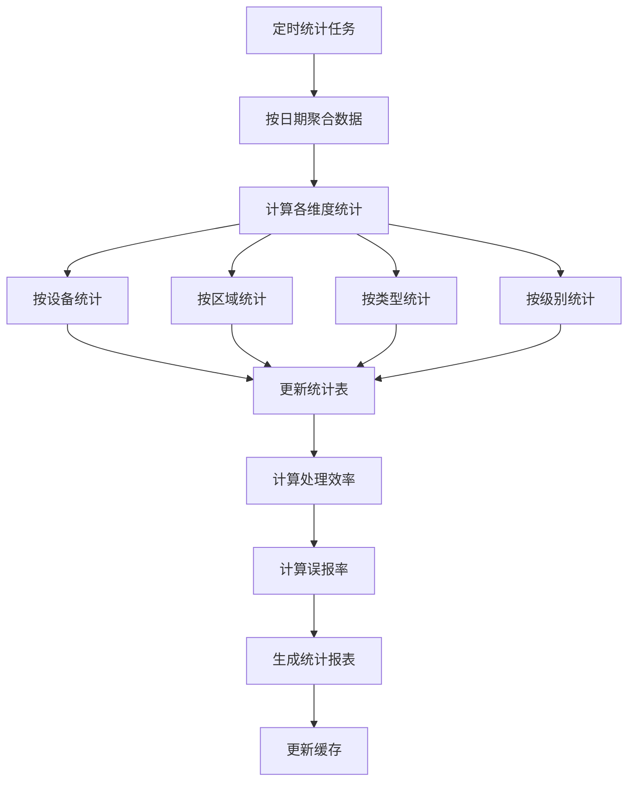
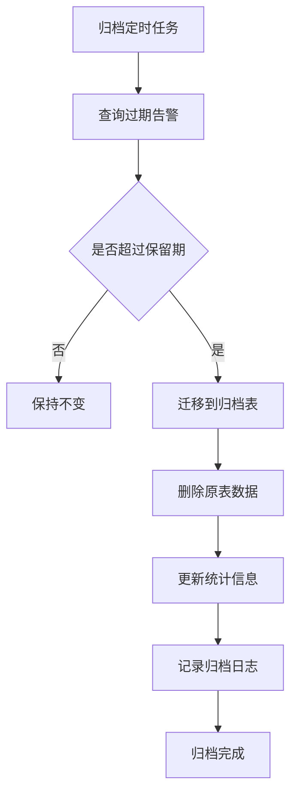

# 告警管理模块 - 业务流程图

## 告警生成流程

```mermaid
flowchart TD
    A[事件源触发] --> B{事件类型}
    B -->|设备告警| C[设备离线/故障]
    B -->|分析告警| D[智能分析结果]
    B -->|移动检测| E[运动检测触发]
    C --> F[创建告警记录]
    D --> F
    E --> F
    F --> G[确定告警级别]
    G --> H[保存到数据库]
    H --> I[发布告警事件]
    I --> J[触发通知推送]
    I --> K[触发联动动作]
```

## 告警推送流程

```mermaid
flowchart TD
    A[告警事件] --> B[查询订阅配置]
    B --> C{是否在静默时段}
    C -->|是| D[延迟推送队列]
    C -->|否| E[确定推送对象]
    E --> F{推送渠道}
    F -->|WebSocket| G[实时推送]
    F -->|APP| H[移动端推送]
    F -->|短信| I[短信发送]
    F -->|邮件| J[邮件发送]
    G --> K[记录推送日志]
    H --> K
    I --> K
    J --> K
    D --> L[定时任务检查]
    L --> E
```

## 告警处理流程

```mermaid
flowchart TD
    A[用户收到告警] --> B[查看告警详情]
    B --> C{处理方式}
    C -->|确认| D[标记已确认]
    C -->|处理| E[填写处理结果]
    C -->|派发| F[选择处理人]
    C -->|误报| G[标记误报]
    C -->|忽略| H[标记忽略]
    D --> I[保存处理记录]
    E --> I
    F --> J[通知被派发人]
    J --> I
    G --> K[记录误报原因]
    K --> I
    H --> I
    I --> L[更新告警状态]
    L --> M[发送状态变更事件]
```

## 告警升级流程

```mermaid
flowchart TD
    A[告警产生] --> B[启动超时计时]
    B --> C{是否超时未处理}
    C -->|否| D[等待处理]
    D --> E{告警是否已处理}
    E -->|是| F[结束计时]
    E -->|否| C
    C -->|是| G[提升告警级别]
    G --> H[扩大通知范围]
    H --> I[通知上级主管]
    I --> J[记录升级日志]
    J --> B
```

## 告警联动流程

```mermaid
flowchart TD
    A[告警触发] --> B[查询联动配置]
    B --> C{联动类型}
    C -->|预置位调用| D[发送PTZ指令]
    C -->|录像标记| E[标记重点录像]
    C -->|灯光控制| F[开启照明]
    C -->|门禁联动| G[触发门禁动作]
    C -->|广播联动| H[播放提示音]
    D --> I[记录联动日志]
    E --> I
    F --> I
    G --> I
    H --> I
    I --> J[联动完成]
```

## 告警统计流程

```mermaid
flowchart TD
    A[定时统计任务] --> B[按日期聚合数据]
    B --> C[计算各维度统计]
    C --> D[按设备统计]
    C --> E[按区域统计]
    C --> F[按类型统计]
    C --> G[按级别统计]
    D --> H[更新统计表]
    E --> H
    F --> H
    G --> H
    H --> I[计算处理效率]
    I --> J[计算误报率]
    J --> K[生成统计报表]
    K --> L[更新缓存]
```

## 告警归档流程

```mermaid
flowchart TD
    A[归档定时任务] --> B[查询过期告警]
    B --> C{是否超过保留期}
    C -->|否| D[保持不变]
    C -->|是| E[迁移到归档表]
    E --> F[删除原表数据]
    F --> G[更新统计信息]
    G --> H[记录归档日志]
    H --> I[归档完成]
```
