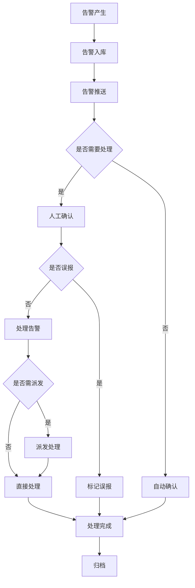

# 告警管理模块 - 功能说明

## 模块概述

告警管理模块负责接收、处理、分发和统计各类视频相关告警，包括设备告警、智能分析告警、系统告警等。

## 功能清单

### 1. 告警接收

| 功能点 | 说明 | 权限要求 |
|--------|------|----------|
| 设备告警接收 | 设备离线/故障告警 | 系统自动 |
| 分析告警接收 | AI分析触发告警 | 系统自动 |
| 移动检测告警 | 运动检测触发告警 | 系统自动 |
| 自定义告警 | 用户配置的规则告警 | 系统自动 |

### 2. 告警展示

| 功能点 | 说明 | 权限要求 |
|--------|------|----------|
| 实时告警列表 | 实时显示告警信息 | Level 2+ |
| 告警弹窗 | 高优先级告警弹窗 | Level 2+ |
| 告警地图 | 地图标注告警位置 | Level 3+ |
| 告警详情 | 查看告警详细信息 | Level 2+ |
| 告警关联视频 | 查看告警关联录像 | Level 3+ |

### 3. 告警处理

| 功能点 | 说明 | 权限要求 |
|--------|------|----------|
| 告警确认 | 确认告警已查看 | Level 2+ |
| 告警处理 | 标记处理状态 | Level 3+ |
| 告警派发 | 派发给指定人员 | Level 4+ |
| 告警升级 | 升级告警级别 | Level 4+ |
| 误报标记 | 标记误报告警 | Level 3+ |

### 4. 告警配置

| 功能点 | 说明 | 权限要求 |
|--------|------|----------|
| 告警级别配置 | 配置告警优先级 | Level 4+ |
| 告警规则配置 | 配置告警触发规则 | Level 4+ |
| 推送配置 | 配置告警推送方式 | Level 4+ |
| 免打扰配置 | 配置静默时段 | Level 3+ |
| 告警联动配置 | 配置告警联动动作 | Level 5 |

### 5. 告警统计

| 功能点 | 说明 | 权限要求 |
|--------|------|----------|
| 告警趋势 | 告警数量趋势图 | Level 3+ |
| 告警分布 | 按类型/区域分布 | Level 3+ |
| 处理统计 | 处理效率统计 | Level 4+ |
| 误报统计 | 误报率分析 | Level 4+ |
| 报表导出 | 导出统计报表 | Level 4+ |

## 告警级别定义

| 级别 | 名称 | 颜色 | 说明 | 处理时限 |
|------|------|------|------|----------|
| 1 | 紧急 | 🔴 红色 | 需立即处理 | 5分钟 |
| 2 | 重要 | 🟠 橙色 | 需尽快处理 | 30分钟 |
| 3 | 一般 | 🟡 黄色 | 需当日处理 | 8小时 |
| 4 | 提示 | 🔵 蓝色 | 知晓即可 | 无 |

## 告警处理流程



## 界面设计

```
┌─────────────────────────────────────────────────────────────────┐
│ ⚠️ 告警管理                                    待处理: 15  今日: 128│
├─────────────────────────────────────────────────────────────────┤
│ 级别:[全部▼] 类型:[全部▼] 状态:[待处理▼] 时间:[今天▼] 🔍     │
├─────────────────────────────────────────────────────────────────┤
│ ┌─────────────────────────────────────────────────────────────┐ │
│ │ 🔴 2024-01-15 10:30:25 │ 紧急 │ 越界检测                    │ │
│ │    设备: 围墙摄像机  区域: 南门  状态: 待处理               │ │
│ │    [查看] [处理] [派发] [详情]                              │ │
│ ├─────────────────────────────────────────────────────────────┤ │
│ │ 🟠 2024-01-15 10:28:15 │ 重要 │ 设备离线                    │ │
│ │    设备: 大门摄像机  区域: 东门  状态: 已确认               │ │
│ │    [查看] [处理] [派发] [详情]                              │ │
│ ├─────────────────────────────────────────────────────────────┤ │
│ │ 🟡 2024-01-15 10:25:00 │ 一般 │ 人脸识别-陌生人            │ │
│ │    设备: 前台摄像机  区域: 大厅  状态: 已处理               │ │
│ │    [查看] [详情]                                            │ │
│ └─────────────────────────────────────────────────────────────┘ │
│ 分页: < 1 2 3 4 5 ... 10 >                     共128条 每页20条 │
└─────────────────────────────────────────────────────────────────┘
```

## 告警弹窗

```
┌───────────────────────────────────────┐
│ 🔴 紧急告警                      [×] │
├───────────────────────────────────────┤
│ ┌───────────────────────────────────┐ │
│ │                                   │ │
│ │     告警抓拍图/视频               │ │
│ │                                   │ │
│ └───────────────────────────────────┘ │
│ 告警类型: 越界检测                    │
│ 告警时间: 2024-01-15 10:30:25        │
│ 告警设备: 围墙摄像机                  │
│ 告警区域: 南门                        │
│ ┌─────────────────────────────────┐   │
│ │ [查看录像] [确认] [处理] [派发]  │   │
│ └─────────────────────────────────┘   │
└───────────────────────────────────────┘
```
