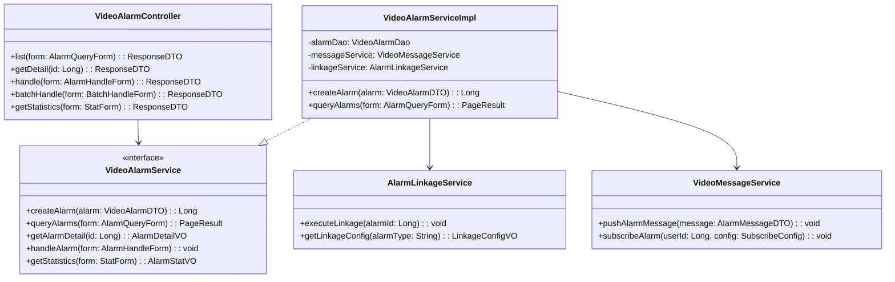

# 告警管理 - 详细设计

> **版本**: v1.0.0  
> **创建日期**: 2025-12-17

---

## 📊 类结构设计



---

## 📋 数据库表设计

### t_video_alarm (视频告警表)

```sql
CREATE TABLE t_video_alarm (
    id BIGINT PRIMARY KEY AUTO_INCREMENT COMMENT '告警ID',
    alarm_no VARCHAR(32) NOT NULL COMMENT '告警编号',
    camera_id BIGINT NOT NULL COMMENT '摄像头ID',
    area_id BIGINT COMMENT '区域ID',
    alarm_type VARCHAR(50) NOT NULL COMMENT '告警类型',
    alarm_level VARCHAR(20) NOT NULL COMMENT '告警级别:LOW/MEDIUM/HIGH/CRITICAL',
    alarm_time DATETIME NOT NULL COMMENT '告警时间',
    alarm_desc VARCHAR(500) COMMENT '告警描述',
    snapshot_url VARCHAR(200) COMMENT '告警快照URL',
    video_url VARCHAR(200) COMMENT '告警视频URL',
    handle_status TINYINT DEFAULT 0 COMMENT '处理状态:0未处理1处理中2已处理3已忽略',
    handler_id BIGINT COMMENT '处理人ID',
    handle_time DATETIME COMMENT '处理时间',
    handle_result VARCHAR(20) COMMENT '处理结果:TRUE_ALARM/FALSE_ALARM',
    handle_remark VARCHAR(500) COMMENT '处理备注',
    linkage_status TINYINT DEFAULT 0 COMMENT '联动状态:0未触发1已触发2执行成功3执行失败',
    create_time DATETIME NOT NULL DEFAULT CURRENT_TIMESTAMP COMMENT '创建时间',
    update_time DATETIME NOT NULL DEFAULT CURRENT_TIMESTAMP ON UPDATE CURRENT_TIMESTAMP COMMENT '更新时间',
    UNIQUE KEY uk_alarm_no (alarm_no),
    INDEX idx_camera_id (camera_id),
    INDEX idx_alarm_time (alarm_time),
    INDEX idx_alarm_type (alarm_type),
    INDEX idx_handle_status (handle_status)
) ENGINE=InnoDB DEFAULT CHARSET=utf8mb4 COMMENT='视频告警表';
```

### t_video_alarm_subscribe (告警订阅表)

```sql
CREATE TABLE t_video_alarm_subscribe (
    id BIGINT PRIMARY KEY AUTO_INCREMENT COMMENT '订阅ID',
    user_id BIGINT NOT NULL COMMENT '用户ID',
    alarm_types VARCHAR(500) COMMENT '订阅告警类型,逗号分隔',
    area_ids VARCHAR(500) COMMENT '订阅区域ID,逗号分隔',
    alarm_levels VARCHAR(100) COMMENT '订阅告警级别,逗号分隔',
    notify_channels VARCHAR(100) COMMENT '通知渠道:SMS,EMAIL,WEBSOCKET,APP',
    time_range VARCHAR(50) COMMENT '接收时间范围,如08:00-22:00',
    status TINYINT DEFAULT 1 COMMENT '状态:0禁用1启用',
    create_time DATETIME NOT NULL DEFAULT CURRENT_TIMESTAMP COMMENT '创建时间',
    INDEX idx_user_id (user_id)
) ENGINE=InnoDB DEFAULT CHARSET=utf8mb4 COMMENT='告警订阅表';
```

---

## 🔧 API接口设计

### 告警列表查询

```
GET /api/video/v1/alarm/list
```

**请求参数**:
```json
{
  "cameraId": 1001,
  "alarmType": "INTRUSION",
  "alarmLevel": "HIGH",
  "handleStatus": 0,
  "startTime": "2025-12-01 00:00:00",
  "endTime": "2025-12-17 23:59:59",
  "pageNum": 1,
  "pageSize": 20
}
```

**响应**:
```json
{
  "code": 0,
  "data": {
    "list": [
      {
        "id": 1,
        "alarmNo": "ALM202512170001",
        "cameraName": "大门摄像头",
        "alarmType": "INTRUSION",
        "alarmLevel": "HIGH",
        "alarmTime": "2025-12-17 10:30:00",
        "snapshotUrl": "/alarm/snapshot/001.jpg",
        "handleStatus": 0
      }
    ],
    "total": 100,
    "pageNum": 1,
    "pageSize": 20
  }
}
```

### 告警处理

```
POST /api/video/v1/alarm/handle
```

**请求参数**:
```json
{
  "alarmId": 1,
  "handleResult": "TRUE_ALARM",
  "handleRemark": "已确认为真实入侵事件，已通知安保人员"
}
```

---

## 📈 性能优化

1. **告警存储**: 使用Elasticsearch存储告警数据，支持快速检索
2. **实时推送**: 使用WebSocket + Redis Pub/Sub实现实时推送
3. **告警去重**: 同一摄像头短时间内相同类型告警去重
4. **异步处理**: 告警联动使用异步队列处理

---

**📝 文档维护**: IOE-DREAM架构团队 | 2025-12-17
